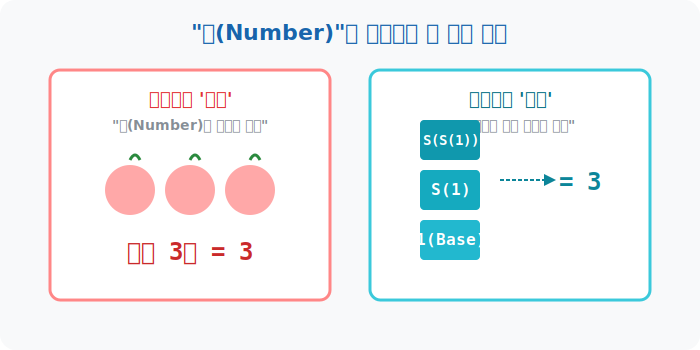
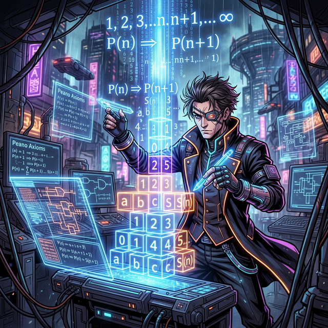

# 00. 수학자에게 수란 무엇인가 : 페아노와 자연수 (Intro)

"도대체 물(Water)이란 무엇인가?" 이 질문을 들으면 평범한 사람들은 "그냥 마시는 거"라고 대답합니다. 하지만 화학자들은 $H_2O$, 즉 수소 원자 2개와 산소 원자 1개의 결합 구조체라고 대답합니다. 친숙하고 당연한 것일수록, 전문가들은 그 '본질(기초 요소)'이 무엇인지 철저하게 뜯어봅니다.

수학에서도 마찬가지입니다. 여러분은 태어날 때부터 너무나 자연스럽게 $1, 2, 3, 4\dots$ 라는 '자연수(Natural Number)'를 공기처럼 들이마시며 수학을 배워왔습니다. 그런데 과연, 19세기의 위대한 수학자와 논리학자들은 이 뻔한 자연수를 어떻게 바라보았을까요?

---

## 학습 목표
* 평범한 직관(1, 2, 3...)을 넘어 수학자가 '수'를 정의하려는 논리적 이유를 이해합니다.
* 19세기 이탈리아의 수학자 **주세페 페아노(Giuseppe Peano)**의 업적과 현대 논리학의 관계를 알아봅니다.

## 1. 익숙함의 함정: 1 다음엔 왜 2인가요?

어린 시절 우리는 사과 1개, 사과 2개를 손으로 직접 세면서 수를 배웠습니다. 그러나 복잡한 함수와 미적분, 나아가 인공지능 컴퓨터를 위한 암호학을 설계하는 수학자들에게 '사과를 세는 직관'만으로는 수 체계를 완벽하게 건설할 수가 없었습니다. 모래성 위에 고층 빌딩을 짓는 것과 같기 때문입니다.

**수학의 근본적인 위기:**
1. 만약 무한히 거대한 숫자가 존재한다면, 인간의 뇌가 세어보지 않고도 그다음 숫자가 분명히 존재한다고 어떻게 증명할 수 있는가?
2. 숫자들이 1씩 커진다는 패턴이 과연 수천억 단위에서도 영원히 똑같이 적용될 것이라 장담할 수 있는가?

이러한 불안감을 잠재우고 모든 형태의 수학 공식이 작동할 수 있는 단단한 철근과 콘크리트 바닥을 마련하기 위해, **'수 자체를 완벽한 설계도(공리)로 다시 정의'**하려는 역사적 시도가 시작되었습니다.

## 2. 블록의 창조자: 주세페 페아노 (Giuseppe Peano)

1858년 이탈리아의 사르데냐 섬에서 태어난 **주세페 페아노**는 천재적인 계산 기계라기보다는 '기호의 마술사'이자 현대 기호 논리학의 개척자였습니다. 

  

뉴턴이나 라이프니츠 시절의 사람들은 미적분을 수학 문장으로 길게 묘사했지만, 페아노는 "모든 복잡한 수학적 사실은 아주 단순하고 부서지지 않는 블록 몇 개와, 짧은 논리 기호만으로 완벽하게 조립될 수 있다"고 믿었습니다. 

우리가 오늘날 사용하는 $\cup$(합집합), $\cap$(교집합) 같은 깔끔한 논리 기호들의 기초를 세운 것도 바로 그가 10년에 걸쳐 집필한 백과사전 《수학공식안 (Formulario Mathematico)》의 엄청난 성과 중 하나입니다.

## 3. 자연수 공리계: 모든 수의 '씨앗' 

페아노는 결심했습니다. 인류가 수만 년 넘게 직관적으로 써오던 "자연수"라는 녀석을 해부하여, 단 5개의 부정할 수 없는 진리 체계로 정제하겠다고 말입니다. 페아노의 머릿속에는 오직 두 가지 기본 무기밖에 없었습니다. 
1. **숫자 1 이라는 씨앗**
2. **'다음 것'을 가리키는 규칙** 

이 2가지 재료만으로, 우주 끝까지 뻗어나가는 모든 무한대의 자연수를 만들어 낸 마법. 그것이 바로 그 유명한 수학의 바이블, **「페아노의 자연수 공리계 (Peano Axioms)」** 입니다. 컴퓨터 프로그래밍(Coding)을 배울 때 배우는 '객체 지향'과 '재귀(Recursion)' 함수의 개념은 사실 100년도 더 전의 페아노의 논리에서 시작된 셈입니다.

## 학습 정리
1. **자연수(Natural Number)**: 인간이 일상에서 자연스럽게 받아들인 수(1, 2, 3...)이지만, 고등 수학과 컴퓨터 과학에서는 직관을 배제한 엄밀한 '정의'가 필요하다.
2. **주세페 페아노**: 19세기의 위대한 이탈리아 논리학자로, 무질서하던 개념들을 정리하여 현대 수학의 기호 체계를 확립하였다.
3. **공리계 (Axiom System)**: 어떤 이론을 논리적으로 설명하기 위해 토대가 되는, 증명 없이 참(True)으로 받아들이는 가장 기본이 되는 설계도 규칙 집합.

다음 장에서는 페아노가 찾아낸 그 5가지의 아름다운 공리(규칙)들이, 현대 파이썬(Python) 객체 프로그래밍 언어와 얼마나 놀랍게 일치하는지 살펴보겠습니다!
