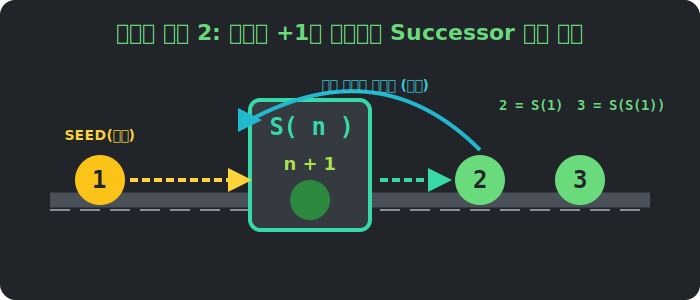

# 01. 첫 번째 수업: 창조주의 설계도, 페아노의 5공리 (Peano Axioms)

우리는 컴퓨터에 $3$ 이라는 숫자를 입력하면, 컴퓨터가 그것을 메모리에 전기 신호로 저장한다는 것을 알고 있습니다. 그렇다면 19세기 수학자들은 종이 위에서 이 숫자의 '원형(Class)'을 어떻게 정의했을까요? 

아무것도 없는 빈 캔버스에서 오직 5개의 규칙만으로 우주의 모든 자연수를 탄생시킨 **페아노의 5공리(Peano Axioms)**를 살펴봅시다.

---

## 학습 목표
* 페아노가 수학적 엄밀함을 위해 제안한 5가지 자연수 공리를 단계별로 이해합니다.
* 무한한 숫자를 창조하는 핵심 원리인 **'다음 수(Successor)'**의 개념을 파악합니다.
* 파이썬(Python)의 **객체 지향 프로그래밍(OOP)** 클래스 문법을 이용하여 내장된 정수(`int`) 타입 없이 숫자 시스템을 밑바닥부터 직접 창조해 봅니다!

## 1. 세상을 세우는 5개의 기둥 (페아노의 공리계)

수학에서 **공리(Axiom)**란, "너무나 당연해서 증명이 필요 없이 참(True)으로 받아들이는 가장 기본이 되는 규칙"을 말합니다. 게임을 시작할 때 정하는 절대 규칙 같은 것이죠.

페아노는 단 5개의 공리로 자연수 왕국을 세웠습니다. 같이 그 왕국의 헌법을 들여다볼까요?

### [공리 1] 1은 자연수이다.
> 기호: $1 \in \mathbb{N}$ (1은 자연수 집합 $\mathbb{N}$ 의 원소이다)
> 의미: 모든 것의 시작점이 되는 '씨앗(Seed)'이 하나 존재한다는 뜻입니다. 컴퓨터 프로그래밍 배열의 첫 시작(Base case)과 같습니다. 씨앗이 없으면 새싹이 돋아날 수가 없겠죠? 

### [공리 2] 모든 자연수 $n$은 '다음 수($n'$)'를 갖는다.
> 의미: 1의 다음 수인 $1'$, 그다음 수인 $(1')'$ 이 무조건 존재한다는 것입니다. 
> 이 규칙 하나 덕분에 우리는 끝없이 수를 생산하는 무한의 쳇바퀴를 얻었습니다. $1$ 다음엔 $2$, $2$ 다음엔 $3$이 생겨나는 공장 시스템입니다. 



<div align="center">
  
</div>

### [공리 3] 1은 어떤 자연수의 '다음 수'도 아니다.
> 의미: 자연수의 맨 앞은 무조건 $1$ 이며, $1$ 보다 앞서 있는 자연수는 존재하지 않는다(음수나 0은 자연수가 아니다)는 강력한 철책선입니다.

### [공리 4] 두 자연수의 '다음 수'가 같다면, 원래 그 두 수도 같다.
> 만약 $a' = b'$ 라면, 반드시 $a = b$ 이다.
> 의미: 1차선 직진 도로와 같습니다. 만약 3과 결승점에 동시에 들어온 숫자가 있다면, 그 숫자 역시 3이어야만 합니다. 딴 길로 새거나 중간에 도로가 두 갈래로 합쳐지는 꼼수(예: 3의 다음수도 4, 10의 다음수도 4가 되는 상황)를 원천 차단하는 교통 규칙입니다.

### [공리 5] 귀납법의 원리 (다음 챕터에서 폭발적으로 다룹니다!)
> 1이 어떤 성질을 가지고 있고, 무작위 자연수 $k$가 그 성질을 가질 때 그 다음수인 $k'$도 똑같이 성질을 가진다면, 세상 모든 자연수 역시 그 성질을 갖는다. (수학적 도미노 이론)

## 2. '다음 수(Successor)' 함수가 만드는 창조의 기적

페아노의 천재성은 복잡한 십진법을 다 버리고, 오직 **$+1$을 하는 기계(Successor 함수 $S$)** 하나만으로 모든 수를 정의했다는 점입니다. 

* 숫자 1은 그냥 $1$
* 숫자 2는 $S(1)$  (1의 다음 수)
* 숫자 3은 $S(S(1))$ (1의 다음 수의 다음 수)
* 숫자 4는 $S(S(S(1)))$ 

이처럼 양파 껍질을 까듯 계속 파고들면, 우주에서 가장 거대한 숫자라도 결국 수없이 많은 '다음 수' 상자들과, 그 제일 깊숙한 안쪽 중심에 놓인 아주 작은 씨앗 '1'로만 이루어져 있다는 사실을 깨닫게 됩니다.

---

## 3. 파이썬(Python)으로 자연수 창조하기 (From Scratch)

파이썬에는 기본적으로 `1, 2, 3`이라는 정수 자료형(`int`)이 존재합니다. 하지만 우리가 진짜 조물주 페아노가 되어, 파이썬의 `int`를 전혀 쓰지 않고 오로지 **씨앗(1)** 과 **다음 수 규칙**만으로 새로운 숫자 클래스를 창조해 보겠습니다!

```python
# 파이썬의 순수 객체 지향 문법으로 구현한 페아노 자연수 체계

class PeanoNumber:
    def __init__(self, previous=None):
        """
        초기화 함수: 씨앗 1은 previous가 None입니다.
        그 외의 수는 자신의 '이전 수'를 꼬리표처럼 기억합니다.
        """
        self.previous = previous

    def next(self):
        """
        [공리 2] 모든 자연수는 '다음 수'를 갖는다.
        자기 자신(self)을 '이전 수'로 삼는 새로운 PeanoNumber 객체를 창조합니다.
        """
        return PeanoNumber(self)

    def to_modern_int(self):
        """
        직관적 이해를 돕기 위해 현대의 숫자로 변환해 주는 통역 기능입니다.
        양파 껍질(previous)을 까면서 1씩 더해갑니다 (재귀 구조).
        """
        if self.previous is None:
            return 1  # [공리 1] 씨앗(Base)
        else:
            return 1 + self.previous.to_modern_int()

# -----------------
# 1. 태초의 숫자 '1' 창조 (Seed)
one = PeanoNumber()
print(f"태초의 수: {one.to_modern_int()}") # 출력: 1

# 2. '1'에서 '다음 수(next)' 버튼을 눌러 새로운 숫자 창조
two = one.next()
print(f"one의 다음 수: {two.to_modern_int()}") # 출력: 2

# 3. '2'에서 '다음 수' 버튼을 눌러 또 새로운 숫자 창조
three = two.next()
print(f"two의 다음 수: {three.to_modern_int()}") # 출력: 3

# 연속으로 next() 함수 호출하기 체인 기법
four = one.next().next().next()
print(f"one에서 next를 세 번 호출한 수: {four.to_modern_int()}") # 출력: 4
```

이 믿을 수 없는 코드를 보세요! 우리는 `4 = 4`라고 컴퓨터에 강제로 외우게 한 적이 없습니다. 단지 `one` 클래스에 내장된 `.next()` 공장 컨베이어 벨트를 세 번 가동했을 뿐인데, 컴퓨터가 완벽한 숫자 $4$의 구조를 조립해 냈습니다.

## 학습 정리
1. **페아노 공리(Peano Axioms)**: 19세기 말, 주세페 페아노가 자연수를 논리적으로 완벽하게 규명하기 위해 만든 5가지의 기본 뼈대(규칙)이다.
2. **Successor (다음 수)**: 모든 자연수는 반드시 자신의 뒤를 잇는 고유한 다음 수를 가지며, 이것이 무한을 만들어 내는 핵심 엔진이다.
3. 페아노의 방법론은 오늘날 컴퓨터 과학에서 **객체 지향(클래스)**과 메모리 체인을 설계하는 가장 아름답고 원초적인 논리 구조와 완벽하게 일치한다.
