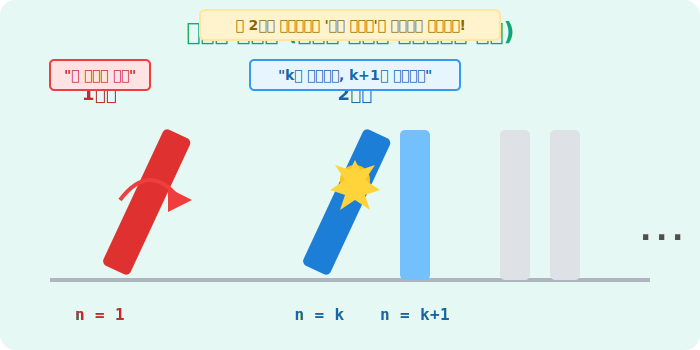

# 02. 두 번째 수업: 무한을 쓰러뜨리는 도미노 (Mathematical Induction)

페아노의 5공리 중 마지막, 가장 압도적인 스케일을 자랑하는 5번째 공리가 바로 **'수학적 귀납법의 원리(Mathematical Induction)'**입니다. 이는 단 두 번의 손짓만으로 우주 끝에 있는 무한대의 도미노를 한 방에 쓰러뜨리는 궁극의 마법입니다.

---

## 학습 목표
* 페아노의 5번째 공리인 수학적 귀납법의 논리적 구조를 도미노 비유를 통해 이해합니다.
* 무한한 자연수 범위에서 무언가를 "증명"할 때 почему 귀납법이 필수적인지 배웁니다.
* 파이썬의 **재귀 함수(Recursive Function)**를 이용하여 코딩 세계에 이 원리가 어떻게 쓰이는지 증명합니다.

## 1. 페아노의 궁극기: 공리 5 (귀납법의 원리)

"어떤 마법의 주문이 1번째 도미노에 통하고, 만약 $k$번째 도미노에 통했을 때 무조건 그 **다음($k'$번째)** 도미노에도 통한다는 사실이 확인되면, 그 마법은 세상 모든 도미노에 다 통한다."

<div align="center">
  
</div>


수학자들은 세상의 모든 자연수 1, 2, 3... 100억, 100조... 무한대 끝까지 어떤 성질이 진짜 맞는지 일일이 대입해서 확인해 볼 수가 없습니다. 그래서 단 두 단계의 논리 확인만으로 전체를 증명하는 기법을 만들었습니다.

* **1단계 (Base Case)**: $n = 1$ 일 때 성립하는가? (첫 번째 도미노를 밀었는가?)
* **2단계 (Inductive Step)**: $n = k$ 일 때 성립한다고 '가정'했을 때, $n = k+1$(다음 수)일 때도 성립하는가? (앞의 도미노가 무너지면, 무조건 뒤의 도미노를 때리도록 간격이 잘 맞춰져 있는가?)

이 두 가지만 통과하면 무한대의 증명은 끝납니다!

## 2. 귀납법 실전 증명 사례

유명한 홀수의 합 공식을 예로 들어볼까요?
$$1 + 3 + 5 + ... + (2n-1) = n^2$$
"1부터 홀수를 차례대로 더하면 무조건 제곱수가 된다"는 공식입니다. 진짜일까요?

> **[1단계: Base Case]**
> $n=1$ 이면, 좌변은 $1$, 우변은 $1^2 = 1$. (딩동댕! 첫 도미노가 쓰러졌습니다.)

> **[2단계: Inductive Step]**
> $n=k$ 일 때 쓰러졌다고 믿어봅시다.
> $1 + 3 + ... + (2k-1) = k^2$
>
> 그럼 그 '다음' 도미노인 $n = k+1$ 일 때도 통할까요? 좌변에 다음 번째 홀수인 $(2k+1)$을 더해봅시다.
> $(1 + 3 + ... + (2k-1)) + (2k+1)$
> $= k^2 + (2k+1)$  *(위의 가정을 이용)*
> $= (k+1)^2$
>
> 앗! 우변이 완벽하게 $(k+1)^2$ 의 형태가 되었습니다. 앞 도미노가 쓰러지니 뒷 도미노도 반드시 쓰러진다는 것이 증명된 셈입니다!

이 마법 같은 2단계 과정만으로, 이 공식은 $n=100$이든, $n=1,000,000$이든 절대 틀리지 않는 **우주의 진리**로 격상됩니다.

---

## 3. 파이썬과 컴퓨터 과학의 '재귀(Recursion)'

수학적 귀납법의 원리는 컴퓨터 과학에서 **재귀 함수(Recursive Function)**라는 이름으로 화려하게 부활합니다. 어떤 거대한 문제를 해결하기 위해, 그 문제와 구조는 똑같지만 크기만 한 단계($k$) 작은 문제로 쪼개어 해결하는 방식입니다.

홀수 덧셈의 진실을 파이썬 재귀 함수로 구현해 봅시다.

```python
# 파이썬 재귀 함수를 이용한 '수학적 귀납법' 시뮬레이션

def sum_of_odds(n):
    """
    1부터 n번째 홀수까지의 합을 반환하는 재귀 함수
    n번째 홀수는 2n-1 입니다.
    """
    
    # [1단계] Base Case : 첫 번째 도미노가 쓰러진다.
    if n == 1:
        return 1
        
    # [2단계] Inductive Step : (n번째 도미노 쓰러트리기)
    # n번째 홀수에다가 앞선 도미노(n-1번째까지)가 모두 쓰러진 결과를 더해준다!
    previous_sum = sum_of_odds(n - 1)  # 마법처럼 알아서 이전 합을 구해옵니다 (가정)
    current_odd_number = 2 * n - 1     # 현재 자신의 홀수 값
    
    return previous_sum + current_odd_number

# -----------------
# 공식 검증 (10번째 홀수까지 더하면 무조건 10의 제곱인 100이 나와야 함)
result = sum_of_odds(10)

print(f"재귀 함수 실행 결과: {result}")      # 출력: 100
print(f"공식(n^2) 예언 결과: {10**2}")       # 출력: 100

if result == 10**2:
    print("=> 수학적 귀납법에 의한 재귀 코딩 증명 완료!")
```

놀랍지 않나요? 우리는 $1$부터 $10$까지의 계산을 컴퓨터에게 일일이 시키지 않고, 단지 **"1일 때는 1이다"**와 **"이전 것에 지금 홀수를 더하라"**는 단 두 문장의 규칙만 입력했습니다. 하지만 귀납법의 연쇄 작용(도미노) 덕분에 컴퓨터가 알아서 결과를 찾아냈습니다.

## 학습 정리
1. **수학적 귀납법**: 첫 번째 사실이 참이고, $k$가 참일 때 $k+1$도 반드시 참이라는 것만 밝혀내면 전체 무한을 증명할 수 있는 페아노의 제5공리.
2. **도미노 비유**: 무한한 수열이나 식을 일일이 증명하지 않고 논리적 연쇄폭발만 일으키면 되는 증명 기법.
3. **재귀(Recursion)**: 수학적 귀납법의 논리가 코딩, 알고리즘 분야에 적용되어 자신의 이전 단계를 호출하며 복잡한 구조를 해결하는 핵심 기술이다.
