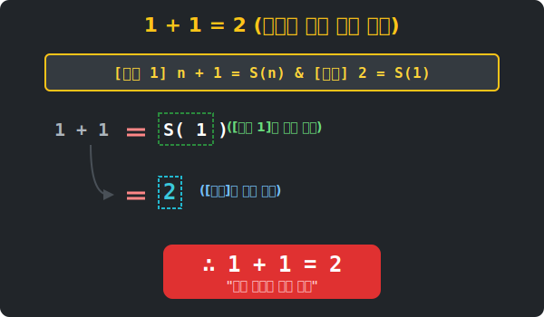

# 03. 세 번째 수업: 공리로 증명하는 1+1=2 (Addition Rules)

유치원생도 아는 "1 더하기 1은 2다"라는 대진리를 엄밀하게 증명하라고 하면 대부분 말문이 막힙니다. 우리는 그저 머리통에 사과 두 개를 번갈아 올리며 "외웠기 때문"입니다. 

하지만 앞서 페아노가 설계한 위대한 '자연수 설계도'를 이용하면, 덧셈의 원리와 교환·결합 법칙마저 단 하나의 허점 없이 수학적으로 증명할 수 있습니다! 

---

## 학습 목표
* "1+1=2"를 직관이 아닌 수학적 공리로 증명해 봅니다.
* 페아노 덧셈 정의와 파이썬 객체의 메서드를 통해 연산의 본질을 이해합니다.
* 무심코 썼던 교환법칙($A+B = B+A$)과 결합법칙의 논리 구조를 배웁니다.

## 1. 덧셈의 설계: 페아노가 세운 규칙

자연수가 '씨앗 1'과 '다음 수(Successor, $S$)'만으로 만들어진다는 것을 배웠습니다. 페아노는 **'덧셈( $+$ )'**이라는 연산을 다음과 같이 단 2개의 조항으로 박제했습니다.

* 임의의 수 $n$에 대하여:
1. **$n + 1 = S(n)$**
   > (해석: 어떤 수에 1을 더한다는 것은, 곧바로 그 수의 '다음 수' 상표를 붙이는 행위와 완벽히 똑같다.)
2. **$n + S(k) = S(n + k)$**
   > (해석: 우측 항의 '다음 수 꼬리표기'를 바깥으로 한 꺼풀 쏙 빼서 묶어버릴 수 있다!)

### [증명] 왜 1 + 1 = 2 인가?
너무나 명쾌합니다. 2라는 숫자는 애초에 1의 '다음 수' 즉, $S(1)$로 정의되었습니다.
위의 [1번 규칙]에서 $n=1$을 대입해 봅시다.
> $1 + 1 = S(1)$
> 그리고 $S(1)$의 이름표는 페아노 왕국에서 $2$ 이므로,
> $\therefore 1 + 1 = 2$

너무나 시시할 정도로 명확한 언어로 규명되었습니다. 
조금 더 가서 $2 + 2 = 4$ 도 증명해볼까요? ($4$의 정의는 $S(S(S(1)))$ 이자 $S(3)$ 입니다)

<div align="center">
  
</div>


> $2 + 2$
> $= 2 + S(1)$   *(2의 정의는 $S(1)$)*
> $= S(2 + 1)$   *(위의 [2번 규칙]에 의해 꼬리표 빼기)*
> $= S(S(2))$    *(위의 [1번 규칙] 적용)*
> $= S(3)$       *(2의 다음수는 3)*
> $= 4$          *(3의 다음수는 4)*

## 2. 덧셈의 절대 법칙: 교환과 결합

이렇게 아주 철저하고 숨막히는 페아노의 공리를 5번 귀납법(도미노)과 결합하면, 놀랍게도 어릴 때부터 외워왔던 덧셈의 법칙들이 쫙 풀리게 됩니다. (과정은 길고 엄밀하므로 요약만 하겠습니다.)

1. **교환법칙 (Commutative Law)**
   - 내용: $a + b = b + a$
   - 의미: $2+3$ 이나 $3+2$ 나 결국 도달하는 궁극의 '다음 수' 단계는 똑같다는 것이 입증됩니다. 순서가 중요하지 않은 대칭성의 승리입니다.

2. **결합법칙 (Associative Law)**
   - 내용: $(a + b) + c = a + (b + c)$
   - 의미: 여러 숫자를 더할 때, 괄호를 어떻게 치든 결국 꼬리표 빼기 작업을 똑같은 횟수로 수행하게 되므로 최종 목적지(값)는 변하지 않습니다.

이 두 법칙 덕분에 수십 개의 영수증을 모두 더할 때, 우리 마음대로 순서를 뒤바꾸거나 묶어서 계산(코딩)해도 절대 오류가 나지 않는 것입니다!

---

## 3. 파이썬으로 경험하는 '진짜' 덧셈의 해부

첫 장에서 만든 아무 숫자(int)도 없는 순수 객체 세계를 기억하시나요? 거기에 이 페아노의 '덧셈' 능력을 파이썬 코드로 장착해 보겠습니다.

```python
# 파이썬으로 증명하는 '1+1=2'의 원리

class PeanoNumber:
    def __init__(self, previous=None):
        self.previous = previous

    def next(self):
        return PeanoNumber(self)

    # ---------------------------------------------
    # 대망의 '더하기(+)' 능력을 주입합니다!
    # 페아노의 천재적인 덧셈 공리 1번, 2번을 코드로 번역했습니다.
    # ---------------------------------------------
    def add(self, m_obj):
        # [공리 1] m이 만약 '1'이라면? 
        if m_obj.previous is None:  
            return self.next()  # 이 수(self)의 다음 수를 바로 뱉어낸다. 

        # [공리 2] m이 1이 아니라 누군가의 '다음 수'라면? (재귀 호출)
        # n + m = n + S(k) 형태일 경우 -> 바깥에서 전체를 S()로 감싸기
        # 즉, (n + m.previous).next() 와 같습니다!
        return self.add(m_obj.previous).next()

    def to_modern_int(self):
        if self.previous is None:
            return 1
        return 1 + self.previous.to_modern_int()

# -----------------
# 실험 1: 1 + 1 = 2 창조하기
one1 = PeanoNumber()
one2 = PeanoNumber()

# one1 객체에 one2 객체를 흡수(add)시킵니다.
two = one1.add(one2)
print(f"페아노 1 + 1 = {two.to_modern_int()}") # 출력: 2

# 실험 2: 2 + 3 = 5 창조하기
two_obj = PeanoNumber().next()
three_obj = PeanoNumber().next().next()

five = two_obj.add(three_obj)
print(f"페아노 2 + 3 = {five.to_modern_int()}") # 출력: 5
```

보이시나요? `add()` 메서드 안에는 $+$ 기호나 숫자가 없습니다. 오직 **`.next()`** 상표를 바깥으로 빼내어 붙이는 작업만 재귀적으로 반복할 뿐입니다. 컴퓨터는 오로지 페아노의 논리만을 따라 덧셈을 수행해 낸 것입니다.

## 학습 정리
1. **페아노의 덧셈**: 직관이 아닌 단 두 개의 치밀한 규칙만으로 덧셈의 결과를 무한대로 끌어내는 구조다.
2. **교환/결합 법칙**: 우리가 일상에서 마음대로 덧셈 순서를 바꾸는 것도, 사실은 페아노 공리와 도미노(귀납법) 증명 덕분에 안심하고 쓸 수 있는 권리이다.
3. 파이썬 내장 기능 없이 순수 재귀 규칙만으로 덧셈(`add`)을 구현해 봄으로써, 복잡해 보이는 연산도 기초 논리의 반복에 불과하다는 것을 증명했다.
