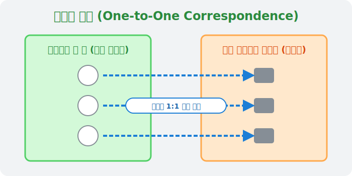

# 04. 네 번째 수업: 뼛조각에 새겨진 인류 최초의 숫자 (Origin of Numbers)

지금까지는 똑똑한 학자들이 세워놓은 아주 엄격하고 차가운 논리 기계 같은 수학을 보았습니다. 하지만 시계를 수만 년 전으로 돌려보면, 숫자는 수학자의 책상이 아니라 **원시인들의 동굴과 사냥터**에서 태어났습니다.

숫자라는 기호도, 글자도 없던 시절... 인간은 어떻게 자신의 재산(양이나 동물)을 헷갈리지 않고 세었을까요?

---

## 학습 목표
* 1960년에 발견된 '이상고 뼈(Ishango bone)'의 역사적 의의를 알아봅니다.
* 인류가 숫자를 세기 시작한 최초의 본능, **'일대일 대응(One-to-One Correspondence)'** 개념을 배웁니다.
* 데이터베이스(DB)에서 고유 값을 매핑하는 방식과 원시인의 셈법을 연결합니다.

## 1. 숫자 없이 숫자를 세는 법: 일대일 대응 

옛날 옛적, 목동이 양 백 마리를 키우고 있었습니다. 아침에 들판에 풀어놓고, 저녁에 다시 동굴로 데려와야 합니다. 늑대에게 잡혀먹힌 양이 없는지 알려면 어떻게 해야 할까요? 1, 2, 3 이라는 말이나 글자가 없으니 셀 수가 없습니다!

목동이 생각해 낸 기발한 방법은 이러했습니다. 막대기나 가죽 주머니를 준비하고, **아침에 양이 한 마리씩 동굴 밖으로 나갈 때마다 주머니에 조약돌을 하나씩 넣는 것**입니다.

  

저녁이 되어 양이 다시 들어오면 주머니에서 돌을 하나씩 뺍니다. 만약 양이 다 들어왔는데도 주머니에 돌이 두 개 남아 있다면? 당장 횃불을 들고 잃어버린 양 2마리를 찾으러 나가야겠죠.

이처럼 내가 세고 싶은 집단(양 떼)과, 다른 비교 수단(조약돌 집단)의 구성원 한 명씩을 서로 짝지어 연결하는 행위를 수학에서는 **'일대일 대응(One-to-One Correspondence)'** 이라고 부릅니다. 

컴퓨터 과학에서 양쪽의 데이터 개수가 정확히 일치하는지, 혹은 특정 주민등록번호(Key)와 사람 이름(Value)이 정확히 하나씩 엮여 있는지 확인하는 **해시 함수(Hash Function)**나 딕셔너리(Dictionary) 구조가 바로 이 본능에서 진화한 것입니다.

## 2. 이상고 뼈(Ishango bone), 2만 년 전의 엑셀(Excel)

1960년, 아프리카 콩고에서 발굴된 이상고 뼈는 고고학계와 수학계를 흥분시켰습니다. 약 2만 년 전 구석기 시대에 쓰였던 것으로 추정되는 이 동물 뼈에는 정체불명의 선들이 일정하게 그어져 있었습니다. 

처음엔 그냥 디자인인 줄 알았으나, 자세히 분석해 본 학자들은 기절할 뻔했습니다. 그 선들은 일대일 대응으로 무언가(아마도 짐승의 수나 달의 모양 변화)를 세어 놓은 완벽한 **'원시 데이터베이스 기록'**이었고, 심지어 덧셈과 곱셈, 소수(Prime numbers)에 대한 초기 개념식 배열까지 보였기 때문입니다.

즉, 숫자를 소리 내어 말하거나 "3"이라는 아라비아 숫자를 쓰기 까마득히 오래전부터, 인간의 DNA와 생활 속에는 수의 패턴을 읽어내고 기록하려는 데이터 공학자의 본능이 흐르고 있었습니다.

## 3. 손가락, 가장 완벽한 휴대용 계산기

인간이 처음으로 사용한 가장 확실한 조약돌은 무엇일까요? 바로 항상 몸에 달고 다니는 두 손의 **손가락 10개**입니다. 
양 한 마리에 손가락 하나를 꼽습니다. 10마리가 지나면 손가락이 모자랍니다. 그때, 땅바닥에 선을 하나 그어서 "손가락 10개짜리 그룹 1개"를 기록하고, 다시 손가락을 폅니다.

이것이 인류 역사의 거의 모든 문명(이집트, 로마, 중국 등)이 하나같이 아주 자연스럽게 숫자 10을 기준으로 단위가 넘어가는 **10진법(Decimal system)**을 기본으로 채택하게 된 이유입니다. (만약 심슨 가족처럼 인류의 손가락이 8개였다면, 우리 모두는 컴퓨터처럼 8진법을 쓰고 있었을지도 모르죠!)

## 학습 정리
1. **일대일 대응**: 두 집합의 요소를 하나씩 짝지어서 굳이 숫자를 세지 않고도 개수가 같은지 다른지 판별하는 행위.
2. **이상고 뼈**: 인류가 자연발생적으로 수를 인식하고 데이터(눈금)를 기록으로 보존했다는 증거.
3. **10진법의 탄생**: 인체에 기본 탑재된 10개의 손가락을 일대일 대응의 도구로 빈번히 사용하다 보니, 10단위로 묶어 세는 것이 전 세계 문명의 기본 표준이 되었다.
