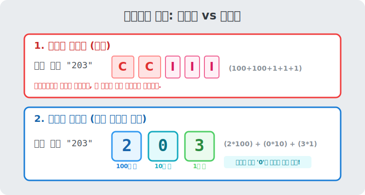

# 05. 다섯 번째 수업: 기호의 진화와 위치적 기수법 (History of Numerals)

뼛조각에 새겨진 단순한 빗금(///)에서 출발한 인간은 문명이 복잡해짐에 따라 거래 규모가 커졌습니다. 이제 조약돌과 손가락만으로는 부족했고, 수만 또는 수억 단위의 별이 움직이는 하늘을 계산해야 했습니다.

'글자(숫자 기호)'는 어떻게 폭발적으로 진화했을까요? 왜 로마 숫자는 덧셈용으로 멸망했고, 우리는 아라비아 숫자를 쓰게 되었을까요?

---

## 학습 목표
* 고대의 덧셈적 기수법(이집트, 로마)의 한계를 이해합니다.
* 인류 최고의 발명 중 하나인 인도의 '0'과 **위치적 기수법(Positional System)**의 혁명을 비교합니다.
* 기호의 진화가 어떻게 오늘날 컴퓨터의 데이터 최적화(메모리 낭비 감소)와 맞닿아 있는지 살펴봅니다.

## 1. 기호의 반복, 무식한 덧셈적 기수법

고대 이집트인들은 큰 수를 쓰기 위해 수많은 상형 우표(그림)를 동원했습니다.
* 1 은 단순한 짝대기 모양 
* 10은 발뒤꿈치 모양 
* 100은 둘둘 만 밧줄 모양 
* 100만은 너무 많아서 깜짝 놀라 두 팔을 번쩍 든 사람 모양

이 방식은 치명적인 단점이 있습니다. **$999$를 쓰려면 기호를 총 $27$개(100짜리 9개 + 10짜리 9개 + 1짜리 9개)나 그려야 합니다!** 

이를 **'덧셈적 기수법'**이라고 합니다. 기호들이 쓰여 있는 위치나 순서와 아무 상관 없이, 그냥 그려진 기호 값들의 합산을 몽땅 더하는 체계입니다. 로마 시대에 쓰던 $\text{X}$ (10), $\text{V}$ (5), $\text{I}$ (1) 도 비슷한 원리입니다. 영수증을 쓰거나 건축 설계를 할 때 이딴 식이면 장부가 남아나질 않겠죠. 데이터 저장 효율성(Compression Ratio)이 그야말로 최악이었습니다.

## 2. 혁명: '자리수'가 값이 되는 위치적 기수법

수학 역사상 불을 발견한 것에 버금가는 정보 혁명은 인도에서 터졌습니다. (비록 유럽으로 전파한 것은 아라비아 상인들이라 '인도-아라비아 숫자'로 불리지만요.)
인도인들은 단 10개의 심플한 기호($1, 2, 3, 4, 5, 6, 7, 8, 9$, 그리고 대망의 **$0$**)만으로 세상에 존재하는 모든 크기의 수를 표현해 냈습니다. 

비밀은 **[기호가 놓인 위치(자리)가 크기를 결정한다(Positions define magnitudes)]**는 규칙이었습니다!

> 같은 숫자 '3' 이라도 
> 뒤에 있으면 **3** (일의 자리)
> 가운데 있으면 **3**0 (십의 자리)
> 맨 앞에 있으면 **3**00 (백의 자리)

이것이 파이썬의 리스트(List) 인덱스 구조와 똑같은 **'위치적 기수법'**입니다. 첫 번째 방, 두 번째 방에 똑같은 숫자 3을 넣어도 그 가치가 $10^0$배, $10^1$배, $10^2$배로 치솟는 시스템이죠! 

이로 인해 두 가지 엄청난 일이 벌어졌습니다.
1. 아무리 큰 숫자라도 기호 딱 몇 개만 연달아 적으면 끝납니다. (데이터 압축률 극대화)
2. 드디어 **종이 위에서 암산 없이 '사칙연산(세로 덧셈, 긴 나눗셈)' 절차(Algorithm)가 구동 가능**해졌습니다!

  

## 3. 영웅 '0(Zero)'의 빈자리 보호 효과

혹시 103이라는 숫자를 써야 하는데 기호가 부족해서 십의 자리가 빈다면 어떡할까요? 과거 문명에는 빈 공간을 표현할 기호가 없어서 $1 \quad 3$ 이라고 띄어 썼습니다. 하지만 누가 대충 뭉뚱그려 읽으면 $13$(십삼)이 될지 $1003$(천삼)이 될지 대혼란이었습니다.

그래서 무의 공간인 '비어있음(Empty, Null)'을 선언하는 위대한 표지판 **$0$** 이 발명되었습니다. 컴퓨터 용어로 치면 쓰레기 값이나 오작동이 들어가지 않도록 `Null` 또는 공간 할당(Placeholder) 선언자를 명시적으로 박아 넣은 것과 같습니다. $0$이 발명되면서부터 위치적 기수법은 완벽한 톱니바퀴를 맞추어 돌아가게 되었습니다.

## 학습 정리
1. **덧셈적 기수법 (이집트/로마)**: 자리와 무관하게 모든 글자의 값을 더하는 방식. 긴 식을 쓰거나 복잡한 연산을 설계할 때 극악의 효율을 띤다.
2. **위치적 기수법 (인도-아라비아)**: 같은 기호라도 십의 자리, 백의 자리에 놓이느냐에 따라 그 가중치값이 폭발적으로 달라지는 혁명 시스템.
3. 숫자를 표현하는 기술은 결국, 방대한 **현실의 '양(Quantity)'을 한정된 종이나 컴퓨터 메모리에 얼마나 효율적으로 압축해서 저장할 것인가**를 다루는 데이터 인코딩 공학과 같다.
