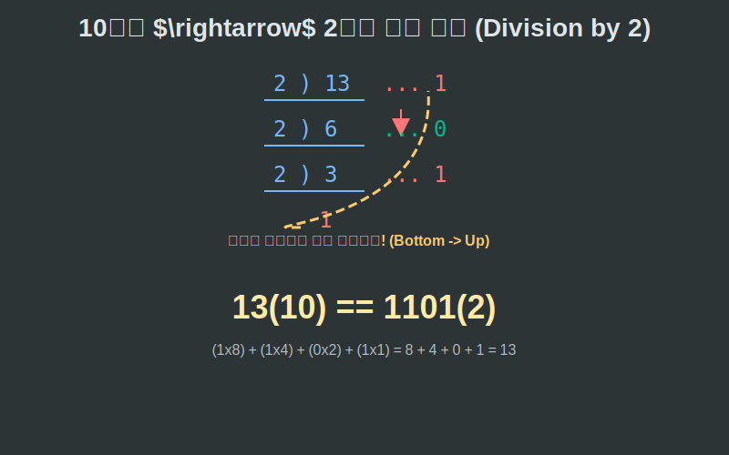

# 04. 네 번째 수업: 진법의 변환과 컴퓨터의 언어

어떤 우주인이 10진법을 모른다면 어떻게 소통해야 할까요? 우리는 10개가 찰 때마다 새로운 상자로 넘어가는 $10$진법(Decimal) 계산기를 쓰지만, 컴퓨터는 전기가 켜지거나($1$), 꺼지는($0$) 단 두 가지 상태밖에 감지하지 못하기 때문에 무조건 꽉 찬 묶음 기준이 $2$개인 **2진법(Binary)** 계산기를 씁니다.

---

## 학습 목표
* 몫과 아버지를 계속해서 나누어 나머지 찌꺼기들만 거꾸로 주워담는 10진수를 2진수로 바꾸는 '폭포수 나눗셈' 원리를 터득합니다.
* 파이썬의 강력한 내장 진법 변환함수 `bin()`, `hex()` 와, 거꾸로 읽어 들이는 `int(string, base)` 클래스 캐스팅의 렌더링 과정을 이해합니다.

## 1. 10진수 13을 2진수로 변환하는 폭포수 작전

10진수 13을 2진법으로 바꾸려면 어떻게 해야 할까요? 2진법은 "2개가 모일 때마다 윗단 자릿수 묶음으로 배달을 보내버리는" 시스템입니다.

<div align="center">
  
</div>

1. $13 \div 2$ : 몫은 $6$묶음이 윗단위로 배달되고, 혼자 남은 버려진 **찌꺼기(나머지)는 `1`**.
2. 윗선 배달받은 $6$묶음 $\div 2$ : 몫은 다시 $3$묶음이 더 윗단위로 넘어가고, 남은 **찌꺼기는 `0`**.
3. 윗선 배달받은 $3 \div 2$ : 몫 $1$묶음은 최상위로 넘어가고, 남은 **찌꺼기는 `1`**.
4. 최상단 보스 $1$은 $2$보다 작으니 그대로 내려온다. 남은 **마지막 왕 찌꺼기 `1`**.

바닥에 남아있는 이 찌꺼기들 잔해를 '마지막에 떨어진 놈부터 거꾸로' 주워 담아 읽어올리면 완벽한 $2$진수 **$1101_{(2)}$** 가 완성됩니다! $(8 + 4 + 0 + 1 = 13)$

## 2. Python 메모리 공장: 진법 직통 번역기

프로그래머들이 이 지루한 나눗셈 폭포수를 종이에 직접 하고 있을까요? 
아닙니다! 파이썬은 C언어 시절부터 내려온 가장 막강하고 직관적인 $2$진법(`bin()`), $8$진법(`oct()`), $16$진법(`hex()`) 내장 스캐너를 이미 탑재하고 있습니다.

<div align="center">
  
</div>

```python
# 파이썬으로 가동하는 우주 통신 진법 변환기

human_decimal_number = 255

print(f"🌍 지구인의 숫자: {human_decimal_number}")

# 1. 외계인(컴퓨터)을 위한 2진법 (Binary) 통역기
# bin() 함수는 숫자를 2진수 텍스트로 즉시 번역합니다.
# 앞에 붙는 '0b'는 "이 뒤부터는 10진법이 아니라 바이너리(0과 1)입니다!"라는 꼬리표 신호입니다.
alien_binary = bin(human_decimal_number)
print(f"👾 컴퓨터 바이너리 번역: {alien_binary}")  # 출력: 0b11111111

# 2. 웹 디자이너를 위한 16진법 (Hexadecimal) 색상 통역기
# hex() 함수는 16진법으로 번역합니다.
# 16진법은 자릿수가 모자라 10=a, 11=b, 15=f 라는 알파벳 기호를 섞어 씁니다!
hacker_hex = hex(human_decimal_number)
print(f"💻 해커와 포토샵 번역: {hacker_hex}")     # 출력: 0xff


# 3. 반대로, 컴퓨터가 보내온 이진수 신호를 인간의 10진수로 복원하기
# int("문자열", 진법베이스) 를 쓰면 파이썬이 거꾸로 계산을 수행합니다.
alien_signal = "10101"

# "이 문자열은 사실 2진법 통신문이니까 10진수로 해석해라!"
restored_signal = int(alien_signal, 2)
print("="*40)
print(f"📡 수신된 외계 신호 [10101]을 지구 숫자 10진법 복원 완료 -> {restored_signal}")
# (16 + 0 + 4 + 0 + 1) = 21 
```

컴퓨터 메모리는 이 거대한 `1111000101` 같은 비트(Bit)의 강물입니다. 인간이 Python에 $255$라고 `print`를 치면, 뒤로는 파이썬 엔진이 순식간에 `bin()` 변환을 걸어 램(RAM)의 반도체 스위치 $8$개를 `11111111` (On, On, On...) 전구 켜듯 불을 밝히며 우주적 계산을 수행하는 무결점 이중 통역 파이프라인인 것입니다.

## 학습 정리
1. **나눗셈 찌꺼기 압축 (2진법 변환)**: 10진수를 `Base` 숫자로 나눌 수 없을 때까지 계속 나누며, 떨어져 나온 나머지(찌꺼기)들을 맨 마지막부터 역순으로 주워 담으면 완벽한 진법 변환이 이루어진다.
2. **`0b`와 `0x` 접두사**: 숫자 앞에 붙는 `0b`(Binary)는 컴퓨터 코어 2진법 시스템 신호이며, `0x`(Hex)는 메모리 주소나 RGB 컬러(FFFFFF)를 묘사할 때 인간이 2진법을 좀 짧게 읽으려고 만든 16진법 압축 패치이다.
3. 파이썬의 **`int(string, 2)`** 함수는 사용자가 외눈박이 진법 통신문을 문자형(`string`)으로 던져주면, 그것의 각 자리(위치적 가중치 폭발력)를 계산해 인간이 스크린으로 편하게 읽는 10진수로 재결합 렌더링 해내는 역분해 엔진이다.
