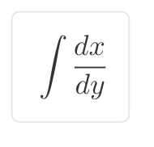



## 라이프니츠를 소개합니다
### Gottfried Wilhelm Leibniz(1646~1716)

나는 평화롭게 사는 것을 꿈꾸는
철학자이자 수학자, 여행가, 정치가입니다.

나는 2진법을 고안하여
오늘날 컴퓨터 발전의 기초를 다졌어요.

"0과 1만으로 이 세상을 설명한다"
멋지지 않나요?

*(그림: 적분 기호가 적힌 종이를 들고 뛰어가는 라이프니츠의 모습)*

