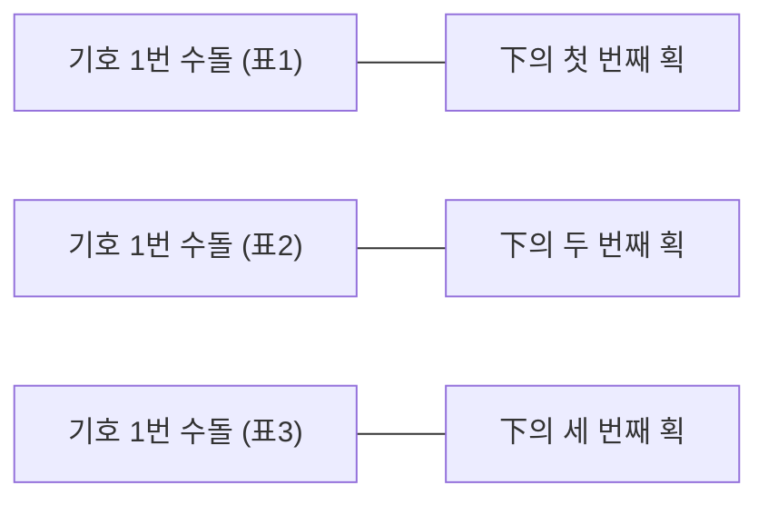
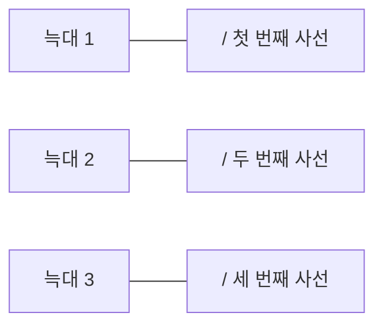

예. 조금 전의 회장 선거를 생각해 보세요. 수돌이 표가 하나 나올 때마다 칠판의 수돌이 이름 밑에 획을 하나 긋죠. 두 번째 표가 나오면 또 획 하나를 긋습니다. 표 하나와 획 하나가 일대일 대응되고 있는 거예요. 개표가 모두 끝나면 수돌이의 득표수는 칠판에 표시된 획의 수로 알 수 있죠. 즉 수돌이가 받은 표의 집합과 칠판에 그은 正자의 획의 집합 사이에 일대일 대응 관계가 성립한 거랍니다.

**[기호 1번 후보가 얻은 표]** .............. **[칠판에 그어진 획]**

원시 부족이 자신들이 잡은 늑대의 수를 세면서 동굴 벽 등에 눈금을 긋는 것도 잡은 늑대의 집합과 동굴 벽 눈금 집합의 원소 사이에 일대일 대응 관계를 만든 거예요.

**[늑대의 집합]** ........................ **[동굴 벽 사선의 집합]**
