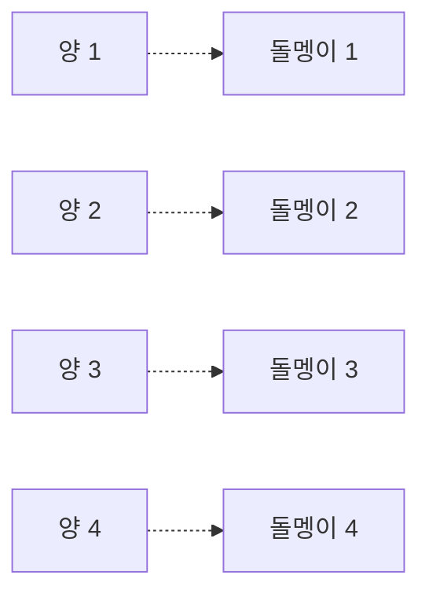

*(만화)*
- **소년 A**: "네가 키우는 양은 모두 몇 마리니? (돌멩이를 내밀며) 이만큼이야."
- **소년 B**: "와! 많은데.... 난 (돌멩이를 만지작거리며) 이만큼인데. 누가 더 많은 거지?"
- **소년 A**: "하나씩 대응시켜 보자!"
- **소년 B**: "그래, 나중에 돌멩이가 남는 사람이 더 많은 거야!"

이 이야기는 문헌상에 셈의 방법으로써 일대일 대응 개념이 나타난 최초의 기록입니다.

**[양의 집합]** ...................................... **[돌멩이의 집합]**
