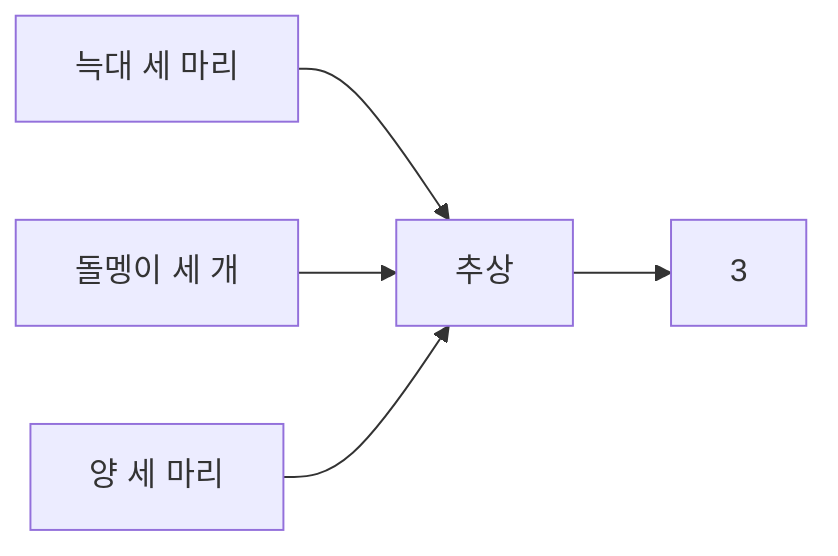

람이 수를 세는 것에는 중요한 차이점이 있답니다. 조금 전에 '추상'에 대해서 얘기했었죠. 동물들은 자신의 알이 세 개에서 두 개로 바뀐 사실은 알아도, 알이 세 개인 것과 둥지 옆의 나무 세 그루가 같은 '3'이라는 사실을 알 수 없어요. 인류가 음식물 등의 표시를 위해서 긁어서 표기하거나 돌멩이를 모았으며, 그것들을 말하기 위해서 소리를 냈다고 했죠? 물체들의 집합 각각을 세기 위해 각기 다른 소리를 사용하다가, 즉 세 마리의 늑대와 세 마리의 양을 세기 위해서 다른 소리를 내다가 그것들에서 '3'이라는 공통성질을 '추상' 해 낸 것을 비로소 인류가 수, 수학을 시작했다는 것을 의미하는 거랍니다.

아마도 우리가 사용하고 있는 수의 이름은 어떤 구체적인 물체
