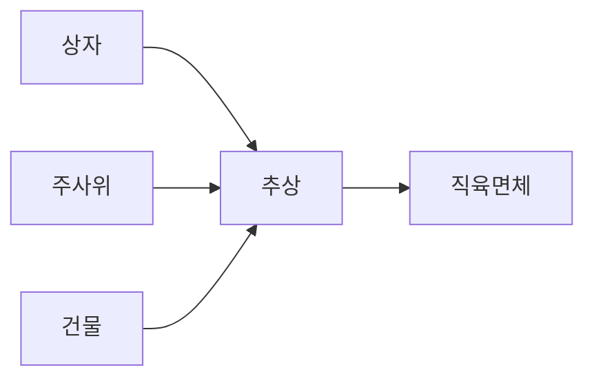

어 상자, 주사위, 건물은 각기 다른 물체들이죠. 이들에게서 공통된 성질만을 생각하면 직육면체의 개념을 얻게 됩니다. 즉 구체적인 물체에서 직육면체라는 추상화가 이루어진 겁니다.

> **직육면체**
> 각 면이 직사각형인 평행육면체로, 직육면체의 마주 대하는 3쌍의 면은 평행이고 합동이다.

원시 시대의 모습을 알아볼 때에는 문명사회와 접촉이 덜 된 부족들의 언어를 살펴보는 것이 도움이 됩니다. 물체의 집합을 가리키는 말이 그 수를 가리키는 말로 발전한 흔적이 보이는 예는 여러 가지가 있답니다. 말레이시아에서는 수 1, 2, 3을 '한 개의 돌, 두 개의 돌, 세 개의 돌'이라고 하고, 자바에서는 '한 알의 곡식, 두 알의 곡식, 세 알의 곡식'이라고 한다네요.

**수돌이가 신나서 말했습니다.**
