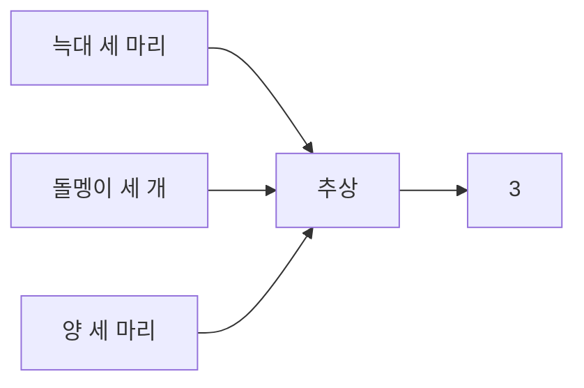

**첫 번째 수업 정리**

1. **기수법**이란 수를 적는 방법을 말합니다.

2. **tally(탤리)**란 원시 시대 사람들이 수를 세기 위해 벽이나 동물의 뼈, 나무막대에 그어서 표시한 것을 말합니다. 현대에도 이런 탤리의 흔적을 여러 곳에서 찾아볼 수 있습니다.

3. 각각의 수를 표현하기 위해서 물체들을 이용했는데, 손가락을 이용한 원시 부족이 많았습니다.

4. 인류가 수를 **추상**해 낸 것이 수학의 시작이라고 할 수 있습니다. 세 마리의 늑대와 세 마리의 양은 각기 다른 집합이지만, '3'이라는 그들의 공통 성질을 추상할 수 있습니다.

