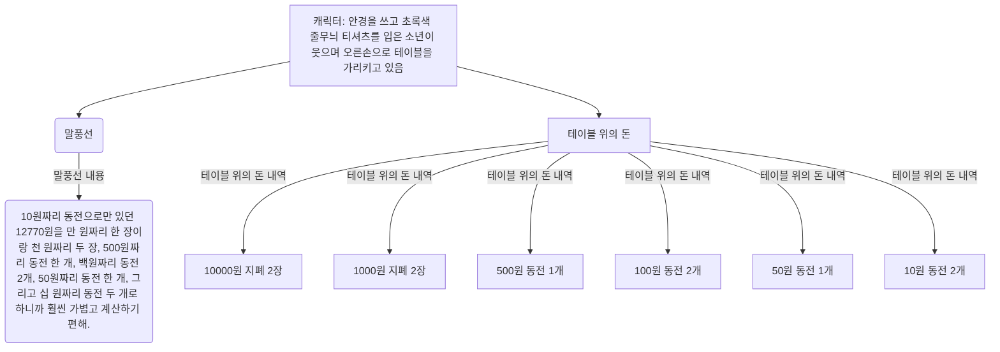

정리하면,

12770원

$ = 10000원 \times 1장 + 2770원 $
$ = 10000원 \times 1장 + 1000원 \times 2장 + 770원 $
$ = 10000원 \times 1장 + 1000원 \times 2장 + 500원 \times 1개 + 270원 $
$ = 10000원 \times 1장 + 1000원 \times 2장 + 500원 \times 1개 + 100원 \times 2개 + 70원 $
$ = 10000원 \times 1장 + 1000원 \times 2장 + 500원 \times 1개 + 100원 \times 2개 + 50원 \times 1개 + 10원 \times 2개 $

이제 수돌이는 10원짜리 동전 1277개 대신, 만 원짜리 지폐 두 장, 1000원짜리 지폐 두 장, 500원짜리 동전 한 개, 100원짜리

두 번째 수업