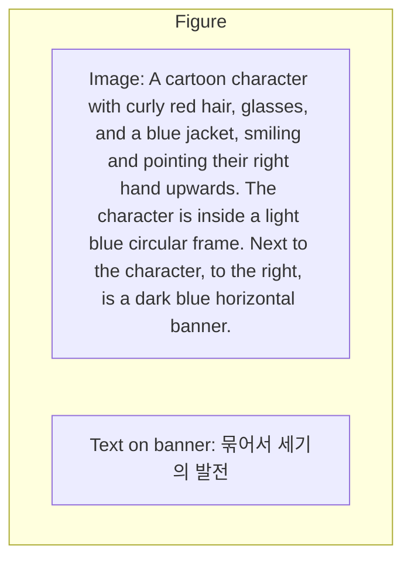

동전 두 개, 50원짜리 동전 한 개, 10원짜리 동전 두 개를 갖게
되었습니다.

내 돈이 제대로 있는지 확인하기 위해서 매번 10원짜리 동전
1277개를 세는 것보다 단위가 다른 돈으로 갖고 있는 것이 세기
쉽고, 갖고 있기 편하다는 것을 알겠나요?

기수법도 마찬가지예요. 앞에서 '묶어서 세기'가 기수법의 기
본이라고 했지요? 앞의 과정이 여러분 부족의 숫자를 만드는 데
에 도움이 되었으면 좋겠네요. 자, 이제 시간을 줄 테니 본격적으
로 자신만의 숫자를 만들어 보세요.

고민하는 아이들……, 괴로워하는 수돌……, 어느 정도의 시간이
흘렀습니다.

자, 모두들 숫자를 만든 것 같네요. 누가 먼저 발표해 볼까요?

라이프니츠가 들려주는 기수법 이야기