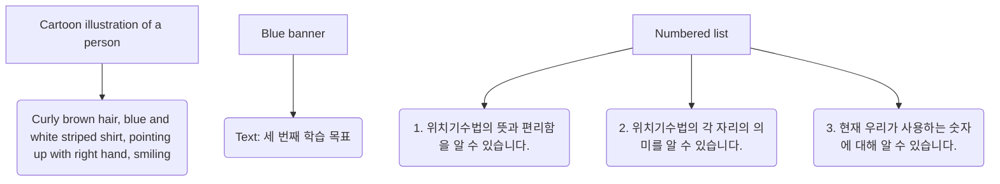

```mermaid
graph TD
    A[Cartoon illustration of a person] --> B(Curly brown hair, blue and white striped shirt, pointing up with right hand, smiling);
    C[Blue banner] --> D(Text: 세 번째 학습 목표);
    E[Numbered list] --> F1(1. 위치기수법의 뜻과 편리함을 알 수 있습니다.);
    E --> F2(2. 위치기수법의 각 자리의 의미를 알 수 있습니다.);
    E --> F3(3. 현재 우리가 사용하는 숫자에 대해 알 수 있습니다.);
```

---

**세 번째 학습 목표**

1. 위치기수법의 뜻과 편리함을 알 수 있습니다.
2. 위치기수법의 각 자리의 의미를 알 수 있습니다.
3. 현재 우리가 사용하는 숫자에 대해 알 수 있습니다.