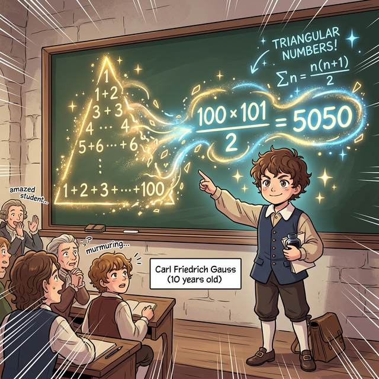

# 01. 첫 번째 수업: 삼각수와 가우스 (Triangular Numbers)

"여러분, 자리에 앉아서 1부터 100까지의 숫자를 전부 더해보세요."
선생님의 이 끔찍한 막노동 지시에 반 아이들은 모두 인상을 구기며 종이에 숫자를 써 내려가기 시작했습니다.
그러나 겨우 10살짜리 꼬마였던 **가우스(Gauss)**는 단 5초 만에 칠판 앞으로 걸어가 정답을 툭 던졌습니다.

**"5,050입니다."** 
선생님은 황당하다는 듯이 아이를 쳐다보았습니다.

---

## 학습 목표
* 삼각수(Triangular Number)의 규칙적인 배열과 덧셈의 원리를 이해합니다.
* 가우스가 양 끝의 숫자를 더해 $101$이라는 일정한 합의 규칙을 찾아낸 $n(n+1)/2$ 공식을 도출합니다.
* 파이썬의 `for` 반복문(Loop)과 `sum(range())` 기능으로 가우스의 수학 연산을 컴퓨터로 검증합니다.

## 1. 꼬마 가우스의 등차수열 마법

가우스는 바보처럼 $1+2+3...$ 을 순서대로 더하지 않았습니다. 그는 숫자 배열 전체의 **양 끝**을 동시에 쳐다보았습니다.

* 맨 처음 숫자 $1$과 맨 마지막 숫자 $100$을 더하면 $\rightarrow 101$
* 그다음 숫자 $2$와 $99$를 더하면 $\rightarrow 101$
* 그 안쪽 숫자 $3$과 $98$을 더해도 $\rightarrow 101$

이렇게 계속 짝을 지어 나가면, 합이 $101$인 콤보가 정확히 **50쌍**(절반 쌍)이 나오게 됩니다.
따라서, $101 \times 50 = \mathbf{5,050}$ 이라는 답을 머릿속에서 5초 만에 박살 내버린 것입니다.
이것이 훗날 고등학교 과정에서 배우게 될 **'등차수열의 합'**을 구하는 위대한 공식입니다.

<div align="center">
  
</div>

<div align="center">
  
</div>

## 2. 삼각형으로 숫자를 쌓기 (삼각수)

이 거대한 덧셈의 나열은 사실 기하학적으로 **'삼각형 무더기'**를 그리는 것과 완벽히 똑같습니다.

1. 첫 번째 삼각수: 점 1개 찍기 ($1$)
2. 두 번째 삼각수: 아래에 점 2개 추가 ($1+2 = 3$) 
3. 세 번째 삼각수: 아래에 점 3개 추가 ($1+2+3 = 6$)
... 
100번째 삼각수: ($1+2+3+...+100 = 5,050$)

이처럼 공을 삼각형 꼴로 차곡차곡 쌓아 올렸을 때의 전체 공의 개수를 우리는 **삼각수(Triangular Number)**라고 부릅니다. 이 삼각수를 구하는 공식은 가우스가 깨달았던 $n$번 째 바닥 숫자와 그 앞 숫자의 배열 원리를 통해 $N \times (N+1) / 2$ 라는 아름다운 대수학 기호로 정립되었습니다.

## 3. Python의 연산 속도: 무식한 Loop와 우아한 수식

가우스가 100까지 더하는 데 5초가 걸렸다면, 인공지능 파이썬은 $1$부터 $100만$까지 더하는 데 $0.0001초$도 걸리지 않습니다. 컴퓨터에게는 3가지 방식의 $덧셈$ 전략이 존재합니다.

```python
# 방법 1. 파이썬의 가장 무식하고 정직한 노동 (for Loop 반복문)
total = 0
for i in range(1, 101):  # 1부터 100까지 차례대로 꺼내기
    total += i           # 기존 값에 계속해서 더하기 (누적)
print(f"1. 거북이처럼 더한 값: {total}") 


# 방법 2. 파이썬의 내장 집합 연산자 (sum 활용)
numbers_list = range(1, 101) # 1부터 100까지의 배열 리스트 생성
fast_total = sum(numbers_list)
print(f"2. 한 큐에 합쳐버린 값: {fast_total}")


# 방법 3. 10살짜리 가우스의 우아한 수학 방정식 (등차수열의 합)
# n * (n + 1) / 2
n = 100
gauss_formula = (n * (n + 1)) // 2 
print(f"3. 가우스의 마법 공식: {gauss_formula}")

if total == gauss_formula:
    print("증명 완료: 파이썬 루프 연산과 가우스의 천재적 방정식의 결과는 동일합니다!")
```

어떤 방식을 쓰든 컴퓨터 모니터에는 $5050$이 뜹니다.
하지만 숫자가 백만이 아니라 **우주 끝($100억$)**까지 갔을 때, $1번$ 더하기를 100억 번 시도하는 컴퓨터(Loop)는 메모리가 터지거나 며칠이 걸립니다. 반면 $3번$ **가우스의 방정식**은 단 2번의 곱셈과 나눗셈으로 단 $0.1초$ 만에 우주 끝의 숫자를 연산해 냅니다.

이것이 단순한 코딩(노동)을 넘어, 수학 공식(알고리즘 최적화)을 배워야 하는 궁극의 이유입니다.

## 학습 정리
1. **삼각수**: 1부터 시작하여 자연수를 차례대로 더해 만들어지는 수열 (예: $1, 3, 6, 10, 15...$)로, 점을 찍었을 때 정삼각형 모양으로 쌓아 올릴 수 있다.
2. 1부터 $n$까지 더하는 등차수열의 합 (가우스의 덧셈) 공식: $\cfrac{n(n+1)}{2}$
3. 파이썬에서 `for` 문으로 막노동 연산을 계속하는 것의 타임 딜레이(Time Complexity)를 극복하기 위해, 수학 방정식인 알고리즘을 소스 코드에 탑재하는 것이 현대 소프트웨어 설계의 필수 역량이다.
