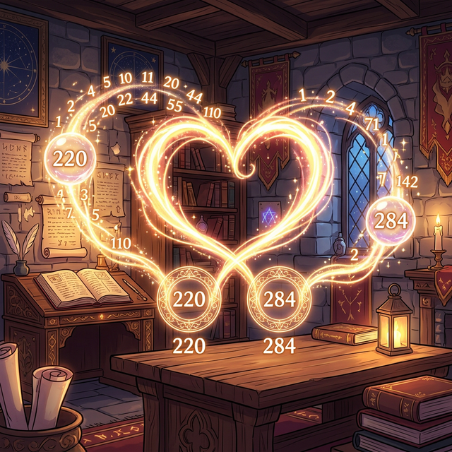

# 02. 두 번째 수업: 약수와 완전수 (Divisors & Perfect Numbers)

나누어떨어지는 수(Divisors, 약수)를 사랑했던 고대 피타고라스 학파 사람들은 숫자들 사이에도 인간처럼 우정, 사랑, 완벽함 같은 성격이 깃들어 있다고 믿었습니다. 아주 사소한 나눗셈에 불과하지만, 약수를 다 더해 보았더니 소름 끼치는 규칙들이 발견되었기 때문입니다.

---

## 학습 목표
* 어떤 수를 나누어 떨어지게 하는 약수(Divisor)의 개념을 이해합니다.
* 자신을 제외한 진짜 약수(진약수)들의 합이 자신과 똑같아지는 '완전수(Perfect Number)'를 배웁니다.
* 서로의 진약수 합이 엇갈려 상대방이 되는 사랑의 숫자, '우애수(Amicable Numbers)'를 구경합니다.
* 파이썬의 나머지 연산자 `%`를 활용하여 약수 판독기 알고리즘을 작성합니다.

## 1. 신의 숫자 6: 완전수 (Perfect Number)

가장 단순한 양의 정수 $6$을 생각해 봅시다. 
$6$을 쪼갤 수 있는 약수들은 $1, 2, 3, 6$ 입니다.
여기서 뻔하게 자기 자신이 되어버리는 $6$을 제외하고 찐 약수(진약수)들만 더해보세요.
> $1 + 2 + 3 = \mathbf{6}$

자신의 몸통을 구성하는 부품(약수) 조각들을 합쳤더니, 기적처럼 원래 자신의 온전한 모습($6$)이 되어 돌아왔습니다. 고대 수학자들은 이렇게 약수의 합이 자기 자신과 똑같아지는 숫자를 신이 창조한 **'완전수(Perfect Number)'**라고 부르며 경배했습니다. 그다음 발견된 완전수는 $28$ ($1+2+4+7+14=28$), 그다음은 $496$, 그리고 $8,128$입니다. 끝없이 커다란 우주에서 완전수는 사막의 바늘처럼 드물게 발견됩니다.

## 2. 아름다운 우애수 (Amicable Numbers)

이번에는 두 개의 숫자, $220$과 $284$의 찐 약수들을 파헤쳐봅시다.
* $220$의 찐 약수 합: $1+2+4+5+10+11+20+22+44+55+110 = \mathbf{284}$
* $284$의 찐 약수 합: $1+2+4+71+142 = \mathbf{220}$

자신의 살점(약수)을 다 떼어 주었더니 상대방 숫자인 $284$가 만들어졌고, $284$도 살점을 다 내어주자 $220$이 되었습니다. 서로가 서로의 몸을 구성하는 완벽한 영혼의 짝궁, 수학자들은 이들을 **'우애수'** 혹은 '친화수'라고 불렀습니다.

<div align="center">
  
</div>

## 3. Python 찌꺼기 추적기: 모듈러(`%`) 연산

종이에 숫자를 쓰고 나눗셈을 하던 시대는 끝났습니다.
현대 컴퓨터 공학에서 어떤 수가 약수인지 아닌지를 단박에 찾아내는 무기는 **`나머지(%)`** 연산자입니다. 컴퓨터는 무식하게 나누지 않습니다. 찌꺼기(나머지)가 $0$인지 아닌지만 감식합니다.

나머지가 $0$이라면? 그것은 완벽히 나누어떨어지는 '약수'라는 증거입니다!

```python
# 파이썬으로 경험하는 '우주의 찌꺼기 판독기' (Modulo Operator)

def get_real_divisors(number):
    """자신을 제외한 진짜 약수(진약수)들만 걸러내는 AI 필터망"""
    divisors = []
    
    # 1부터 자기자신 바로 앞(number - 1)까지 탈곡기에 돌립니다.
    for i in range(1, number):
        if number % i == 0:  # 컴퓨터의 핵심 필터 [%]: 찌꺼기(나머지)가 0인가?
            divisors.append(i)  # 약수가 맞다면 리스트(배열) 안으로 쓸어담습니다!
            
    return divisors

# 수학자들이 10년을 찾았던 3번째 완전수 [496]을 테스트해 봅시다.
target = 496
pieces = get_real_divisors(target)

print(f"[{target}] 을 구성하는 생명 조각들(진약수): {pieces}")

# 조각들을 다 합치면?
total_power = sum(pieces)
print(f"조각들을 다시 조립한 파워: {total_power}")

if total_power == target:
    print("축하합니다! 이 숫자는 영혼까지 '완전수(Perfect Number)'입니다.")
else:
    print("불완전한 숫자입니다. 폐기합니다.")
```

여러분의 CPU 메모리는 고대 그리스 수학자들이 밤을 새워가며 찾았던 4번째 우주 완전수 $8,128$도 단 $0.001초$ 만에 찾아내어 판독합니다. 수의 신비감은 컴퓨터의 강력한 `%` (모듈러) 루프 안에서 가장 논리적인 데이터로 거듭납니다.

## 학습 정리
1. **약수(Divisor)**: 어떤 수를 나머지($0$) 없이 딱 떨어지게 나눌 수 있는 부품 숫자 배열.
2. **완전수와 우애수**: 자기를 뺀 찐 약수(진약수)의 합이 자기 자신 본체와 똑같아지면 완전수, 다른 짝꿍 숫자를 가리키면 우애수이다.
3. 데이터 파싱이나 분류 알고리즘에서 파이썬 **나머지 `%` 연산(Modulo)** 은 홀수/짝수 판별부터 거대 소수 판독, 해시(Hash) 암호 생성까지 가장 극단적이고 치명적인 역할을 해낸다.
