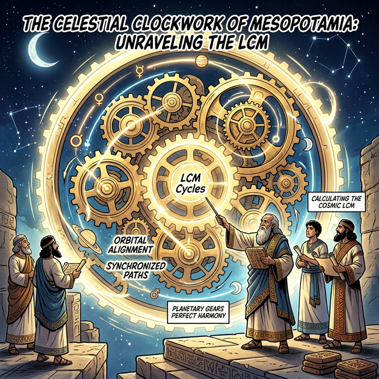
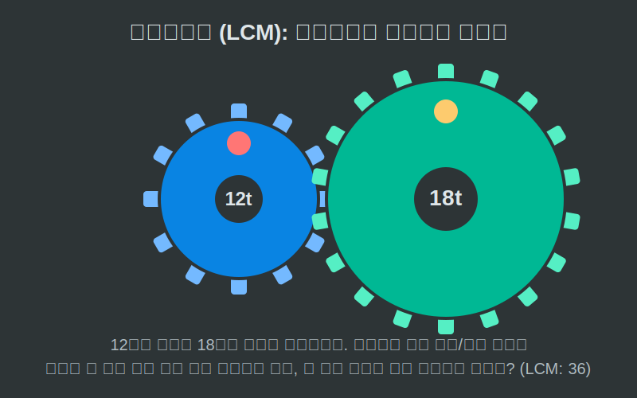

# 05. 다섯 번째 수업: 최소공배수와 톱니바퀴 (Least Common Multiple)

우주는 거대한 시계태엽 장치와 같습니다. 태양, 달, 그리고 행성들은 각자의 속도(주기)를 가지고 끝없이 돌아가고 있습니다. 이 서로 다른 궤도(Cycle)를 가진 행성들이 어느 날, 정확하게 한 치의 오차도 없이 하늘에서 일렬로 늘어서게 되는 기적적인 날을 고대인들은 어떻게 알아냈을까요? 

---

## 학습 목표
* 서로 다른 주기(배수)가 일치하는 최초의 순간, **최소공배수(LCM)**의 기하학적 의미를 톱니바퀴로 이해합니다.
* 동양의 $60$갑자 달력이 최소공배수 $60$을 기반으로 만들어진 과학적 이유를 깨닫습니다.
* 파이썬의 `math.lcm()` 라이브러리를 통해 수백, 수천 자리의 공전 주기를 단번에 동기화시킵니다.

## 1. 톱니바퀴의 기적적인 동기화 (Synchronization)

$12$개의 톱니를 가진 '파란 톱니바퀴'와 $18$개의 톱니를 가진 거대한 '초록 톱니바퀴'가 서로 맞물려 돌아간다고 쳐봅시다. 처음에 맞물린 톱니 부분에 몰래 빨간 페인트를 칠해두었습니다.
삐걱삐걱 돌아가는 두 톱니바퀴는 크기가 달랐기 때문에 한 바퀴를 돌아도 빨간 페인트 자국은 서로 만나지 못하고 계속 엇갈립니다.

과연 몇 개의 톱니가 스쳐 지나가야, 저 두 페인트 칠해진 톱니가 태초의 모습처럼 다시 '딱!' 하고 맞물릴까요?

<div align="center">
  
</div>

<div align="center">
  
</div>

* 12의 배수 테이블 (파란 톱니가 한 바퀴 돈 횟수): $12, 24, \mathbf{36}, 48...$
* 18의 배수 테이블 (초록 톱니가 한 바퀴 돈 횟수): $18, \mathbf{36}, 54...$

정확히 **$36$**개의 톱니가 지나가는 순간, 마치 우주의 톱니바퀴가 기적을 부리듯 다시 페인트가 맞물립니다. (이때 작은 바퀴는 $3$바퀴를, 큰 바퀴는 $2$바퀴를 돌아버린 상태입니다.)
이것이 바로 가장 빨리 만나는 공통된 배수, **최소공배수 (Least Common Multiple)**입니다.

과거 조상님들은 $10$개의 천간(갑, 을, 병...) 기어와 $12$개의 띠 동물(자, 축, 인...) 기어를 맞물려 달력을 만들었습니다. 여기서 최소공배수가 $60$이기 때문에, 누구든 태어난 지 딱 **$60$년**이 지나면 처음 태어난 해의 이름(환갑)으로 다시 정확하게 돌아오게 되는 것이랍니다!

## 2. Python 천문대: `math.lcm()` 주파수 탐지기

여러분이 인공위성을 발사하는 나사(NASA)의 프로그래머라고 가정해 봅시다. 
- 화성은 $687일$마다 한 번씩 태양을 돕니다.
- 지구는 $365일$마다 한 바퀴를 돕니다.

두 행성이 출발선에서 동시에 로켓을 쏘아 올린다면, 도대체 몇일 뒤에야 두 행성이 다시 출발선에 나란히 도착할까요?

```python
import math

# 파이썬으로 구현하는 천체역학 (최소공배수 시뮬레이터)

earth_orbit = 365
mars_orbit = 687

# 우리는 두 주기의 배수 목록을 수만 개씩 종이에 적을 필요가 없습니다.
# 파이썬의 math.lcm() 함수가 눈 깜짝할 사이에 톱니바퀴를 초고속 충돌시킵니다.
galactic_sync_day = math.lcm(earth_orbit, mars_orbit)

print("🚀 지구와 화성의 궤도 동기화를 계산합니다...")
print(f"-> 두 행성이 같은 출발선에 다시 정확히 나란히 서게 되는 날: {galactic_sync_day}일 뒤")

years_passed = galactic_sync_day / 365
print(f"-> 지구의 시간으로 치면 무려 {years_passed:.1f}년이 걸리는 기적의 날입니다.")
```

출력 결과 단 $1$초도 걸리지 않고 `250,755일 (약 687.0년)` 이라는 까마득한 우주의 동기화 지점(LCM)을 파이썬 엔진이 뽑아버립니다. 우리는 최소공배수를 통해 서로 다른 주파수와 궤도를 가지는 자연의 파동들을 통일시킬 수 있게 되었습니다.

## 학습 정리
1. **공배수 (Common Multiple)**: 두 개 이상의 수가 가진 배수 테이블 중 공통으로 겹치는(맞물리는) 숫자. 끝없이 나타난다.
2. **최소공배수 (LCM)**: 그 공배수들 중 가장 인내심이 적은 첫 번째(가장 작은) 만남의 지점. 톱니바퀴, 행성 궤도, 주기 등 '시간'을 동기화(Sync)하는 데 반드시 필요한 천체 공학 공식이다.
3. 데이터 파이프라인이나 애니메이션 주사율($60Hz$와 $144Hz$ 모니터 동기화 등)을 세팅할 때 파이썬의 **`math.lcm`** 함수는 두 시스템 간의 충돌 없는 스케줄러(Scheduler)를 설계하는 데 최고의 엔진으로 사용된다.
