# 09. 아홉 번째 수업: 소수의 개수는 무한해요 (Infinite Primes)

우리가 $1, 2, 3$ 처럼 숫자를 계속 세어 나가면, 과연 제일 끝에는 어떤 거대한 덩어리 숫자가 나타날까요? 숫자는 영원히 끝이 없다는 것을 우리는 직감적으로 압니다. 그렇다면 우주의 가장 단단한 다이아몬드 부품인 **'소수(Prime)'**도 끝이 없을까요? 어쩌면 우주 어딘가에 가장 큰 '마지막 소수'가 숨겨져 있지 않을까요?

---

## 학습 목표
* 고대 철학자 유클리드가 만들어낸 '소수가 무한히 존재한다'는 치명적인 귀류법 증명 원리를 터득합니다.
* 특정 숫자의 범위 안에 숨은 소수들을 모조리 걸러내는 고대 최고의 해킹 알고리즘, **에라토스테네스의 체(Sieve of Eratosthenes)**를 봅니다.
* 파이썬의 `List`에서 배수 격자를 만들어 융단 폭격(삭제)을 퍼붓는 `Boolean Array` 필터 루프를 코딩합니다.

## 1. 유클리드의 치명적인 모순(귀류법) 해킹

"가장 큰 마지막 소수가 존재한다면 어떨까?"
유클리드는 이 문장 하나를 가지고 전 우주를 속이는 해킹 증명법을 만들었습니다.

만약 소수들이 $2, 3, 5, 7$ 까지만 존재하고 더 이상 없다고 칩시다(가정).
그럼 이 모든 우주의 소수들을 싹 다 곱한 다음 가증스럽게 **$+1$**을 해봅시다.
> $M_{\text{new}} = (2 \times 3 \times 5 \times 7) + \mathbf{1} = 210 + 1 = \mathbf{211}$

이제 이 무시무시한 괴물 $211$이 소수 $2, 3, 5, 7$ 중 하나로 나뉠까요? 
어떤 소수로 나누든 항상 꼬리표처럼 마지막에 더했던 **$1$이라는 찌꺼기(나머지)**가 남아버립니다!
결론: $211$은 기존의 그 어떤 소수로도 나뉘지 않으므로, 지가 스스로 $211$이라는 '엄청나게 새로운 소수'가 되어야 합니다!

따라서 "가장 큰 마지막 소수가 존재한다는 가정"은 언제나 $+1$ 무기를 들고나온 새로운 괴물 소수에게 깨져버립니다. 소수는 영원히(무한히) 창조될 수밖에 없는 우주의 숙명입니다.

## 2. 에라토스테네스의 융단 폭격 (Sieve Check)

무한한 우주에서 $1$부터 $100$까지의 소수를 어떻게 가장 빨리 긁어모을까요?
고대 그리스의 지리학자 메라토스테네스는 하나씩 소수인지 묻는 대신, **'제거(삭제)' 방식**의 거칠고 치명적인 필터망(체, Sieve)을 고안했습니다.

1. $1$부터 $100$까지 숫자를 다 바닥에 깔아 놓는다. (1은 바로 발로 차버려 기절시킨다.)
2. 최초의 생존 소수 **$2$**를 잡는다. 그리고 남은 바닥의 모든 $2$의 배수(짝수 덩어리)를 샷건 하나로 산산조각(삭제) 내버린다! 절반이 싹 날아갔다!
3. 그다음 생존자 **$3$**을 잡는다. 그리고 바닥에 남은 모든 $3$의 배수 집단을 바주카포로 연쇄 폭발시킨다. 
4. 이 작업을 $10$($\sqrt{100}$)까지만 반복하면, 바닥에 지워지지 않고 핏물 속에 반짝이는 놈들만 남는다. 그놈들이 싹 다 소수다!

<div align="center">
  
</div>

## 3. Python 부울 배열 (Boolean Array) 폭격기

컴퓨터 메모리에 배수 위치마다 `False`(폭파됨) 스위치를 딸깍거리며 내려찍는 인공지능 코드를 만들어봅시다.

```python
# 파이썬으로 가동하는 에라토스테네스의 융단 폭격 헬기 (Sieve of Eratosthenes)

def sieve_of_eratosthenes(max_range):
    """
    모든 것을 True(생존)로 켜두고 공격을 시작합니다.
    """
    
    # 0과 1은 애초에 소수가 아니므로 스위치를 아예 끈다 (False)
    # 나머지는 일단 다 True(생존자 팻말)로 세워놓은 수만 개의 부울(Boolean) 배열 생성!
    primes_shield = [True] * (max_range + 1)
    primes_shield[0] = primes_shield[1] = False
    
    # 2번 건물부터 융단 폭격 폭파 헬기 이륙! 
    # (제곱근까지만 돌아도 모든 배수가 박살 난다는 수학적 기적을 이용)
    for p in range(2, int(max_range**0.5) + 1):
        
        # 만약 이 건물이 아직 생존자(True, 소수)라면?
        if primes_shield[p]:
            
            # 이 놈의 '모든 배수' 건물(p+p, p+p+p...)에 폭탄(False)을 끝까지 투하해 연쇄 폭발!
            for multiple in range(p * p, max_range + 1, p):
                primes_shield[multiple] = False
                
    # 폭격이 끝난 후, 살아남은 생존자(True) 건물 번호만 수거해서 리스트 화
    survivors = [i for i, is_prime in enumerate(primes_shield) if is_prime]
    return survivors

# 지구상 0부터 100 구역까지 폭격 가동!
print("🚁 2의 배수, 3의 배수 융단 폭격을 가동합니다. 타겟 100 구역 🚀")
final_primes = sieve_of_eratosthenes(100)

print("="*50)
print(f"✅ 폭격 종료 후 살아남은 절대 소수(Prime) 생존자 명단: \n{final_primes}")
```

진짜 프로그래머들은 거대한 숫자가 소수인지 찾을 때 하나씩 무식하게 나누지 않습니다. 저 거대한 `Boolean Array`(참/거짓 배열)를 이용해 배수의 위치를 인덱스(`index`) 스킵하며 `False`로 바꿔버리는 (덮어쓰기) 이 폭격 코드를 통해 우주 끝 소수까지 $1초$ 안에 도달합니다.

## 학습 정리
1. **귀류법**: 가정이 맞다고 치고 밀고 나가다가 모순(에러)이 터지면 그 가정이 틀렸다고 부수어버리는 해킹 증명. 유클리드가 최고 소수가 존재한다는 가정을 이 무기로 부수며 소수의 무한성을 입증했다.
2. **에라토스테네스의 체**: 소수를 하나씩 찾지 않고, 반대로 가장 작은 소수의 덩어리(배수)를 집단으로 색출해 제거율을 기하급수적으로 높이는 마법 알고리즘.
3. 데이터 파싱이나 인덱싱에서 파이썬의 **리스트 컴프리헨션(`[i for i in list if i]`)**과 **`Boolean(True/False)` 배열 격자 구조**는 `append`보다 수십 배 빠른 메모리 직접 조작을 가능하게 한다.
