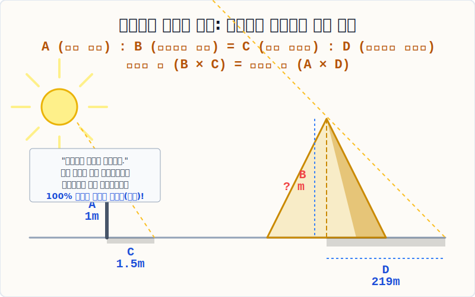

# 06. 탈레스와 피라미드의 비례식 ($A:B = C:D$)

## 1. 학습 목표 (Learning Objectives)
* 비례식의 영원불멸한 성질, **"내항의 곱과 외항의 곱은 같다"** 라는 마법의 등식을 배웁니다.
* 태양의 평행광선을 이용하여 도저히 자로 잴 수 없는 거대한 피라미드의 높이를 막대기 하나로 알아낸 고대 그리스 철학자 탈레스의 '비례 닮음 증명법'을 SVG 도해로 체감합니다.

## 2. 등호 하나로 묶인 두 형제: 비례식
앞선 챕터에서 배운 '비(Ratio)' 두 개를 가지고, "얘네 둘의 비의 값(비율)이 똑같다!"라고 등호($=$)로 묶어버린 문장을 **'비례식(Proportional Equation)'** 이라고 부릅니다.

> $\mathbf{A : B = C : D}$
> "A의 B에 대한 스케일이나, C의 D에 대한 스케일이나 한 치의 오차 없이 쌍둥이 비율이다!"

여기서 바깥쪽에 있는 두 녀석($A, D$)을 **'외항(Outer Terms)'**, 안쪽에 있는 두 녀석($B, C$)을 **'내항(Inner Terms)'**이라고 부릅니다.
그리고 전 세계 모든 수학책에 실려 있는 비례식 최강의 해킹 스킬이 발동됩니다.

> **비례식의 성질**: **내항의 곱($B \times C$) = 외항의 곱($A \times D$)**

이 공식 하나면 4개의 숫자 중 1개를 미지수 $❓$ 로 구멍을 뚫어놔도, 곱셈 방정식으로 탈바꿈시켜 순식간에 정답을 스캔해 낼 수 있습니다.

## 3. 탈레스의 기적: 지팡이 하나로 피라미드를 재다
기원전 600년경, 고대 이집트를 여행하던 그리스 최고의 철학자 탈레스(Thales)는 140미터가 넘는 거대한 쿠푸왕의 대피라미드 앞에 섰습니다. 파라오는 그에게 "이 건축물의 꼭대기까지의 정확한 높이를 잴 수 있겠소?"라고 물었습니다. 
탈레스는 아무런 사다리나 거친 측량 도구 없이, 땅바닥에 자신의 **1미터짜리 단단한 지팡이** 를 수직으로 꽂아 넣고 단 1분 만에 높이를 선언합니다.

  

**[탈레스의 브레인 해킹 로직]**
1. 저 멀리 우주에서 쏟아지는 태양 빛은 완벽한 '평행 라인(Parallel Lines)'으로 내리꽂힌다.
2. 따라서 태양빛이 만드는 **①내 지팡이의 그림자 직각삼각형** 과 **②거대 피라미드의 가상 그림자 직각삼각형** 은 완벽히 100% 동일한 비율의 스케일을 가진 쌍둥이(닮음)이다!
3. 즉, **막대 높이($1m$) : 막대 그림자($1.5m$) = 피라미드 높이($❓$) : 피라미드 그림자($219m$)** 가 성립해야만 한다!

비례식 $\mathbf{1 : 1.5 \ =\ ? : 219}$ 가 세워졌습니다.
비례식의 치트키 스킬, '내항의 곱 = 외항의 곱' 을 발동합니다!
> $1.5 \times ? = 1 \times 219$
> $1.5 \times ? = 219$
> $? = \frac{219}{1.5} = \mathbf{146}$ (미터)

탈레스는 이 대수학의 등식 하나로 인류 최초로 그림자 사냥꾼이 되어 파라오를 경악시켰습니다.

## 4. 학습 정리 (Summary)
1. **비례식($A : B = C : D$)**: 두 비의 값이 서로 같음을 보여주는 강력한 등식으로, 내부 숫자의 곱과 외부 숫자의 곱이 똑같아진다는 대수학적 성질을 갖습니다.
2. **탈레스의 응용**: 아무리 덩치가 차이 나더라도 기하학적 앵글(태양빛)만 같다면 두 조형물의 '높이와 그림자 비율'은 비례식의 법칙에 의해 완벽히 강제 속박됨을 이용하여 간접 측량학을 창시했습니다.
