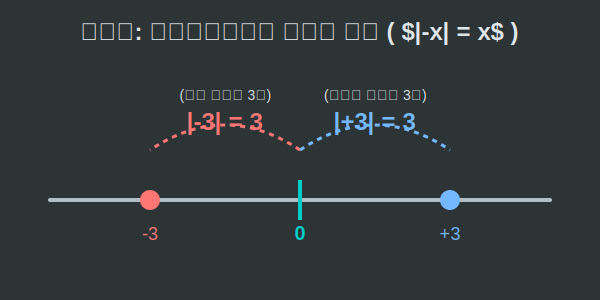

# 02. 두 번째 수업: 원점을 향한 중력, 절댓값 (Number line & Absolute Value)

정수 왕국의 지리(Map)를 한눈에 파악하려면 **수직선(Number Line)**이라는 직선 도로를 그려보면 됩니다. 수직선은 0을 중심으로 오른쪽은 양수, 왼쪽은 음수가 끝없이 펼쳐진 1차원 우주입니다.

그런데 내비게이션에 "앞으로 -3km 이동하세요"라고 뜨는 것을 본 적이 있나요? 
방향(부호)을 떼어내고 오직 **'거리(Magnitude)'**만을 잴 때 필요한 마법의 기호, 바로 **절댓값(Absolute Value)**을 만나봅시다.

---

## 학습 목표
* 수직선 위에서 양수와 음수의 대칭적 위치 관계를 이해합니다.
* 절댓값($|x|$)의 개념이 기하학적 '거리'임을 시각적으로 파악합니다.
* 파이썬의 `abs()` 내장 함수를 통하여 절댓값 연산의 효율성을 배웁니다.

## 1. 수직선 위의 쌍둥이 자리

수직선 한가운데에는 기준점인 **원점(0)**이 떡하니 버티고 있습니다. 
만약 원점에서 오른쪽(동쪽)으로 3칸 떨어진 곳에 학교($+3$)가 있다면, 왼쪽(서쪽)으로 정확히 3칸 떨어진 곳에는 집($-3$)이 있습니다.

수직선에서 항상:
* **오른쪽**으로 갈수록 값은 **커집니다** ( $3 > 2$ ).
* **왼쪽**으로 갈수록 값은 **작아집니다** ( $-3 < -2$ ).

음수들끼리 헷갈린다면 통장 잔고를 생각하세요. 빚이 2만 원($-2$) 있는 사람이 빚이 3만 원($-3$) 있는 사람보다 더 부자(값이 큼)입니다!

## 2. 절댓값 (Absolute Value): 부호 탈착기

학교( $+3$ )에서 원점( $0$ )까지 걸어가려면 3칸을 가야 합니다. 반대로 집( $-3$ )에서 원점까지 걸어갈 때도 똑같이 3칸을 가야 합니다! "나 -3칸 걸어왔어"라며 땀 흘리는 사람은 없죠. 거리는 무조건 양수(+)로 잽니다.

수학에서는 이렇게 **"수직선 위에서 어떤 수가 원점(0)과 떨어져 있는 순수한 거리"**를 **절댓값(Absolute Value)**이라고 부르고, 숫자 양옆에 감옥의 창살 같은 기호 **$| \quad |$** 를 씌워 표현합니다.

* $| +3 | = 3$  (오른쪽으로 3칸 거리이므로 값은 3)
* $| -3 | = 3$  (왼쪽으로 3칸 거리이지만 여전히 거리는 3)
* $| 0 | = 0$   (자신의 위치이므로 거리는 0)

<div align="center">
  
</div>

방향을 나타내는 꼬리표인 $+$, $-$ 부호를 가위로 싹둑 잘라내고, 오직 **순수한 알맹이 크기(거리)**만 뽑아내는 기계라고 생각하면 완벽합니다.

## 3. 파이썬과 `abs()` 폭탄 해체기

컴퓨터 프로그래밍에서 절댓값은 무지막지하게 중요합니다. 얼굴 인식 인공지능이 두 사람의 눈매가 얼마나 비슷한지 비교할 때 "내 눈 길이가 네 놈보다 -2cm 길어"라고 계산하면 에러가 납니다. 거리에 대한 오차나 차이는 무조건 양수로만 계산해야 안전합니다.

파이썬에는 이 절댓값을 한방에 씌워주는 **`abs()`** (absolute의 약자)라는 마법의 내장 함수가 있습니다!

```python
# 파이썬의 내장 함수 abs() 를 이용한 절댓값 추출

player_pos = -5   # 플레이어는 기준점(0)에서 왼쪽으로 5칸에 있다.
enemy_pos = +3    # 적은 기준점(0)에서 오른쪽으로 3칸에 있다.

# 1. 원점으로부터의 거리 (알맹이만 추출)
print(f"플레이어의 원점 거리: {abs(player_pos)}칸") # 출력: 5칸
print(f"적군의 원점 거리: {abs(enemy_pos)}칸")      # 출력: 3칸

# 2. 실전 응용: 두 사람 사이의 '진짜 거리'는 몇 칸일까?
# 거리 계산 공식 : |목적지 - 출발지|
# -5에서 +3을 빼면 -8 이지만, | | 를 씌우면 양수가 튀어나옵니다!
distance = abs(enemy_pos - player_pos) 

print(f"플레이어와 적 사이의 거리는 {distance}칸 입니다!") 
# 출력: 플레이어와 적 사이의 거리는 8칸 입니다!

if distance > 10:
    print("너무 멀어 공격 불가!")
else:
    print("사정권 이내! 파이어볼 발사!") # => 이 조건이 참이 되어 출력됨
```
보이시나요? `player_pos`가 음수이든 양수이든 상관없이 `abs()`라는 탈수기에 집어넣기만 하면 방향 축축한 부호는 다 짜지고 뽀송뽀송한 양수 알맹이만 나와 깔끔하게 거리가 계산됩니다.

## 학습 정리
1. **수직선 (Number Line)**: 0을 기준으로 오른쪽(양수)과 왼쪽(음수)으로 무한히 뻗어 나가는 도표로, 오른쪽 수일수록 항상 크다.
2. **절댓값 (Absolute Value)**: 원점 0에서부터 그 숫자까지의 '순수한 거리'. 기호는 $|x|$ 이며 결과값은 무조건 양수나 0이다.
3. 파이썬의 **`abs()`** 함수는 복잡한 인공지능, 3D 게임, 물리 엔진 등에서 '거리의 차이'와 '오차'를 구할 때 방향(+,-)에 얽매이지 않기 위해 필수적으로 사용되는 도구이다.
