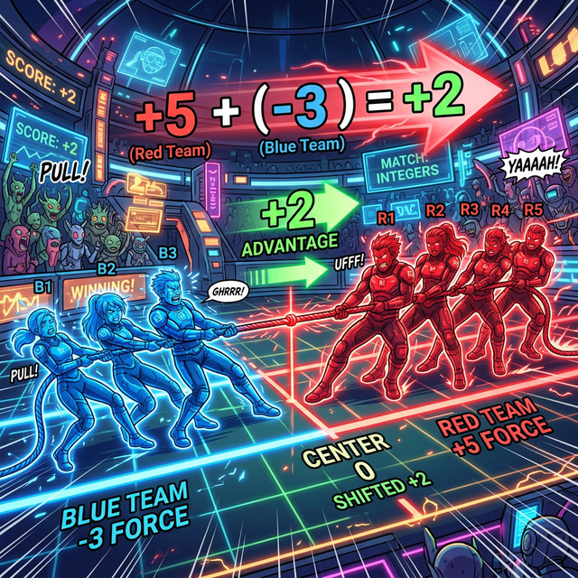

# 03. 세 번째 수업: 양수팀과 음수팀의 제로섬 줄다리기 (Addition & Subtraction)

우리는 어릴 때부터 $5 + 3 = 8$ 이나 $5 - 3 = 2$ 처럼 자연수들끼리의 계산표는 구구단처럼 외웠습니다. 하지만 음수가 섞인 계산식, 예를 들어 $-5 + (+3)$ 이나 $-5 - (-3)$ 같은 수식을 만나면 갑자기 머리가 멍해집니다.

정수의 덧셈과 뺄셈은 암기할 필요가 전혀 없습니다. 이것은 우주 공간에서 벌어지는 **힘의 대결(벡터의 합)**이자, 줄다리기 시합일 뿐입니다!

---

## 학습 목표
* 정수의 덧셈을 '양수 팀'과 '음수 팀' 간의 힘겨루기로 이해합니다.
* 뺄셈 기호($-$)를 방향을 반대로 뒤집는 스위치로 해석합니다.
* 두 수의 부호가 같을 때와 다를 때, 합산된 위력(절댓값)이 어떻게 변하는지 파악합니다.

## 1. 덧셈(+): 양수팀 홍달이 vs 음수팀 청달이의 줄다리기

정수의 모든 덧셈은 양수(+)의 힘과 음수(-)의 힘을 한데 모으는 합산 과정입니다. 
양수 팀(빨간색)과 음수 팀(파란색)이 밧줄을 당기고 있다고 상상해 봅시다.

1. **같은 팀끼리 더할 때 (부호가 같음)**
   > $(+3) + (+5) = +8$  (양수팀 3명과 양수팀 5명이 합쳐서 당기니 양수팀 8명의 힘!)
   > $(-3) + (-5) = -8$  (음수팀 3명과 음수팀 5명이 합쳐서 당기니 음수팀 8명의 힘!)
   *결론:* 같은 방향으로 힘을 합치기 때문에, 최종 힘(절댓값)은 **커집니다**. 최종 승리팀(부호)은 원래 팀의 부호가 됩니다.

2. **다른 팀끼리 더할 때 (부호가 다름) - 진정한 대결!**
   > $(+5) + (-3) = +2$ 
   (양수팀 5명과 음수팀 3명이 반대로 당깁니다. 3명씩은 힘이 서로 **상쇄(Cancel out)**되어 0이 되고, 결국 양수팀 2명만 남아 승리합니다.)

   > $(-5) + (+2) = -3$
   (이번엔 음수팀이 5명, 양수팀이 2명입니다. 양수 2명의 힘이 상쇄되고 나면, 음수팀 3명의 힘이 남아서 이깁니다.)

   *결론:* 서로 반대로 당기기 때문에, 최종 힘(절댓값)은 **두 힘의 차이**만큼 약해집니다. 최종 승리팀은 애초에 더 숫자가 많았던(절댓값이 큰) 쪽의 부호가 됩니다.

  

## 2. 뺄셈(-): 넌 지금부터 우리 팀이야! (부호 뒤집기)

뺄셈은 수학적으로 아주 재미있는 장치입니다. 뺄셈 기호($-$)는 뒤에 오는 녀석의 유니폼을 강제로 벗기고 **반대 팀의 유니폼을 입혀버리는 '마법의 방향 전환 스위치'**입니다.

"뺀다"는 것은 수직선에서 "반대 방향으로 가라"는 명령과 완벽히 동일합니다.

1. **양수를 뺄 때**
   > $(+5) - (+3)$
   스위치 작동! 뒤에 있는 양수팀(+3)에게 반대 팀 유니폼을 입힙니다 $\rightarrow (-3)$이 됩니다.
   이제 덧셈으로 바뀌어 줄다리기를 합니다. $(+5) + (-3) = +2$

2. **음수를 뺄 때 (마이너스의 마이너스)**
   > $(+5) - (-3)$
   스위치 작동! 뒤에 있는 음수팀(-3)에게 반대 팀 유니폼을 입힙니다 $\rightarrow (+3)$이 됩니다.
   적군의 적은 나의 아군이죠! 빚을 빼앗아간다는 것은 돈을 주는 것과 같습니다.
   $(+5) + (+3) = +8$ 

즉, **모든 뺄셈은 빼는 수의 부호를 반대로 바꾼 뒤 '덧셈(줄다리기)'으로 고쳐서 계산**하면 만사형통입니다!

## 학습 정리
1. **정수의 덧셈 (+)**: 같은 부호끼리는 힘을 합쳐서 절댓값이 커지고, 다른 부호끼리는 서로 힘이 상쇄되어 남은 쪽(절댓값이 큰 쪽)이 그 차이만큼 이기는 벡터의 합산이다.
2. **정수의 뺄셈 (-)**: 뺄셈 기호는 뒤따라오는 숫자의 방향(부호)을 $180^\circ$ 뒤집어 버리는 장치이다.
3. 뺄셈은 부호를 뒤집은 후 다시 덧셈(줄다리기) 룰을 적용하면 직관적으로 완벽하게 풀결된다.
