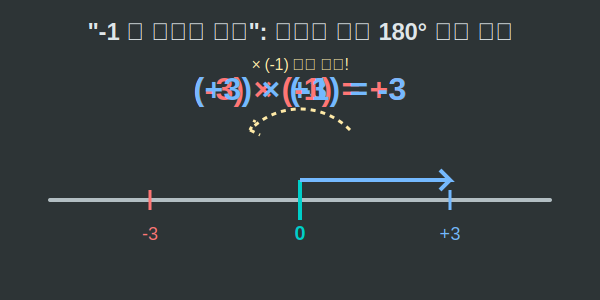

# 04. 네 번째 수업: 음수 곱하기 음수는 왜 양수일까? (Multiplication & Division)

정수의 곱셈에서 가장 많은 학생들의 뒷목을 잡게 하는 마의 구간, 바로 **"음수 곱하기 음수는 양수다 $(- \times - = +)$"** 입니다.
도대체 왜 마이너스와 마이너스가 만나면 플러스가 되는 걸까요? 외우지 말고, 수직선에서의 '방향의 마법'으로 증명해 봅시다.

---

## 학습 목표
* 정수의 곱셈을 수직선 위에서의 '거리 스케일링(Scaling)'과 '방향 회전(Rotation)'으로 시각화합니다.
* "음수를 곱한다"는 행위가 $180^\circ$ 방향을 뒤집는 스위치 작용임을 이해합니다.
* 나눗셈 역수 개념을 통해 정수의 사칙연산을 완결합니다.

## 1. 곱셈은 돋보기(스케일링) 기능이다

$3 \times 2 = 6$ 이란 무엇일까요?
내가 원래 가진 크기 3을 복사해서 **2배로 늘려라(스케일업)**라는 뜻입니다. 양수를 곱하면 원래 보던 그 방향(오른쪽)을 그대로 유지한 채 크기만 커집니다. 

그럼 $(-3) \times 2$ 는 뭘까요?
왼쪽으로 3칸 가 있는 내 위치를, 방향은 유지한 채 **크기만 2배로 늘려라**는 뜻입니다. 
당연히 왼쪽 화살표 길이가 2배로 늘어나니 $-6$ 에 도착합니다.

## 2. '음수 곱하기': 180도 뒤로 돌아!

이제 진짜 마술을 부려볼 시간입니다. 곱해야 할 숫자가 **음수(-)** 라면 어떤 일이 벌어질까요?
수학에서 **$(-1)$ 을 곱한다는 것은, 크기는 그대로 둔 채 "너, 지금 보는 방향에서 정확히 $180^\circ$ 반대로 돌아!"라는 회전 명령**과 완벽히 동일합니다.

> $3 \times (-1) = ?$
> $\rightarrow$ 원점에서 동쪽(오른쪽)으로 3칸 떨어진 위치에 있는데, 방향 스위치(-1)가 켜졌습니다!
> $180^\circ$ 휙 돌아서 서쪽(왼쪽)으로 3칸 떨어진 곳에 착지합니다. 답은 $-3$ 입니다.

자, 이제 대망의 **음수 곱하기 음수** 차례입니다.

> $(-3) \times (-2) = ?$
1. 일단 알맹이거리(절댓값)부터 곱합시다. $3 \times 2 = 6$ 배율이 적용됩니다.
2. 현재 시작 위치는 $-3$ 이니까 서쪽(왼쪽) 방향입니다.
3. 그런데 뒤에 곱하는 숫자가 **음수(-)** 로군요! "지금 방향에서 $180^\circ$ 반대로 돌아랏!" 명령이 하달됩니다.
4. 왼쪽을 보고 있던 화살표가 휙 돌아 오른쪽 6칸 지점에 꽂힙니다.
5. $\therefore (-3) \times (-2) = +6$

어떤가요? 무조건 "마이너스 두 개면 짝대기 그어서 플러스가 된다"고 외우는 것보다, 벡터(화살표)가 휙 하고 뒤집어지는 모습을 뇌리에 그리면 소름 돋게 명확해집니다!

  

## 3. 정수의 분배법칙과 증명 대방출

음수 곱하기 음수가 양수라는 사실은, 앞서 배운 분배법칙을 통해서도 논리적으로 증명 가능합니다.
한번 그 유명한 논리 흐름을 감상해 보시겠어요?

$3 \times 0 = 0$ 이라는 사실과, $0$은 아무리 더하거 빼도 $0$이라는 성질을 이용할 것입니다.
> $(-3) \times 0 = 0$

위 식의 $0$을 $(2 + (-2))$ 로 분해해서 괄호 안에 넣어봅시다. 
> $(-3) \times (2 + (-2)) = 0$

분배법칙을 사용하여 괄호 안으로 폭탄($-3$)을 던져보겠습니다.
> $(-3) \times 2 \quad + \quad (-3) \times (-2) \quad = \quad 0$

앞부분 $(-3) \times 2$ 는 음수의 양수배(방향 유지)이므로 $-6$입니다. 이것을 대입합니다.
> $-6 \quad+\quad (-3) \times (-2) \quad = \quad 0$

자, 퍼즐이 완성되었습니다. $-6$ 에다가 도대체 무얼 더해야 $0$ 이 될 수 있을까요?
당연히 그와 크기는 같고 방향이 반대인 극상성(절대적 쌍둥이), **$+6$ 이어야만 합니다!!**

따라서 논리적 오류를 발생시키지 않으려면 $(-3) \times (-2) = +6$ 이 되는 수밖에 없습니다.

## 4. 나눗셈은 곱셈의 그림자

나눗셈($\div$)은 사실 새로운 문단이 필요 없을 정도입니다. 모든 나눗셈은 역수를 취해 곱셈($\times$)으로 바꿔 풀 수 있기 때문입니다.

$8 \div (-2)$ 는 $8 \times (-\frac{1}{2})$ 와 같습니다. 
양수 $\times$ 음수이므로, $180^\circ$ 턴이 발생하여 결과는 $-4$ 가 됩니다.
결국 곱셈과 똑같이 **부호가 짝수번(2, 4회) 만나면 양수(+)**, **부호가 홀수번(1, 3회) 만나면 음수(-)** 가 된다는 그 아름다운 대칭 법칙이 나눗셈에도 그대로 적용됩니다.

## 학습 정리
1. **정수 곱셈의 본질**: 양수를 곱하면 크기만 스케일업되고, 음수를 곱하면 크기 스케일업과 함께 방향이 **$180^\circ$ 회전 (Flip)** 한다.
2. **$- \times - = +$ 의 이유**: 왼쪽 방향(-)인 상태에서 다시 $-1$(뒤로 돌아) 명령을 내리니 결국 오른쪽 방향(+)으로 원상복귀 되기 때문이다.
3. 분배법칙과 역수의 성질을 빌리면, 정수의 그 어떤 복잡한 덧/뺄/곱/나눗셈이라도 하나의 틀릴 수 없는 논리 회로처럼 완벽하게 맞물려 작동한다.
