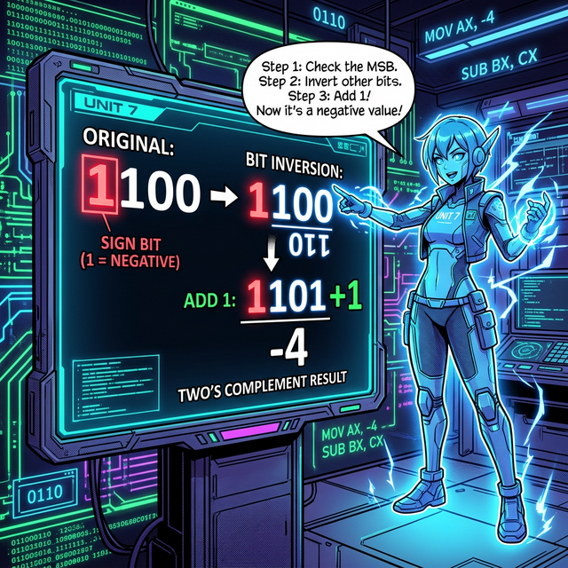

# 05. 다섯 번째 수업: 컴퓨터 메모리 속의 정수와 파이썬 형변환 (Integers in Computers)

지금까지 우리는 종이 위에서 $+3$ 이나 $-5$ 같은 정수를 아주 쉽게 적고 계산했습니다. 하지만 전기 신호밖에 모르는 기계 덩어리인 컴퓨터는 도대체 '+'나 '-' 같은 기호를 어떻게 알아듣고 메모리에 저장하는 걸까요? 

이번 장에서는 수학의 음수 개념이 어떻게 **컴퓨터 구조(Architecture)** 속으로 녹아들었는지, 그리고 파이썬(Python)이 이를 얼마나 우아하게 처리하는지 파헤쳐 보겠습니다.

---

## 학습 목표
* 컴퓨터가 음수를 표현하기 위해 사용하는 **2의 보수(Two's Complement)**와 부호 비트(MSB)의 원리를 이해합니다.
* 파이썬의 `int` 자료형이 가지는 무한대 정밀도(Arbitrary-precision)의 강력함을 배웁니다.
* 데이터의 형태를 자유자재로 바꾸는 **형변환(Type Casting)** 기법을 실습합니다.

## 1. 컴퓨터는 마이너스 기호를 모른다 (부호 비트와 2의 보수)

컴퓨터의 메모리(RAM)와 CPU는 오로지 전기 신호가 켜짐(1)과 꺼짐(0)이라는 **이진수(Binary)**만 이해할 수 있습니다. 그래서 컴퓨터 공학자들은 기발한 꼼수를 생각해 냈습니다.

바로 데이터가 들어갈 상자(Bit) 중 **가장 맨 앞자리의 비트 하나를 '부호 전용 방'**으로 쓰는 것입니다. 이를 **MSB (Most Significant Bit, 최상위 비트)**라고 부릅니다.
* **MSB가 `0` 이면:** "나 양수(+)야!"
* **MSB가 `1` 이면:** "나 음수(-)야!"

하지만 단순히 맨 앞자리만 1로 바꾼다고 덧셈/뺄셈 계산이 완벽하게 맞아떨어지지 않았습니다. 수학에서 $5 + (-5) = 0$ 이 되어야 하듯, 비트끼리 더했을 때 완벽하게 $00000000$ 이 나오도록 만들어야 했습니다.

이 문제를 해결한 궁극의 마법이 바로 **'2의 보수(Two's Complement)'** 기법입니다.
1. 먼저 양수를 이진수로 적습니다. ($5 \rightarrow 0101$)
2. 모든 0을 1로, 1을 0으로 뒤집습니다. (1의 보수: $1010$)
3. 마지막으로 끝에 1을 살짝 더해줍니다. (2의 보수: $1011 \rightarrow$ 이것이 완벽한 $-5$의 전기 신호입니다!)

<div align="center">
  
</div>

## 2. 파이썬의 정수(`int`), 한계란 없다!

대부분의 프로그래밍 언어(C나 Java)에서는 정수형(int)을 담는 메모리 상자의 크기가 정해져 있습니다. 보통 32비트 상자를 쓰는데, 여기에는 약 $-21$억부터 $+21$억까지만 담을 수 있습니다. 숫자가 30억이 넘어가면 상자가 찢어지며 오류(Overflow)가 발생합니다! 

하지만 데이터 과학과 인공지능의 지배자인 **파이썬(Python)**은 다릅니다. 파이썬의 `int`는 컴퓨터의 RAM 메모리가 허락하는 한, 상자의 크기를 무한대로 고무줄 늘리듯 스스로 늘려버립니다. 이를 **임의 정밀도(Arbitrary-precision)**라고 합니다.

```python
# 파이썬의 진정한 힘: 무제한 크기의 정수 처리

import sys

# 1. 태양에서 지구까지의 거리 (약 1억 5천만 km)
distance = 150000000
print(f"변수 크기: {sys.getsizeof(distance)} 바이트") 
# 출력: 보통 28 바이트 정도

# 2. 파이썬은 아무리 큰 수를 곱해도 Overflow 에러가 나지 않습니다.
massive_number = distance ** 10  # 1억 5천만의 10제곱 (일반 언어라면 즉시 에러 발생)

print("\n--- 파이썬의 무한 정수 파워 ---")
print(f"엄청나게 큰 정수: {massive_number}")
print(f"거대해진 변수 크기: {sys.getsizeof(massive_number)} 바이트") 
# 숫자가 커짐에 따라 파이썬이 알아서 메모리 바이트를 50~60 크기로 슬쩍 늘려줍니다!
```

파이썬 개발자는 "정수 크기가 넘치면 어떡하지?"라는 고민을 할 필요 없이 덧셈과 곱셈에만 집중하면 됩니다. 파이썬이 뒤에서 묵묵히 메모리를 늘리며 2의 보수 처리를 다 해주고 있기 때문입니다.

## 3. 정수의 연금술: 형변환 (Type Casting)

문자로 된 `"100"` 과 정수인 `100`은 다릅니다. `"100"`에 `50`을 더하라고 하면 파이썬은 "글자에 어떻게 숫자를 더해!"라며 에러를 뱉습니다.

이때 필요한 것이 바로 데이터의 형태(타입)를 강제로 바꿔버리는 **형변환(Type Casting)**입니다. 파이썬에서는 이름표(`int`, `float`, `str`)를 함수처럼 씌워주기만 하면 됩니다.

```python
# 문자열에서 정수로, 실수를 정수로 변환하는 연금술

# 1. 문자열을 정수로 변환 (User Input 처리 시 가장 많이 쓰임!)
str_number = "-750"               # 따옴표로 감싸진 글자(str) 데이터
real_integer = int(str_number)    # int() 용광로에 넣어 진짜 정수로 변형!

print(f"변환 전: {type(str_number)} -> 변환 후: {type(real_integer)}")
# 연산이 드디어 가능해집니다!
print(f"계산 결과: {real_integer + 250}")  # 출력: -500

# 2. 소수점 아래를 무자비하게 날려버리는 int()
# float(실수)를 int로 바꾸면 소수점 아래는 반올림 없이 무조건 "버림" 처리됩니다.
temperature = 36.9
int_temp = int(temperature)

print(f"36.9의 정수 변환: {int_temp}")    # 출력: 36 (37이 아님에 주의!)

# 3. 반대로, 정수를 소수(float)나 글자(str)로 변환
wallet = 5000
print( float(wallet) )   # 5000.0
print( str(wallet) + "원" ) # "5000원" (글자끼리의 덧셈=글자 붙이기)
```

우수리를 무자비하게 쳐내고 `int()`로 부품을 조립하는 방식을 이해하면, 복잡한 인공지능 데이터 가공도 결국 이 작은 형변환에서부터 시작됨을 알 수 있습니다.

## 학습 정리
1. **MSB와 2의 보수**: 컴퓨터 메모리가 마이너스(-) 기호 없이 0과 1만으로 완벽하게 음수의 덧셈을 수행하기 위해 고안해 낸 천재적인 이진수 암호 규칙이다.
2. **파이썬의 `int`**: 다른 언어들과 달리 컴퓨터 메모리가 감당하는 한 무한한 크기의 정수를 에러 없이 스스로 상자를 늘려가며 계산하는 똑똑한 클래스이다.
3. **형변환(Type Casting)**: 정수(`int`), 글자(`str`), 소수(`float`) 등 다른 형태의 데이터를 섞어 쓰려면 `int("100")` 처럼 감싸서 컴퓨터에게 확실히 신분을 바꿔주어야 연산이 동작한다.
