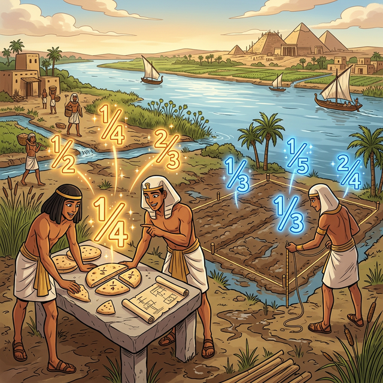

# 00. 인트로: 피자 조각과 인류의 생존 (Intro)

자연수(Natural Numbers)가 '사과 1개', '양 2마리'처럼 눈에 보이는 완전한 개체를 세는 데서 출발했다면, **유리수(Rational Numbers)**는 '나누기'라는 인류의 필사적인 생존 과정에서 탄생했습니다.

---

## 1. 나일강의 범람과 공평한 분배

수천 년 전 고대 이집트, 나일강은 매년 주기적으로 범람했습니다. 물이 빠지고 나면 비옥한 흙이 남았지만, 밭의 경계선들은 모두 지워져 버렸습니다. 
파라오의 관리들은 이 땅을 농부들에게 다시 공평하게 나누어 주어야 했습니다.

만약 똑같은 크기의 밭이 3개 있는데 농부가 4명이라면 어떻게 해야 할까요? 
"자연수"의 세계에서는 $3$을 $4$로 나눌 수 없습니다. 하지만 현실에서는 누구 하나 굶어 죽게 내버려 둘 수 없으므로, 밭을 쪼개서라도 나누어 가져야 했습니다.

  

## 2. '조각'을 표현하는 새로운 수의 언어

이집트인들은 자연수로 표현할 수 없는 이 '조각난 양'을 표시하기 위해 **분수(Fraction)**라는 새로운 개념을 발명했습니다. 
그들은 빵 1개를 4조각으로 자른 것 중 1조각을 $\frac{1}{4}$로 표현했고, 이것이 바로 **유리수의 기원**입니다.

* 원래 온전했던 하나를 $b$개로 자르고,
* 그중에서 $a$개를 가질 때, 
* 우리는 이것을 $\frac{a}{b}$라고 씁니다.

## 3. 유리수의 위대함: 비율(Ratio)

이집트인들이 시작한 분수는 이후 고대 그리스의 피타고라스 학파로 넘어가면서 **비율(Ratio)**이라는 철학적 개념으로 완성되었습니다. 피타고라스 학파는 우주의 모든 조화로움—음악의 화음, 건축물의 비례, 별들의 궤도—이 모두 정수와 정수의 비율, 즉 유리수로 이루어져 있다고 믿었습니다.

그래서 나눌 분(分), 셈 수(數)를 뜻하는 **분수**를 넘어, 비율(Ratio)이 있는 수라는 뜻의 **유리수(Rational Number)**라는 거대한 수 체계가 수학의 무대에 등장하게 된 것입니다.

이제 다음 시간부터는 이 유리수가 수학적으로 정확히 어떤 의미를 가지며, 우리가 쓰는 컴퓨터 안에서는 이 비율을 어떻게 계산하고 있는지 본격적으로 탐험해 보겠습니다!
