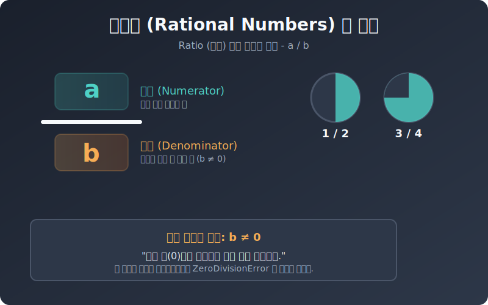

# 01. 첫 번째 수업: 유리수의 개념 (Concept of Rationals)

사과나 양의 개수를 셀 때 쓰던 $1, 2, 3\dots$을 우리는 자연수라고 부릅니다. 이 자연수에 $0$과 음의 정수($-1, -2\dots$)를 합치면 **정수(Integer)**가 됩니다.

하지만 정수만으로는 피자 반 판, 온도계의 소수점도 표현할 수 없습니다. 그래서 우리는 전체를 나누어 조각으로 표현하는 **분수**가 필요합니다. 

---

## 1. 유리수(Rational Number)의 정의

수학에서 유리수는 다음과 같이 명확하게 정의됩니다:

> **분모와 분자가 모두 정수이고, 분모가 0이 아닌 분수 $\frac{a}{b}$ 형태로 나타낼 수 있는 수**

* $a$: 분자 (Numerator) - 내가 가진 조각의 수
* $b$: 분모 (Denominator) - 전체를 자른 총 조각 수 (단, $b \neq 0$)

<div align="center">
  
</div>

## 2. 왜 분모는 절대 0이 될 수 없을까요?

수학에서 $0$으로 나누는 것은 금지되어 있습니다. 그 이유를 나누기를 "몫"의 관점에서 생각해 볼까요?
$\frac{6}{2} = 3$ 이라는 것은, $6$개짜리 피자를 $2$명이 똑같이 나누어 먹으면 한 명이 $3$개씩 먹는다는 뜻입니다. (이것은 $3 \times 2 = 6$과 같습니다.)

그렇다면 $\frac{6}{0} = ?$ 은 어떨까요?
$6$개짜리 피자를 $0$명이 똑같이 나누어 먹는다? 먹을 사람이 "없는"데 어떻게 나눌까요? 이를 역으로 곱셈 수식으로 만들면 $? \times 0 = 6$이 성립해야 합니다.
**어떤 수에 0을 곱해도 항상 0이 되므로, 곱해서 6을 만들 수 있는 수는 이 세상에 존재하지 않습니다.**

그래서 수학의 위대한 원칙: **"분모는 절대 0이 될 수 없다 ($b \neq 0$)"**가 생겨났습니다.

## 3. 파이썬에서 0으로 나누기를 시도한다면?

우리가 프로그래밍을 할 때 컴퓨터는 수학의 엄밀한 법칙을 그대로 따릅니다. 파이썬에게 0으로 나누기 계산을 시키면 어떻게 될까요? 컴퓨터는 즉시 붉은색 에러 메시지를 던지며 작업을 멈춥니다!

```python
# [Python] 0으로 나누기 (ZeroDivisionError) 확인하기

a = 10
b = 0

print("10을 0으로 나누는 유리수를 만들어 볼까요?")

try:
    result = a / b
    print(result)
except Exception as e:
    print(f"컴퓨터의 경고: {type(e).__name__} 발생!")
    print(f"상세 메시지: {e}")
```

**[실행 결과]**
```text
10을 0으로 나누는 유리수를 만들어 볼까요?
컴퓨터의 경고: ZeroDivisionError 발생!
상세 메시지: division by zero
```

어느 프로그래밍 언어에서든 메모리나 데이터 구조를 만들 때 "존재하지 않는 단위"로 나누려고 시도하면 `ZeroDivisionError`라는 치명적인 오류가 발생합니다. 수학책에서 배운 "단, 분모 $b \neq 0$" 이라는 ছোট্ট 글씨 하나가, 수백억짜리 웹 서버를 다운시킬 수 있는 핵심 원리인 것입니다.

## 4. 정수도 사실 유리수입니다!

놀랍게도 우리가 알던 정수 $3$도 유리수입니다. 왜냐하면 **결과적으로 $3$이 되는 분수 형태로 억지로 변신**할 수 있기 때문입니다.

$$
3 = \frac{3}{1} = \frac{6}{2} = \frac{300}{100}
$$

즉, 세상의 모든 정수(Integer)는 분모가 $1$인 꼴로 쓰일 수 있으므로 **유리수(Rational Numbers)**라는 거대한 집합의 아주 작고 평범한 일부분에 불과합니다.
