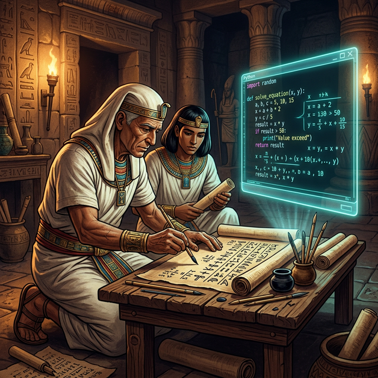

# 00. 식의 계산: 우리는 왜 문자를 사용할까? (Introduction)

안녕하세요! 이번 시리즈에서는 수학에서 가장 중요하고 혁명적인 발명 중 하나인 **'문자와 식(Algebraic Expressions)'**에 대해 알아봅니다.

여러분은 수학 문제를 풀 때 $x, y, a, b$ 같은 알파벳 문자를 본 적이 있을 것입니다. 단순히 숫자만 더하고 빼면 될 텐데, 수학자들은 왜 굳이 골치 아프게 영어 알파벳까지 수학에 끌어들였을까요? 

오늘날 우리가 스마트폰을 쓰고 인공지능(AI)과 자율주행 자동차를 만들 수 있는 모든 기술의 밑바탕에는 바로 이 '수학의 문자 사용'이 자리 잡고 있습니다.

---

## 학습 목표
* 수학에서 문자를 왜 사용하는지 근본적인 이유를 이해합니다.
* 수학의 문자가 컴퓨터 코딩의 '변수(Variable)'와 어떤 관계가 있는지 알아봅니다.

## 1. 문자는 가장 효율적인 암호이자 약속이다

과거, 아주 먼 옛날 수학자들은 수식을 어떻게 표현했을까요?
문자가 없던 시절에는 수학 문제를 전부 **'말로 풀어서'** 썼습니다.

예를 들어, "어떤 수에 3을 곱한 뒤 5를 더하면 14가 된다."라는 아주 간단한 수식도, 옛날 이집트나 중세 시대에는 수십 자루의 펜을 굴리며 길고 복잡한 소설처럼 길게 풀어써야 했습니다. 외국인에게 이 문제를 설명하려면 언어 장벽 때문에 번역기도 필요했죠.

<div align="center">
  
</div>

> **(참고: 생성된 AI 아트워크)**
>
> 고대에는 파피루스에 길게 서술하던 수학이, 현대에는 깔끔한 모니터 화면 속 코드 몇 줄로 바뀌었습니다!

하지만 시간이 흘러, 사람들은 아주 기발한 생각을 해냅니다. 
*"말이 안 통하는 외국인도, 그리고 나중에 이 글을 읽는 사람도 한눈에 알아볼 수 있는 세계 공통의 약속 기호를 만들면 어떨까?"*

이때 도입된 것이 바로 $+$, $-$, $=$, 그리고 미지의 값을 대신하는 문자 $x, y$ 였습니다. 
수학의 문자와 기호는 마치 길거리의 **'교통 표지판(Traffic Sign)'**과 같습니다. 빨간색 팔각형 표지판을 보면 러시아 사람이든, 한국 사람이든 모두 "정지(STOP)!"를 떠올리듯, $x + 5 = 10$ 이라는 식을 보면 전 세계 누구나 똑같은 의미를 이해할 수 있게 된 것입니다.

---

## 2. 코딩 변수(Variable)의 기원: 수학의 문자

이러한 수학의 문자는 수백 년이 지나 현대 컴퓨터 공학과 프로그래밍 언어(파이썬, C, 자바 등)의 핵심 개념인 **변수(Variable)**로 다시 태어났습니다.

우리가 파이썬(Python)으로 게임이나 AI를 만들 때, 컴퓨터 메모리 어딘가에 점수나 체력을 저장해야 합니다. 이때 컴퓨터에게 빈 '상자'를 만들어 달라고 요청하고, 그 상자에 이름을 붙이는데, 이것이 바로 코딩의 시작입니다.

### 🐍 파이썬과 수학의 문자 비교 (Variables in Python)

```python
# 파이썬에서 문자를 다루는 방법
# 'score'라는 이름표가 붙은 공간(상자)에 100을 넣습니다.
score = 100 

# 'bonus'라는 상자에 20을 넣습니다.
bonus = 20

# 두 문자를 더해서 새로운 'total' 상자에 넣습니다!
total = score + bonus 

print(f"나의 총 점수는 {total}점 입니다!")
# 출력 결과: 나의 총 점수는 120점 입니다!
```

이처럼 컴퓨터 공학에서 `score` 나 `bonus` 처럼 이름이 붙은 저장 공간을 **변수**라고 부르며, 그 본질은 수학자들이 모르는 수나 변하는 수를 표현하기 위해 $x$, $y$를 쓰기 시작한 것과 완벽하게 똑같은 아이디어입니다.

---

## 3. 문자와 식을 알면 세상이 단순해진다

숫자만 쓰면 구체적인 하나의 상황밖에 설명하지 못합니다. (예: 10 + 20)
하지만 문자($x + y$)를 사용하면 세상의 모든 덧셈 상황을 묘사할 수 있는 **'공식(Formula)'**과 **'일반화(Generalization)'**가 가능해집니다.

앞으로 우리는 이 책을 통해 다음과 같은 재미있는 사실들을 파헤쳐 볼 것입니다.

1. **상자($x$) 속에 숫자 집어넣기** (대입과 식의 값)
2. **복잡한 수식을 아주 깔끔하게 다듬기** (일차식과 다항식의 계산)
3. **세포가 증식하는 것 같은 거듭제곱의 원리** (지수법칙)
4. **블록처럼 맞추는 퍼즐 공식** (곱셈공식)

단순히 지루한 계산 문제가 아니라, 코딩과 논리적인 사고방식의 관점에서 '식의 계산' 세상을 함께 모험해 봅시다! 다음 1장(첫 번째 수업)에서는 본격적으로 '문자를 사용하여 식을 아주 짧게 요약하는 마법'을 배워보겠습니다.

---

## 학습 정리
1. **문자의 사용**: 과거의 길고 복잡한 말 풀이 대신, 세계 누구나 한눈에 알아볼 수 있는 공통 기호로 식을 간단하고 명확하게 표현하기 위해 발명되었습니다.
2. **변수 (Variable)**: 수학에서 미지의 값을 나타내는 문자($x, y$)의 개념은 현대 컴퓨터 프로그래밍에서 데이터를 담는 공간인 '변수'의 완벽한 기원이 되었습니다.
