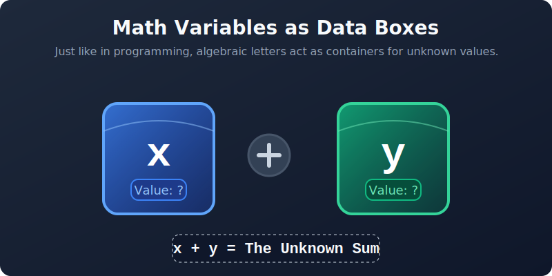




# 01. 첫 번째 수업: 문자를 사용하여 식을 나타내 볼까요? (Why use letters?)

우리는 일상생활에서 수많은 기호와 그림을 봅니다. 스마트폰의 와이파이(Wi-Fi) 기호나 배터리 잔량 아이콘, 그리고 횡단보도의 초록불 신호등은 굳이 길게 말로 설명하지 않아도 우리에게 완벽한 정보를 줍니다. 내비게이션의 ↱ (우회전) 표시나 옷의 라벨에 그려진 세탁 기호($60^{\circ}\text{C}$, 비틀어 짜지 말 것 등) 역시 우리 삶을 안전하고 편리하게 만들어주는 필수적인 약속입니다.

수학에서 사용하는 기호와 문자도 마찬가지입니다. 수학은 전 세계 사람이 공통으로 사용하는 **가장 짧고 강력한 언어**입니다. 이 언어를 사용할 때 없어서는 안 될 핵심 주인공이 바로 **문자(Letters/Variables)**입니다.

## 0. 대수학의 아버지, 프랑수아 비에트(François Viète)

> "내가 바로 수학 계산의 기준이야. 이전의 수학은 수 계산이었지만, 내 이후의 수학은 기호 계산이지."

16세기 프랑스의 천재 수학자 **비에트**는 당시 스페인 군대의 500개가 넘는 복잡한 비밀 암호를 풀어내어 전쟁에서 프랑스를 승리로 이끈 영웅이었습니다. 그는 암호를 풀던 치밀한 논리를 바탕으로, "아직 모르는 수나 계속 변하는 수를 계산할 때마다 매번 말로 길게 적지 말고, **알파벳 문자(기호)로 대신 쓰자**"고 강력하게 주장했습니다. 비에트 덕분에 인류는 비로소 숫자에서 해방되어 논리와 문자의 세계(대수학)로 진입하게 되었습니다.

---

## 학습 목표
* 프랑스의 천재 수학자 비에트가 창안한 '문자를 사용한 식'의 위대함을 이해합니다.
* 문자를 사용하여 수식을 가장 짧고 효율적인 형태로 줄여 쓰는 규칙을 익힙니다.
* 곱셈 기호($\times$)와 나눗셈 기호($\div$)를 생략하여 식을 간결하게 표현하고, 이를 컴퓨터 알고리즘과 연결해 이해합니다.

## 1. 문자는 변하는 값(데이터)을 담는 상자

길이를 모르거나 값이 계속 변할 수 있을 때, 옛날 사람들은 "알 수 없는 어떤 수"라고 길게 적었습니다. 하지만 비에트의 발명 이후, 우리는 그 빈 곳에 알파벳 **$x$** 나 **$y$** 를 세워 둡니다.

> 코딩과 컴퓨터 과학에서는 이런 문자의 역할을 **변수(Variable)**라고 부릅니다.
> 변수란 데이터를 담아두는 '이름표가 붙은 투명 상자'와 같습니다.

<div align="center">
  
</div>

보통 수학에서 길이를 모를 때는 영어 Length의 첫 글자인 **$l$**, 시간은 Time의 **$t$**, 속도는 Velocity의 **$v$**를 사용하며, 가장 보편적으로 모르는 수는 **$x, y, z$**를 사용합니다.

예를 들어, 1000원짜리 두부를 $x$개, 500원짜리 아이스크림을 $y$개 샀다고 해봅시다. 아직 몇 개를 샀는지는 정확히 모르지만, 우리가 지불해야 할 총금액은 문자를 사용하여 아주 깔끔하게 적을 수 있습니다.

**지불할 금액:** $(1000 \times x) + (500 \times y)$ 원

과자를 3개 샀다면 나중에 투명 상자 $x$ 안에 숫자 3을 쏙 집어넣기만 하면 계산이 끝납니다!

---

## 2. 수학 기호 다이어트: 곱셈과 나눗셈 기호 생략하기

스마트폰에서 문자를 보낼 때 우리는 "ㅇㅇ", "ㅋㅋ" 처럼 말을 줄여 씁니다. 수학자들도 마찬가지로 어떻게 하면 수식을 더 짧게 줄여 쓸 수 있을까 고민했습니다. 

그 결과 탄생한 위대한 발명이 바로 **곱셈 기호($\times$)와 나눗셈 기호($\div$)의 생략**입니다.

### 📝 [규칙 1] 곱셈 기호 생략하기
1. **수와 문자의 곱:** 수는 문자 앞에 쓰고 '$\times$'를 지웁니다.
   * $x \times 5 \Rightarrow \mathbf{5x}$
   * $y \times (-3) \Rightarrow \mathbf{-3y}$
2. **문자와 문자의 곱:** '$\times$'를 지우고 보통 알파벳 순서대로 씁니다.
   * $b \times a \times 2 \Rightarrow \mathbf{2ab}$
3. **1의 생략:** $1$이나 $-1$을 문자에 곱할 때는 $1$을 쓰지 않습니다.
   * $1 \times x \Rightarrow \mathbf{x}$  $(1x 라고 쓰지 않아요!)$
   * $-1 \times y \Rightarrow \mathbf{-y}$

> **⚠️ 주의할 점!**
> "그럼 $0.1 \times x$ 도 1을 빼고 $0.x$ 라고 쓰면 되나요?"
> **안 됩니다!** 소수점 아래에 있는 $1$은 숫자의 크기를 나타내기 때문에 지울 수 없습니다. 답은 $\mathbf{0.1x}$ 입니다.

### 📝 [규칙 2] 나눗셈 기호 생략하기
나눗셈은 언제나 **분수**로 바꿀 수 있죠! $\div$ 기호를 싹 지우고, 뒤에 있는 수를 분모로 내려보내면 됩니다.

* $x \div 3 \Rightarrow \mathbf{\frac{x}{3}}$ (또는 $\mathbf{\frac{1}{3}x}$)
* $5a \div 2b \Rightarrow \mathbf{\frac{5a}{2b}}$

<div align="center">
  
</div>

<div align="center">
  
</div>

---

## 3. 파이썬(Python)의 인공지능 수학 라이브러리: SymPy

우리가 방금 배운 문자의 생략 규칙, 컴퓨터도 알아들을 수 있을까요?
파이썬에는 수학 공식을 사람처럼 풀어주는 똑똑한 **`SymPy`** (Symbolic Python)라는 라이브러리가 있습니다.

컴퓨터 프로그래밍 세상에서는 문자끼리 곱할 때 반드시 `*` (별표 기호)를 써야 하지만, 이 똑똑한 인공지능 수식 라이브러리는 우리의 곱셈 기호 생략 규칙을 이해하고 수학 교과서 모습 그대로 화면에 띄워줍니다.

```python
import sympy as sp

# 1. 컴퓨터에게 '이 알파벳들은 단순히 글자가 아니라 수학 변수(기호)야!' 라고 알려줍니다.
x, y = sp.symbols('x y')

# 2. 아주 지저분한 곱셈과 나눗셈 식을 만들어 줍니다.
# 수학식: (y * -3 * x * 2) / (x * 4)
expression = (y * -3 * x * 2) / (x * 4)

# 3. 컴퓨터야, 식을 예쁘게 다이어트 시켜줘! (생략 규칙 적용)
simplified_expr = sp.simplify(expression)

print("원래 복잡했던 식:", expression)
print("깔끔하게 생략된 결과:", simplified_expr)

# 출력 결과
# 유치한 쌩얼(?) 식: -6*x*y / (4*x)
# 다듬어진 결과: -3*y/2 
```
파이썬 코드를 실행해 보면, 컴퓨터가 $x$를 약분하고, 숫자는 문자 앞으로, $-\frac{6}{4}$은 $-\frac{3}{2}$으로 완벽하게 정리해서 $\mathbf{-\frac{3y}{2}}$ 라고 대답해 줍니다. 

**수학의 규칙과 생략법은 현대 인공지능 프로그래밍의 기초 논리와 완벽하게 똑같습니다.**

---

## 학습 정리

1. **수식의 문자 = 코딩의 변수(Variable):** 아직 알 수 없는 수나 변하는 데이터를 담아두는 유용한 마법의 빈 상자이다.
2. **비밀 축지법: 기호 생략하기:** 
   * 문자와 숫자를 곱할 땐 숫자가 대장! 앞으로 갑니다. (예: $a \times (-5) = -5a$)
   * 나눗셈은 무조건 분수 모양 층간소음 탈출! (예: $a \div b = \frac{a}{b}$)
3. **AI와의 연동:** 파이썬 `SymPy`를 사용하면, 수학책에서 배운 문자의 생략 및 약분 규칙을 컴퓨터가 알아서 계산해 준다.

식을 깔끔하게 생략하여 쓰는 방법을 알았으니, 이제 저 **$x$ 상자** 안에 진짜 숫자를 집어넣어 봐야겠죠? 
다음 장 **"두 번째 수업: 식에도 값이 있다고!"** 에서 대입(Substitution)의 세계로 떠나봅시다!

