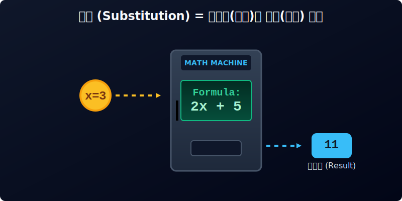

# 02. 두 번째 수업: 식에도 값이 있다고! (Value of Expressions)

지난 시간에 우리는 문자를 사용해서 길고 지저분한 식을 아주 간결하게 줄여 쓰는 방법을 배웠습니다. $x$나 $y$ 같은 문자는 아직 정해지지 않은 **구멍 난 상자(빈칸)**와 같습니다. 

이번 시간에는 그 빈 상자 안에 진짜 숫자를 집어넣었을 때 어떤 마법처럼 숫자가 완성되어 나오는지, **대입(Substitution)**의 원리를 배워봅시다.

---

## 학습 목표
* 식에 등장하는 문자 대신 숫자를 집어넣는 '대입(Substitution)'의 개념을 이해합니다.
* 괄호의 활용법과 부호에 주의하며 식의 값을 정확하게 계산하는 원리를 배웁니다.
* 함수에 값을 입력하여 결과를 내는 컴퓨터 과학의 자판기 모델을 수식과 연결하여 이해합니다.

## 1. 대입(Substitution): 기즈모에게 물방울 떨어뜨리기

대입이라는 말은 '대신(代)해서 넣는다(入)'는 뜻입니다. 
문자 대신에 어떤 강력한 **숫자**를 식에 집어넣는 과정을 의미합니다.

수학자 비에트는 이 과정을 귀여운 영화 캐릭터인 **'기즈모(Gizmo)'**에 비유했습니다. 영화 <그렘린>에 나오는 기즈모는 몸에 물이 닿으면 사악한 괴물 '모과이'로 변신하며 증식하는 특징이 있습니다. 

<div align="center">
  
</div>

1. **식(Formula)**은 아직 물을 맞지 않은 귀여운 기즈모 $x$ 입니다. (예: 생성될 괴물의 수 = $2x + 5$)
2. **대입(Substitution)**은 기즈모에게 떨어뜨리는 **물방울(숫자)**입니다. (예: 물방울 $x = 3$ml)
3. **식의 값(Value)**은 물방울을 맞고 증식 연산을 끝낸 뒤 실제로 튀어나오는 모과이 괴물의 총 마릿수입니다. (예: 11마리)

기즈모 식 '$2x + 5$' 에 물방울 $x=3$ 을 떨어뜨렸다고 상상해 봅시다.
* $2x$는 원래 $2 \times x$에서 곱하기가 생략된 것입니다.
* $x$ 자리에 $3$이 쏙 들어가면, 숨겨졌던 곱하기 기호가 다시 살아납니다!
* $2 \times 3 + 5$ 로 변환됩니다.
* 계산하면 $6 + 5 = 11$ 입니다.

이렇게 문자에 숫자를 넣어서(대입하여) 얻어낸 최종 결과 $11$을 **식의 값**이라고 부릅니다. 아주 직관적이고 재밌죠?

---

## 2. 괄호의 마법: 음수를 넣을 때 조심하세요!

양수를 넣을 때는 그냥 숫자만 넣으면 되지만, 마이너스($-$)가 달린 **음수**를 대입할 때는 매우 조심해야 합니다. 
마치 독극물을 다루듯, 음수는 반드시 안전한 보호장구인 **괄호 ( )**로 꽁꽁 싸매서 대입해야 합니다.

<div align="center">
  
</div>

<div align="center">
  
</div>

**예제: 식 $-3x + 4$ 일 때, $x = -2$ 대입하기**

1. 문자에 숫자를 대입하기 전에 **생략된 곱셈 기호**를 다시 살려줍니다.
   $$-3 \times x + 4$$
2. $x$ 자리에 음수 $-2$를 넣습니다. 이때 반드시 **괄호**를 칩니다!
   $$-3 \times \mathbf{(-2)} + 4$$
3. 음수와 음수를 곱하면 양수가 되는 규칙을 기억하나요? $(-3 \times -2 = +6)$
   $$6 + 4 = 10$$
   
따라서 이 식의 값은 $10$이 됩니다. 만약 괄호를 치지 않고 대충 $-3 \times -2 + 4$ 처럼 쓰면, 나중에 뺄셈이랑 헷갈려서 계산을 다 망칠 수 있습니다. **음수 대입 = 무조건 괄호 씌우기!** 만 기억하세요.

---

## 3. 파이썬 `SymPy`로 식의 값 1초 만에 구하기 

수학 문제집에서는 이 계산을 손으로 하나하나 다 풀어야 하지만, 실제 인공지능 엔지니어들이 쓰는 파이썬에서는 `subs()` 라는 함수 하나로 이 대입 연산을 순식간에 끝냅니다. (`subs`는 영어 단어 Substitution의 줄임말입니다.)

파이썬이 자판기 역할을 어떻게 하는지 실습해 봅시다!

```python
import sympy as sp

# 1. 기호 상자 만들기
x = sp.Symbol('x')

# 2. 강력한 계산기(식) 설계하기
formula = 2*x + 5

# 3. 상황별로 동전(입력값) 넣기! => subs() 함수 사용
# "formula.subs(x, 3)" 이란 "formula 식의 x 자리에 3을 넣어라" 라는 뜻입니다.

result_1 = formula.subs(x, 3)
result_2 = formula.subs(x, -2) # 음수도 알아서 척척 계산합니다.
result_3 = formula.subs(x, 100)

# 결과 출력
print(f"자판기에 x=3 을 넣으면? 띠링~ 결과는: {result_1}")
print(f"자판기에 x=-2 를 넣으면? 띠링~ 결과는: {result_2}")
print(f"자판기에 x=100 을 넣으면? 띠링~ 결과는: {result_3}")

# 결과값:
# 자판기에 x=3 을 넣으면? 띠링~ 결과는: 11
# 자판기에 x=-2 를 넣으면? 띠링~ 결과는: 1
# 자판기에 x=100 을 넣으면? 띠링~ 결과는: 205
```

컴퓨터 안에서는 아무리 복잡하게 얽힌 식이라도, $x, y, z$ 값이 주어지면 0.001초 만에 `subs()`를 통해서 결과값을 연쇄적으로 뽑아냅니다. 
우리가 넷플릭스에서 영상을 추천받을 때도, 여러분의 나이, 시청 기록 같은 숫자(동전)들이 알고리즘(거대한 자판기 식)에 대입되어 "취향 점수"라는 식의 값으로 변환되어 나오는 것이랍니다!

---

## 학습 정리

1. **대입 (Substitution)**: 식 안에 들어 있는 문자(빈 상자) 대신에 특정한 숫자를 집어넣어 식을 완성하는 통과 의례입니다.
2. **식의 값 (Value)**: 숫자를 대입한 후, 계산 순서(괄호 $\to$ 곱셈/나눗셈 $\to$ 덧셈/뺄셈)에 맞게 풀어낸 최종 결과값입니다.
3. **음수 주의보**: 음수를 대입할 때는 숫자 주변에 **(괄호)**라는 방패를 반드시 둘러 쳐야 부호 실수를 하지 않습니다.
4. **파이썬 명령어**: `SymPy` 라이브러리의 `subs(기호, 숫자)` 함수를 쓰면 대입과 계산을 한 번에 끝낼 수 있습니다.

식에 숫자를 넣어서 결과를 확인하는 법을 배웠으니, 다음 장 **"세 번째 수업: 일차식 간단하게 나타내기"**에서는 숫자 대입 전에 복잡하고 지저분한 긴 식을 끼리끼리 묶어서 짧게 다이어트 시키는 훈련을 해보겠습니다!
