# 03. 세 번째 수업: 일차식 간단하게 나타내기 (Linear Expressions)

여러분, 책상 위가 어지럽혀져 있을 때 어떻게 정리하나요? 연필은 연필꽂이에, 지우개는 지우개통에, 책은 책꽂이에 **'같은 종류끼리 묶어서'** 정리하죠? 

수학의 수식도 마찬가지입니다. 길고 복잡하게 나열된 식을 보면 눈이 아픕니다. 
이번 시간에는 식이 어지럽게 늘어져 있을 때, 수학자들과 컴퓨터가 어떻게 같은 종류(동류항)끼리 모아서 식을 깔끔하게 **'청소'**하는지 알아보겠습니다.

---

## 학습 목표
* 문자와 차수가 같은 항을 뜻하는 '동류항'의 개념을 이해하고, 이를 이용해 식을 간단히 정리할 수 있습니다.
* 분배법칙을 사용하여 괄호를 풀고 식을 연산하는 계산 원리를 익힙니다.
* 파이썬의 `simplify()` 명령어가 하는 역할이 복잡한 수식을 동류항끼리 모아주는 것과 같음을 이해합니다.

## 1. 동류항 (Like Terms): 끼리끼리 모여라!

수학에서 식을 정리하는 핵심 기술은 **동류항(Likely Terms)**을 찾는 것입니다. 
**'동류(同類)'**란 같을 동, 무리 류 자를 써서 "같은 무리(종류)"라는 뜻입니다.

마트에서 과일을 고르듯, 아니면 저금통에 동전을 분류하듯 생각해 봅시다.

### 💰 저금통과 동전 분류하기
비에트는 동류항을 재미있게 '저금통'으로 설명했습니다. 책상 위에 500원, 100원, 50원, 10원짜리 동전들이 뒤섞여 있다고 생각해 보세요. 이 동전들을 같은 종류끼리 모아 저금통에 넣으려면 몇 개의 저금통이 필요할까요? 

당연히 **4개**의 저금통이 필요합니다. 500원짜리는 500원짜리끼리, 100원짜리는 100원짜리끼리 넣어야 하니까요. 식에 써 있는 항들도 마찬가지입니다. 같은 종류의 항끼리 모으는 것, 그것이 바로 **동류항**입니다.

### 🍎 과일 바구니 인공지능 로봇
장바구니에 사과 3개, 바나나 2개, 다시 사과 2개, 바나나 1개가 섞여 있습니다. 이 상황을 문자를 써서 나타내 볼까요? 사과를 $x$, 바나나를 $y$라고 합시다.

$$3x + 2y + 2x + 1y$$

이렇게 늘어놓고 영수증을 쓰면 굉장히 헷갈리겠죠? 인공지능 로봇이 이 과일들을 정리한다면, 붉은 사과($x$)는 빨간 바구니에, 노란 바나나($y$)는 노란 바구니에 끼리끼리 모아서 정리할 것입니다.

<div align="center">
  
</div>

<div align="center">
  
</div>

### 🟨 색종이의 넓이 더하기
수학적으로 동류항이란 **문자의 종류($x, y$)와 차수(제곱의 횟수)가 똑같은 항**을 말합니다. 
가로가 $x\text{cm}$, 세로가 $2\text{cm}$인 색종이의 넓이($2x$)와 가로가 $x\text{cm}$, 세로가 $3\text{cm}$인 색종이 넓이($3x$)를 더한다고 생각해 보세요.

* 색종이 넓이 더하기: $2x + 3x = (2+3)x = \mathbf{5x}$
* 과일 합치기: $(3x + 2x) + (2y + 1y) = \mathbf{5x + 3y}$

동류항끼리는 앞에 붙어있는 숫자(계수)들끼리 덧셈과 뺄셈을 해서 아주 예쁘고 짧은 하나로 깔끔하게 합칠 수 있습니다!

---

## 2. 일차식의 계산 규칙

과일 바구니 정리를 이해했다면, 이제 본격적인 일차식(문자가 한 번만 곱해진 식, 예: $3x$, $-5y$) 청소를 해봅시다.

### [규칙 1] 문자가 여러 종류일 때: 자기 짝꿍(동류항)만 찾아서 계산한다.
$$5a - 2b + 3a + 7b$$
1. $a$는 $a$끼리, $b$는 $b$끼리 묶어줍니다.
2. $(5a + 3a) + (-2b + 7b)$
3. $\mathbf{8a + 5b}$

> ⚠️ 절대 $8a$와 $5b$를 더해서 $13ab$라고 쓰면 안 됩니다! 사과와 바나나를 합쳐서 사바나(?)를 만들 수 없는 것과 같습니다.

### [규칙 2] 괄호가 있을 때: 배달 기사님(분배법칙)을 먼저 출동시킨다.
식 앞에 숫자가 곱해진 채로 괄호가 있다면, 이 숫자는 괄호 안의 모든 문자에 골고루 곱해져야 합니다. 이것을 **분배법칙(Distributive Property)**이라고 합니다. 
마치 배달 기사님이 한 명 한 명 빠짐없이 물건을 나눠줘야 하는 것과 같습니다.

$$2(3x + 4) - (x - 5)$$
1. 먼저 앞의 $2$를 괄호 안의 $3x$와 $4$에 모두 곱합니다(배포).
   $\Rightarrow 6x + 8$
2. 뒤의 $-(x - 5)$는 사실 $-1(x - 5)$와 같습니다. $-1$을 골고루 분배해 줍니다.
   $\Rightarrow -x + 5$  (마이너스가 두 번 만나면 플러스가 됩니다!)
3. 이제 괄호가 풀린 식을 나열해 볼까요?
   $\Rightarrow 6x + 8 - x + 5$
4. 마지막으로 동류항(같은 글자끼리, 숫자끼리) 묶어줍니다.
   $\Rightarrow (6x - x) + (8 + 5)$
   $\Rightarrow \mathbf{5x + 13}$

---

## 3. 파이썬 `SymPy`의 청소기: `.simplify()`

우리가 방금 손으로 한 괄호 풀기와 동류항 묶기를 컴퓨터는 어떻게 할까요?
파이썬 언어에서는 이 과정을 **'식 단순화(Simplify)'** 라고 부릅니다. 

로봇 청소기의 전원 버튼을 누르는 것처럼, 파이썬 라이브러리 `SymPy` 에서는 `.simplify()` 라는 강력한 전용 명령어를 사용합니다. 복잡한 수식이 들어오면 내부 알고리즘이 자동으로 같은 문자($x$)를 쑥쑥 뽑아서 모아줍니다.

```python
import sympy as sp

x, y = sp.symbols('x y')

# 1. 아까 풀었던 복잡한 과일 바구니 식
messy_fruit = 3*x + 2*y + 2*x + 1*y

# 2. 아주 복잡한 괄호 식 (배달 기사님 분배법칙 필요!)
messy_equation = 2*(3*x + 4) - (x - 5)

# 3. 로봇 청소기 작동! (.simplify())
clean_fruit = sp.simplify(messy_fruit)
clean_equation = sp.simplify(messy_equation)

print(f"과일 바구니 정리 결과: {clean_fruit}")
print(f"복잡한 괄호식 정리 결과: {clean_equation}")

# 출력 결과:
# 과일 바구니 정리 결과: 5*x + 3*y
# 복잡한 괄호식 정리 결과: 5*x + 13
```

컴퓨터 프로그래머들은 데이터를 분석할 때 이런 수학적 알고리즘을 이용해서 불필요하게 쪼개어져 있는 빅데이터를 한곳에 예쁘게 모으는(분류하는) 작업을 한답니다.

---

## 학습 정리

1. **동류항 (Like Terms):** 문자와 그 차수가 완벽하게 똑같은 항. (사과는 사과끼리, 바나나는 바나나끼리!)
2. **식 간단하게 하기:** 
   * 괄호가 있다면 무조건 **분배법칙**을 사용하여 괄호부터 찢어(?) 버린다.
   * 식이 일렬로 늘어지면 흩어진 **동류항끼리 짝꿍**을 지어 덧셈, 뺄셈을 해서 합친다.
3. **AI 시대의 단순화:** 파이썬 `SymPy` 모듈의 `simplify()` 명령어를 사용하면 AI가 인간보다 훨씬 빠르고 정확하게 수식 다이어트를 시켜준다.

이제 문자 한 개짜리 일차식을 마스터했습니다! 
그런데 만약 세포 분열처럼 똑같은 숫자가 2번, 3번, 10번 계속 곱해진다면 어떨까요?
다음 네 번째 수업 **"지수법칙 (Laws of Exponents)"** 에서는 데이터가 폭발적으로 증식하는 수학의 마법을 알아보겠습니다!
