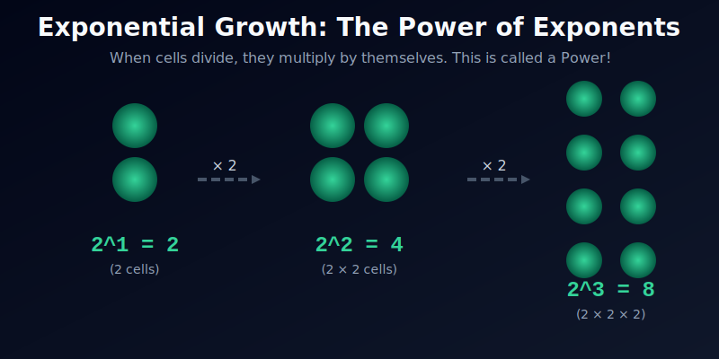




# 04. 네 번째 수업: 곱셈의 강력한 마법, 지수법칙 (Laws of Exponents)

공상과학(SF) 영화를 보면, 연구소에서 탈출한 작은 바이러스 세포 하나가 순식간에 두 개로 쪼개지고, 두 개가 다시 네 개가 되고, 네 개가 여덟 개가 되면서 전 세계로 퍼져나가는 무서운 장면이 나오곤 합니다.

이렇게 특정한 숫자가 끊임없이 자기 자신과 곱해지며 똑같이 부풀려지는 폭발적인 현상을 수학에서는 **거듭제곱(Powers)**이라고 부릅니다. 그리고 이 거듭제곱을 다루는 강력한 규칙이 바로 **지수법칙(Laws of Exponents)**입니다.

---

## 학습 목표
* 같은 숫자나 문자를 여러 번 곱한 '거듭제곱'을 밑과 지수로 나타내는 방법을 이해합니다.
* 거듭제곱의 곱셈, 나눗셈, 거듭제곱의 거듭제곱을 계산할 때 사용하는 **지수법칙 3가지**를 완벽히 익힙니다.
* 파이썬 코딩 기호 `**` 가 어떻게 지수를 표현하는지 알아봅니다.

## 1. 폭발적인 성장의 기록: 거듭제곱

비에트는 거듭제곱을 설명하기 위해 종이접기를 예로 들었습니다. 
"색종이를 반으로 자르면 2조각이 되고, 그걸 또 반으로 자르면 4조각, 또 반으로 자르면 8조각이 됩니다. 만약 10번을 자른다면 $2 \times 2 \times 2 \times 2 \times 2 \times 2 \times 2 \times 2 \times 2 \times 2$ 조각이 됩니다. 너무 길죠?"

이렇게 특정한 숫자가 끊임없이 곱해지는 현상을 거듭제곱(Powers)이라고 부릅니다. 수학자들은 방금 전의 긴 식을 아주 영리한 표기법으로 발명했습니다.

$$ 2 \times 2 \times 2 \dots (10\text{번}) = \mathbf{2^{10}} $$

* 밑에 있는 큰 숫자 **$2$**를 **밑(Base)**이라고 부릅니다. (복사기로 복사할 원본 데이터입니다.)
* 오른쪽 위에 있는 작은 숫자 **$10$**을 **지수(Exponent)**라고 부릅니다. (몇 번 복사할 것인지 횟수를 뜻합니다.)

도형의 넓이나 부피도 거듭제곱입니다. 한 변의 길이가 $1\text{m}$인 정사각형의 넓이는 $1\text{m}^2$ (제곱미터)이고, 한 변이 $x\text{m}$인 루빅스 큐브(정육면체)의 부피는 가로 $\times$ 세로 $\times$ 높이이므로 $x \times x \times x = \mathbf{x^3}$ (세제곱미터)라고 표기합니다. 

<div align="center">
  
</div>

* 밑에 있는 큰 숫자 **$2$**를 **밑(Base)**이라고 부릅니다. (복사기로 복사할 원본 데이터입니다.)
* 오른쪽 위에 있는 작은 숫자 **$3$**을 **지수(Exponent)**라고 부릅니다. (몇 번 복사할 것인지 횟수를 뜻합니다.)

<div align="center">
  
</div>

<div align="center">
  
</div>

문자도 마찬가지입니다. $a$를 똑같이 세 번 곱했다면 $a \times a \times a = \mathbf{a^3}$ 이라고 깔끔하게 씁니다. 지난 시간에 배운 '덧셈'을 여러 번 한 것($a + a + a = 3a$)과는 하늘과 땅 차이만큼 결과값이 다릅니다!

---

## 2. 지수법칙 3총사: 거듭제곱을 다루는 치트키

이제 이 '지수'들이 서로 만났을 때 어떤 마법 같은 일들이 벌어지는지, 핵심 계산 규칙 3가지를 알아봅시다. 공식을 그냥 외우지 말고 원리를 이해하면 절대 까먹지 않습니다!

### [법칙 1] 곱할 때는 지수끼리 "더하기" (지수의 합)
세포가 2번 분열된 덩어리($2^2$)와 3번 분열된 덩어리($2^3$)가 만나서 합쳐진다면, 결국 처음 세포가 총 5번 분열한 것과 똑같아집니다.

* $a^2 \times a^3 = (a \times a) \times (a \times a \times a)$
* 총 $a$가 5번 곱해졌으므로 $\mathbf{a^5}$ 이 됩니다.
* **공식:** $a^m \times a^n = a^{m+n}$

### [법칙 2] 나눌 때는 지수끼리 "빼기" (지수의 차)
곱할 때 더했다면, 나눌 때는 당연히 반대로 빼면 됩니다. $a$를 5번 곱한 덩어리에서 3번 곱한 덩어리를 덜어내면 몇 번 곱한 것만 남을까요?

* $a^5 \div a^3 = \frac{a \times a \times a \times a \times a}{a \times a \times a}$
* 분모와 분자에서 $a$ 세 개씩을 똑같이 약분(지우기)해 버립니다.
* 그러면 위쪽 분자에 $a$가 2개만 남으므로 $\mathbf{a^2}$ 이 됩니다.
* **공식:** $a^m \div a^n = a^{m-n}$ (단, 앞의 숫자가 크고, $a$가 0이 아닐 때)

### [법칙 3] 지수에 지수를 입힐 때는 "곱하기" (지수의 곱)
비에트는 이를 아주 재밌는 '독도 박테리아'로 설명했습니다. 1시간마다 4배로 늘어나는 박테리아가 5시간 뒤면 $4^5$ 마리가 됩니다. 그런데 4는 $2^2$ 과 같죠? 즉 $(2^2)^5$ 가 됩니다. 

* $(2^2)^5$ 은 $2^2$ 이라는 묶음 5개가 있다는 뜻입니다.
* $2^2 \times 2^2 \times 2^2 \times 2^2 \times 2^2 = 2^{2+2+2+2+2}$
* 지수가 5번 더해졌으므로 결국 $2 \times 5$를 한 $\mathbf{2^{10}}$ 과 같습니다.
* **공식:** $(a^m)^n = a^{m \times n}$

---

## 3. 파이썬 `SymPy`로 거듭제곱 날개 달기

파이썬 프로그래밍 언어에서 거듭제곱(지수)을 나타낼 때는 숫자 위에 작게 얹어서 쓸 수가 없기 때문에, 곱하기 기호(별표 `*`)를 두 번 연속으로 써서 `**` 로 표시합니다. (예: $2^3$ 은 코딩으로 `2**3` 입니다.)

AI 수학 라이브러리인 `SymPy`를 사용해서 우리가 방금 배운 세 가지 법칙이 컴퓨터 안에서 완벽하게 들어맞는지 실험해 봅시다!

```python
import sympy as sp

# 1. 미지수 상자 준비
a = sp.Symbol('a')

# 2. 지수법칙 1번 실험: 곱하기 (지수끼리는 덧셈이 될까?)
rule_1 = (a**2) * (a**3)

# 3. 지수법칙 2번 실험: 나누기 (지수끼리는 뺄셈이 될까?)
rule_2 = (a**5) / (a**3)

# 4. 지수법칙 3번 실험: 지수의 거듭제곱 (지수끼리는 곱셈이 될까?)
# 복잡한 괄호를 풀어주는 sympy의 powsimp(power simplification) 명령어를 씁니다.
rule_3 = sp.powsimp((a**2)**3)

print("결과 1 [합]:", rule_1)
print("결과 2 [차]:", rule_2)
print("결과 3 [곱]:", rule_3)

# 출력 결과:
# 결과 1 [합]: a**5  (성공!)
# 결과 2 [차]: a**2  (성공!)
# 결과 3 [곱]: a**6  (성공!)
```

이처럼 프로그래밍 세상에서도 거듭제곱의 원리는 수학 교과서의 지수법칙 3총사와 완벽하게 똑같이 굴러가고 있습니다!

---

## 학습 정리

1. **거듭제곱:** 똑같은 숫자나 문자를 계속 곱하는 마법. 오른쪽 위 작게 적힌 숫자가 바로 복사기 횟수인 **지수(Exponent)**입니다.
2. **지수법칙 3공식:** 
   * 원본이 같은 끼리 **곱할 땐** 지수끼리 더한다! ($+$, 합)
   * 원본이 같은 끼리 **나눌 땐** 지수끼리 뺀다! ($-$, 차)
   * 괄호 바깥에 **또 지수가 있으면** 지수끼리 곱한다! ($\times$, 곱)
3. **파이썬 기호:** 수학책에서는 $a^3$ 이지만, 컴퓨터 코딩에서는 별 두 개를 달고 `a**3` 이라고 씁니다.

지수법칙까지 마스터했다면, 이제 여러분은 덩어리가 큰 복잡한 차수의 수식(다항식)을 만날 마음의 준비가 된 것입니다. 
다음 장 **"다섯 번째 수업: 다항식 간단하게 나타내기"** 에서는 괄호와 더하기/빼기가 복잡하게 얽혀 있는 수식들의 껍질을 벗기고 하나로 모으는 진정한 마술을 연습해 보겠습니다!

