# 05. 다섯 번째 수업: 다항식 간단명료하게 정리하기 (Polynomial Simplification)

지금까지 우리는 $x$ 하나만 덩그러니 있는 식(일차식)을 다루었습니다. 하지만 세상이 그렇게 호락호락하지 않죠?
인공지능이나 빅데이터를 다루다 보면 $x^2, x^3, y^2, y^3$ 심지어 그들이 복잡하게 뒤섞인 긴 수식을 마주하게 됩니다.

항이 여러 개 모여 있는 이런 거대한 식들을 **다항식(Polynomial)**이라고 부릅니다. 이번 시간에는 아무리 복잡하게 얽히고설킨 괄호와 다항식의 산더미라도, 깔끔한 규칙 몇 가지로 순식간에 청소하는 방법을 배워봅시다!

---

## 학습 목표
* 다항식의 덧셈과 뺄셈 원리를 이해하고 차수(Degree)별로 내림차순 정렬할 수 있습니다.
* 분배법칙을 활용하여 복잡한 괄호를 여러 개 풀고 식을 깔끔하게 정리하는 방법을 익힙니다.
* 파이썬의 `expand()` 와 `collect()` 명령어로 거대한 다항식을 처리하는 원리를 배웁니다.

## 1. 다항식의 분류 기준: 차수 (Degree)

우리가 과일을 종류별로 분류하듯, 컴퓨터가 다항식을 정리할 때 가장 먼저 보는 것은 **차수(Degree)**입니다.
차수는 '한 항에서 문자가 총 몇 번 곱해졌는가?'를 뜻합니다. 지수법칙에서 배웠던 작은 숫자(지수)가 바로 차수를 결정하는 핵심입니다.

* $3x$ $\rightarrow$ $x$가 한 번 곱해졌으므로 **1차항**
* $-5x^2$ $\rightarrow$ $x \times x$ 두 번이니까 **2차항**
* $2x^3$ $\rightarrow$ $x \times x \times x$ 세 번이니까 **3차항**

다항식의 식 전체의 이름은 **가장 덩치가 큰 최고차항**을 따라갑니다. 
예를 들어 식 $2x^3 - 5x^2 + 3x - 1$ 은 3차항을 가졌으므로 웅장하게 **'3차식'**이라고 부릅니다. 맨 끝에 문자 없이 숫자만 덜렁 있는 $-1$은 **상수항(Constant, 0차항)**이라고 합니다.

> ⚠️ 문자 종류가 다르고 섞여 있다면?
> $5xy$ 는 $x$가 한 번, $y$가 한 번, 총 2번의 문자가 곱해졌으므로 문자의 종합 횟수를 기준으로 **2차항**입니다.

---

## 2. 괄호 풀기의 마법: 분배법칙 심화편

1차식에서 배운 배달 기사님 규칙(분배법칙)을 다항식에 적용할 시간입니다.
이번에는 배달 기사님이 그냥 숫자가 아니라 $x$가 달린 문자일 수도 있고, 상자(괄호) 안에 포장된 물건이 더 많을 수도 있습니다!

### 🟨 색종이와 분배법칙
비에트는 분배법칙을 설명하기 위해 가로 길이가 각각 $a$와 $b$, 세로 길이가 $c$인 두 장의 색종이를 꺼냈습니다.
1. 첫 번째 색종이 넓이는 $ac$, 두 번째 넓이는 $bc$입니다. 따로 더하면 $\mathbf{ac + bc}$가 되죠.
2. 하지만 두 색종이를 딱 붙이면 어떻게 될까요? 가로 길이는 $(a+b)$, 세로 길이는 $c$인 큰 직사각형이 됩니다. 이 큰 прямоугольник의 넓이는 $\mathbf{(a+b)c}$입니다.
결국 이 두 넓이는 똑같습니다! 즉, $\mathbf{(a+b)c = ac + bc}$ 라는 **분배법칙**이 눈으로 증명됩니다.

<div align="center">
  
</div>

<div align="center">
  
</div>

가장 복잡한 다항식의 뺄셈을 예시로 들어볼까요? 

$(-2x^2 + 3x - 5) - (4x^2 - 2x + 1)$

1. **마이너스 공격 분배하기:** 뒤쪽 괄호 앞에 있는 빼기($-$) 기호는 사실 $-1$이 숨어있는 것입니다. 이 파괴적인 $-1$을 괄호 안의 세 식구에게 전부 골고루 쏴주어야 합니다! (부호가 전부 반대로 뒤집힙니다.)
   $$ -1 \times (4x^2 - 2x + 1) = -4x^2 + 2x - 1 $$
2. **괄호 껍질 벗기기:** 
   $$ -2x^2 + 3x - 5 - 4x^2 + 2x - 1 $$
3. **동류항(계급) 끼리 묶어주기:** 2차항은 2차항끼리, 1차항은 1차항끼리 끼리끼리 정리합니다.
   * 2차항: $-2x^2 - 4x^2 = \mathbf{-6x^2}$
   * 1차항: $+3x + 2x = \mathbf{+5x}$
   * 상수항: $-5 - 1 = \mathbf{-6}$
4. **최종 결합:** $\mathbf{-6x^2 + 5x - 6}$

---

## 3. 차수별로 예쁘게 줄 세우기 (내림차순)

청소를 다 끝냈다면 이제 예쁘게 정렬할 차례입니다. 수학에서도 식을 적어놓는 암묵적인 순서 룰이 있습니다. 로봇 팔이 큰 박스부터 작은 박스로 순서대로 쌓아 올리듯, 우리도 정리합니다.

일반적으로 **가장 차수가 높은 거물급 항부터 1차항, 마지막 상수항 순서**로 적는데, 이를 **내림차순 정리(Descending order)**라고 합니다. 숫자가 계단처럼 $3, 2, 1$ 로 낮아진다 해서 내림차순입니다. 컴퓨터 알고리즘도 무조건 내림차순 정렬 기능을 기본으로 탑재하고 있습니다.

---

## 4. 파이썬 `SymPy`의 다항식 정렬 명령: `collect()`

파이썬 환경에서는 이렇게 복잡한 다항식을 어떻게 정리할까요? 
이번에는 `simplify()` 만큼이나 강력한 `expand()` (전개하기)와 `collect()` (동류항끼리 묶기)를 써봅시다!

```python
import sympy as sp

x = sp.Symbol('x')

# 1. 보기만 해도 머리가 아픈 복잡한 괄호 연산 식
poly = -2*(x**2 - 3*x + 5) - (4*x**2 - 2*x + 1)

# 2. 괄호 분쇄기 가동! (배달 기사 분배법칙)
expanded_poly = sp.expand(poly)

# 3. x의 차수(계급) 별로 예쁘게 모아주세요! 
collected_poly = sp.collect(expanded_poly, x)

print("1. 처음 식:", poly)
print("2. 괄호 푼 식:", expanded_poly)
print("3. 깔끔한 정리 완성:", collected_poly)

# 출력 결과:
# 1. 처음 식: -4*x**2 + 2*x - 2*(x**2 - 3*x + 5) - 1
# 2. 괄호 푼 식: -6*x**2 + 8*x - 11
# 3. 깔끔한 정리 완성: -6*x**2 + 8*x - 11
```
`SymPy` 덕분에 수십 개의 괄호가 얽힌 10차식, 100차식이 주어져도 인공지능 엔지니어들은 단 1초 만에 깔끔한 내림차순 정답을 얻을 수 있답니다. 

---

## 학습 정리

1. **차수(Degree):** 식에 문자가 곱해진 횟수. 높은 차수일수록 힘이 센 대장 항이다.
2. **다항식의 뺄셈:** 괄호 앞의 뺄셈 기호($-$)는 마치 파괴 광선처럼 괄호 안의 모든 숫자의 부호를 정반대로 뒤집으며 분배된다!
3. **내림차순 정렬:** 정리를 다 하고 나면 가장 차수가 높은 대장 항부터, 1차, 상수항 순서로 계단 내려가듯 적는 것이 국제적인 수학 예절이다.
4. **파이썬 명령어:** `expand()`로 괄호를 모조리 부수고 전개한 뒤, `collect(식, x)` 를 쓰면 $x$를 기준으로 동류항을 깔끔하게 묶어준다.

점점 고차원의 지식을 흡수하고 있습니다! 
다음 장 **"여섯 번째 수업: 곱셈공식"**에서는 분배법칙을 매번 쓰기 너무 귀찮아서 수학자들이 발명해버린 **'마법의 퍼즐 조립 공식'**에 대해 배워보겠습니다!
