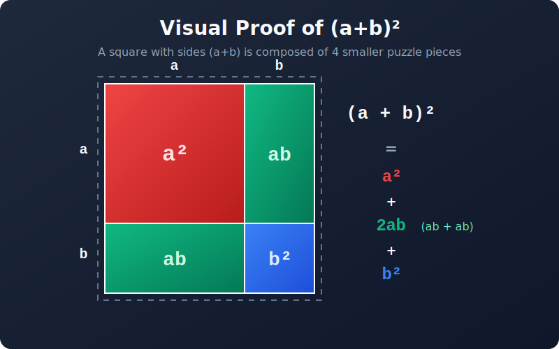

# 06. 여섯 번째 수업: 조립식 수학 퍼즐, 곱셈공식 (Multiplication Formulas)

지금까지 배운 분배법칙은 식 앞에 숫자가 곱해졌을 때 식구들에게 골고루 나눠주는 법칙이었습니다. 
그렇다면 만약 **식과 식이 통째로 곱해진다면** 어떨까요? 예를 들어, $(a+b)$ 와 $(a+b)$ 를 곱하는 $(a+b)^2$ 같은 식 말입니다.

분배법칙을 매번 써서 하나하나 전개(풀어헤치기)하는 것은 시간도 오래 걸리고 실수하기도 쉽습니다. 그래서 수학자들은 "어차피 똑같은 패턴이 반복된다면, 차라리 치트키(공식)를 만들어 버리자!" 라고 생각했습니다. 그것이 바로 **곱셈공식**입니다.

---

## 학습 목표
* 다항식끼리 곱할 때 발생하는 전개의 원리를 이해합니다.
* 매번 식을 분배하여 푸는 수고를 덜어주는 '완전제곱식, 합차공식' 등 핵심 곱셈공식을 암기하고 기하학적으로 증명할 수 있습니다.
* 파이썬의 `expand()` 명령어가 복잡한 곱셈공식을 순식간에 풀어주는 기능을 체험합니다.

## 1. 공연장 좌석 수 늘리기 (다항식의 전개)

비에트는 다항식의 곱셈을 설명할 때 '공연장 건축'에 비유했습니다.
만약 여러분이 뮤지컬 <맘마미아!>가 열리는 거대한 공연장을 설계한다고 해봅시다. 

원래 가로 $a$줄, 세로 $c$줄인 좌석이 있었는데, 관객이 너무 많아져서 가로를 $b$줄, 세로를 $d$줄만큼 더 늘리기로 했습니다. 그렇다면 새롭게 만들어진 공연장의 전체 좌석 수는 어떻게 될까요?
가로는 $(a+b)$줄, 세로는 $(c+d)$줄이 되므로, 전체 좌석은 **$(a+b)(c+d)$** 석이 됩니다.

이를 구역별로 나누어 계산해 보면 어떨까요?
1. 원래 있던 좌석: $ac$
2. 가로만 늘어난 구역: $bc$
3. 세로만 늘어난 구역: $ad$
4. 가로, 세로 모두 늘어난 끄트머리 구역: $bd$

즉, $(a+b)(c+d) = ac + ad + bc + bd$ 로 4개의 항이 생깁니다. 이렇게 분배법칙을 사용하여 단항식들의 합으로 펼쳐 내는 것을 **전개(Expansion)**라고 합니다.

---

## 2. 퍼즐 조각으로 방음재 붙이기 (기하학적 증명)

수학 공식을 무작정 달달 외우는 것은 컴퓨터 메모리에 의미 없는 데이터를 쑤셔 넣는 것과 같습니다. 하지만 도형의 넓이를 통해 퍼즐처럼 이해하면 절대 잊어버리지 않습니다!

비에트는 이번엔 소음 방지용 방음재를 벽에 붙이는 상황을 예로 들었습니다.
가장 대표적이고 유명한 1번 공식인 완전제곱식 $(a+b)^2$ 의 비밀이 바로 여기에 있습니다.
이 식은 가로 길이가 $(a+b)$, 세로 길이가 $(a+b)$ 인 커다란 정사각형 방음재의 넓이를 구하는 것과 똑같습니다.

<div align="center">
  
</div>

<div align="center">
  
</div>

커다란 정사각형 안에는 4개의 작은 퍼즐 조각이 숨어 있습니다.
1. 빨간색 큰 정사각형: 가로 $a$, 세로 $a$ $\rightarrow$ 면적 **$a^2$**
2. 파란색 작은 정사각형: 가로 $b$, 세로 $b$ $\rightarrow$ 면적 **$b^2$**
3. 초록색 직사각형 2개: 가로 $a$, 세로 $b$ 가 두 개 $\rightarrow$ 면적 **$2ab$**

이 네 조각을 모두 더하면 결국 전체 넓이가 나옵니다!
$$ (a+b)^2 = \mathbf{a^2 + 2ab + b^2} $$

이 공식 하나만 머릿속에 장착하면, 복잡한 전개 과정을 순식간에 암산으로 건너뛸 수 있게 됩니다.

---

## 2. 우리가 꼭 알아야 할 곱셈공식 치트키 3종 세트

위에서 증명한 1번 공식을 포함하여, 가장 자주 쓰이는 곱셈공식 3가지를 정리해 봅시다.

### 🔑 [공식 1] 완전제곱식 (합과 차의 제곱)
덩어리 전체를 단숨에 제곱하는 공식입니다. 중간에 $2ab$ 라는 샌드위치 속 같은 항이 생긴다는 것을 꼭 기억하세요!

* $(a+b)^2 = \mathbf{a^2 + 2ab + b^2}$
* $(a-b)^2 = \mathbf{a^2 - 2ab + b^2}$ (가운데 부호만 마이너스야!)

### 🔑 [공식 2] 합차공식 (모양이 똑같고 부호만 다를 때)
가장 속이 시원하게 풀리는 공식입니다. 중간 과정이 전부 취소(0)가 되어버리고 양 끝에 제곱만 남습니다. (가성비 최고 공식!)

* $(a+b)(a-b) = \mathbf{a^2 - b^2}$

### 🔑 [공식 3] 일차식의 곱 (자유로운 두 식의 만남)
앞의 문자는 똑같은데 뒤의 상수가 다를 때 쓰는 공식입니다. x의 계수는 두 상수를 **'더한 값'**, 상수항은 두 상수를 **'곱한 값'**이 됩니다.

* $(x+a)(x+b) = \mathbf{x^2 + (a+b)x + ab}$
* 예시: $(x+2)(x+3) = x^2 + (2+3)x + (2 \times 3) = \mathbf{x^2 + 5x + 6}$

---

## 3. 파이썬 `SymPy`로 곱셈공식 1초 만에 풀기: `expand()`

인공지능 코딩을 할 때, 컴퓨터에게 "이 괄호 덩어리 식 좀 다 풀어헤쳐 줘!" 라고 명령할 때는 **`expand()`**(전개하다, 펼치다) 라는 함수를 사용합니다.

파이썬 알고리즘이 곱셈공식을 사람보다 얼마나 빨리 풀어내는지 확인해 볼까요?

```python
import sympy as sp

a, b, x = sp.symbols('a b x')

# 1. 1번 치트키: 완전제곱식
formula_1 = (a + b)**2

# 2. 2번 치트키: 합차공식
formula_2 = (a + b) * (a - b)

# 3. 3번 치트키: 일차식의 곱셈
formula_3 = (x + 2) * (x + 3)

# sp.expand() 함수를 사용하여 마법처럼 식을 풀어헤칩니다!
print("1번 전개 결과:", sp.expand(formula_1))
print("2번 전개 결과:", sp.expand(formula_2))
print("3번 전개 결과:", sp.expand(formula_3))

# 출력 결과:
# 1번 전개 결과: a**2 + 2*a*b + b**2
# 2번 전개 결과: a**2 - b**2
# 3번 전개 결과: x**2 + 5*x + 6
```

파이썬 내부 엔진은 우리가 암기한 곱셈공식의 로직을 그대로 본떠서, 수백 수천 번의 곱셈이 얽힌 식도 눈 깜짝할 새에 오차 없이 전개해 냅니다.

---

## 학습 정리

1. **곱셈공식:** 괄호와 괄호가 곱해질 때 매번 분배법칙을 하기 귀찮아서 만든 **패턴 치트키**.
2. **도형의 넓이 증명:** $(a+b)^2$ 은 거대한 정사각형을 4등분 조각내어 더한 합과 완벽히 일치한다. 결과는 $a^2 + 2ab + b^2$.
3. **가장 유명한 3대 치트키:** 완전제곱식, 합차공식, 일차식의 곱.
4. **파이썬 명령어:** `SymPy`의 `expand()` 안에 괄호 식을 던져 주면 컴퓨터가 즉시 곱셈공식을 적용하여 펼쳐 준다.

문자와 식이 어떻게 복잡한 공식으로 진화했는지 잘 따라왔나요?
다음 장 **"일곱 번째 수업: 문자 사용의 역사"** 에서는 이렇게 편한 '문자'를 도대체 어떤 천재들이, 언제 발명했는지 역사 속 코딩(수학)의 발전 과정을 가볍게 여행해 보겠습니다!
