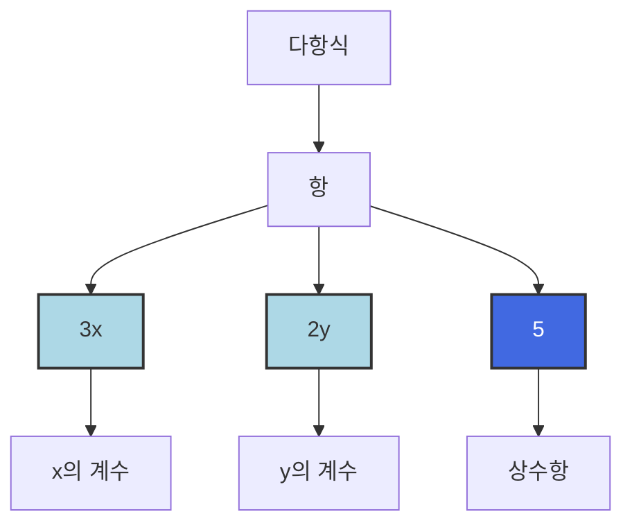

# 3교시 일차식 간단하게 나타내기


복잡한 식을 간단하게 나타낼 수는 없을까요?
식을 간단하게 나타내어 봅시다.

## 세 번째 학습 목표

1. 항, 다항식, 단항식, 계수, 차수의 뜻을 알아봅니다.
2. 동류항을 모아 식을 간단히 해 봅니다.

## 미리 알면 좋아요

1. 직사각형의 넓이는 (가로) $\times$ (세로)로 구할 수 있습니다.

   ```mermaid
   graph TD
       A[가로] --- B[세로]
       style A fill:#fff,stroke:#333,stroke-width:2px
       style B fill:#fff,stroke:#333,stroke-width:2px
   ```
   *(참고: 직사각형 모양의 도형표현)*

2. $\text{cm}^2$은 넓이의 단위입니다. 가로의 길이가 2cm, 세로의 길이가 3cm인 직사각형의 넓이는 $6\text{cm}^2$입니다. 넓이의 단위를 알아보면 $10000\text{cm}^2 = 1\text{m}^2$(제곱미터)라고 하고 $100\text{m}^2 = 1\text{a}$(아르), $100\text{a} = 1\text{ha}$(헥타아르), $100\text{ha} = 1\text{km}^2$(제곱킬로미터)입니다. $\text{ha}$(헥타아르)는 보통 땅의 넓이는 재는 데 쓰입니다.

3. 문자를 사용하여 곱셈을 나타낼 때 숫자와 문자, 문자와 문자 사이에 곱하기 기호 '$\times$'는 생략하여 나타낼 수 있습니다. 예를 들어 $2 \times x = 2x$이고 $x \times y = xy$입니다.

# 비에트의 세 번째 수업

지난 수업 시간에는 식을 보고 계산하는 방법을 알 수 있었고 그 식의 값도 구해 보았습니다. 이번 시간에는 복잡한 식을 간단하게 나타내는 방법을 알아보도록 합시다. 농구에서는 슛에 따라 점수가 다릅니다. 농구시합의 점수를 아나요?

"반원 밖에서 던지면 3점 슛이요!"

"반원 안에서는 2점이요."

"자유투는 1점이요."

그래요, 농구는 1점의 자유투, 2점 슛, 3점 슛으로 슛에 따라 점수가 다릅니다. 농구 시합에서 3점 슛 $x$개, 2점 슛 $y$개, 1점 슛 5개를 넣었다면 우리 팀의 점수는 얼마일까요?

아이들은 문자를 사용하여 식을 나타내는 것에 자신이 있다는 표정으로 대답합니다.

"$3x + 2y + 5$입니다."

맞습니다. 식 $3x + 2y + 5$에서 수와 문자의 곱으로 이루어진 $3x$, $2y$, $5$를 각각 $3x + 2y + 5$의 항이라고 하고, $3x + 2y + 5$과 같이 항의 합으로 이루어진 식을 다항식이라고 합니다. 보통 우리가 쓰는 모든 식은 다항식입니다.


이 항들에는 여러 가지 의미가 숨어 있습니다.

$3x$를 봅시다.

$3x$와 같이 항이 하나만 있는 다항식을 단항식이라고 합니다.

$3x$는 $3 \times x$이므로 숫자 3과 문자 $x$를 곱하여 계산하는 것입니

다. 이때 문자에 곱해진 숫자를 $x$의 계수라고 합니다. 계수는 한자 係數를 소리 나는 대로 적은 것으로 係(계)는 '관련을 갖다' 는 뜻이에요. 계수는 '어떤 것과 관련이 있는 수' 라고 할 수 있습니다. $3x$의 계수 3은 $x$와 관련이 있는 것이지요.

항 $2y$의 계수는 얼마일까요?

"2입니다."

네, 맞습니다. 이번에는 $3x$에 곱해진 문자를 봅시다. 문자 $x$가 하나만 곱해져 있죠? 항에 곱하여진 문자의 개수를 그 문자의 차수라고 합니다.

$3 \times x$는 $x$가 한 번 곱해져 있으므로 일차입니다. $3 \times x \times x$와 같이 $x$가 두 번 곱해져 있으면 이차입니다.

비에트가 칠판에 $3x + 3x^2$를 썼습니다.

$3x^2$에서 문자 $x$의 뒤에 작게 2라는 숫자가 써 있죠?

이것은 $x$를 두 번 곱했다는 뜻으로 해석하고 제곱이라고 읽으면 됩니다.

$x^2 \rightarrow$ '$x$제곱' 이라고 읽습니다.

이 식의 차수는 얼마일까요?

$3x + 3x^2$

아이들은 1과 2중에 어떤 것인지 모르겠다는 표정을 지으며 작은 목소리로 답했습니다.

"1입니다."

"2입니다."

항 $3x$는 일차이고 항 $3x^2 = 3 \times x \times x$는 이차입니다. 이렇게 2개 이상인 항이 더하여 있을 때는 차수가 더 높은 것을 그 다항식의 차수라고 합니다. 그러면 같은 질문을 다시 해 볼까요? 식 $3x + 3x^2$의 차수는 얼마일까요?

아이들이 이제는 확실하게 안다는 표정으로 큰 소리로 대답합니다.

"2입니다."

$3x$와 같이 차수가 1인 식을 일차식이라고 합니다. $3x + 3x^2$와 같이 차수가 2인 식은 이차식이라고 합니다.

이번에는 5를 봅시다.


이 항은 $3x$, $2y$와 달리 숫자만 써 있습니다.

$3x$라는 항에서 $x$에 1을 넣으면 $3x$의 값은 얼마인가요?

"3입니다."

이번에 $x$에 2를 넣으면 $3x$의 값은 얼마인가요?

"6입니다."

$x$에 어떤 수를 넣느냐에 따라 $3x$의 값이 달라지죠? 마찬가지로 $y$에 어떤 수를 넣느냐에 따라 $2y$의 값도 달라집니다. 이렇게 변하는 $x$, $y$를 변수라고 합니다. 변수는 한자 變數를 소리 나는

대로 적은 것으로 變(변)은 '변한다' 는 뜻입니다. 즉 문자에 어떤 수를 쓰느냐에 따라 여러 가지 값으로 변할 수 있는 수입니다. 하지만 항 중에서 숫자로만 이루어진 5와 같은 항은 값이 변하지 않습니다. 이렇게 값이 변하지 않는 특별함 때문에 수로 이루어진 항은 상수항이라는 특별한 이름을 줍니다.



비에트가 칠판에 동전을 여러 가지 붙여 놓았습니다.

여기 있는 동전에서 같은 종류끼리 모아서 저금통에 넣을 거예요.


저금통이 몇 개 필요할까요?

"4개요!"

500원짜리는 모두 같은 종류이니까 한 저금통에 넣으면 됩니다. 마찬가지로 100원끼리, 50원끼리, 10원끼리 넣어야 하니까 4개의 저금통이 필요합니다. 이렇게 같은 종류를 동류라고 하는데 식에 써 있는 항들도 같은 종류가 있어요. 같은 종류의 항이라고 해서 동류항이라고 합니다. 식에서 동류항은 어떻게 구하는지 알아봅시다.


*(말풍선 내용: 같은 종류의 동전끼리 저금통에 넣는다면 저금통이 4개가 필요합니다. / 이렇게 같은 종류를 동류라고 합니다.)*


*(말풍선 내용: 식에 써 있는 항들도 같은 종류가 있는데 동류항이라고 합니다. / $2x$와 $3x$는 동류항입니다.)*

우선, 두 개의 색종이를 보세요.

두 개의 색종이 $x\text{cm}$ 넓이가 $2x$, $x\text{cm}$ 넓이가 $3x$인 것의 넓이는 얼마일까요?

"①번 색종이는 $2x\text{cm}^2$입니다."

"②번 색종이는 $3x\text{cm}^2$입니다."

그러면 이 두 색종이의 넓이의 합은 $2x + 3x$입니다.

넓이를 나타내는 식 $2x + 3x$에 항이 두 개 있죠? $2x$와 $3x$는 공통점이 있어요. 둘 다 문자 $x$가 한 번 곱해진 일차식이라는 점입니다. 동전에서 같은 값을 나타내는 500원 동전끼리 한 저금통에 넣었던 것처럼 항도 같은 종류의 문자와 차수가 공통점을 가진 항을 동류항이라고 합니다. 이때 문자와 차수를 잘 살펴보아야 합니다.

비에트가 칠판에 $3x^2y$와 $2xy^2$를 적었습니다.

두 식의 공통점을 찾아볼까요?

"같은 문자가 들어가 있어요."

"문자를 세 개 곱했어요."

네, 맞습니다. 그러면 두 식은 동류항일까요?

아이들은 둘 다 $x, y$ 문자가 있고 세 개 곱해졌으므로 동류항이라고 생각하고 '네!' 라고 대답합니다.

같은 문자와 문자가 세 개 곱했다고 동류항이라고 생각하면 안 돼요.

$3x^2y = 3 \times x \times x \times y$ : $x$가 두 개, $y$가 한 개

$2xy^2 = 2 \times x \times y \times y$ : $x$가 한 개, $y$가 두 개

$3x^2y$와 $2xy^2$에 곱해진 $x$의 개수가 다릅니다. 마찬가지로 곱해진 $y$의 개수도 달라요. 이렇게 같은 문자의 곱해진 수가 다르면 동류항이라고 할 수 없습니다.

아이들은 이제야 곱해진 문자의 수도 같아야 된다는 것을 이해하고 고개를 끄덕입니다.

$2x$와 $3x$를 동류항이라고 했습니다. 이런 동류항끼리는 모아서 간단하게 할 수 있어요.


③번 색종이의 넓이는 얼마인가요?

"$x\text{cm}^2$입니다."

네, 이제 문자를 이용하여 식을 잘 나타내는군요. $1 \times x$이므로 1을 생략하여 $x$입니다.

①번 색종이에 ③번 색종이가 몇 개 들어갈까요?

"2개입니다."

①번 색종이의 넓이 $2x\text{cm}^2$는 ③번 색종이 두 개의 넓이의 합 $x\text{cm}^2 + x\text{cm}^2$와 같습니다.

$$2x = x + x$$

②번 색종이에는 ③번 색종이가 몇 개 들어갈까요?

"3개입니다."

②번 색종이의 넓이 $3x\text{cm}^2$는 ③번 색종이 세 개의 넓이의 합 $x\text{cm}^2 + x\text{cm}^2 + x\text{cm}^2$와 같습니다.

$$3x = x + x + x$$

이제 ①번 색종이와 ②번 색종이의 넓이를 더해 봅시다.


두 색종이를 더하면 ③번 색종이가 몇 개 들어갈까요?

"5개입니다."

③번 색종이가 3개 들어가는 ②번 색종이와 ③번 색종이가 두 개 들어가는 ①번 색종이를 더하면 ③번의 색종이가 5개 들어갑니다.

①번 색종이 넓이 $= 2x = x + x$
+) ②번 색종이 넓이 $= 3x = x + x + x$
------------------------------------
두 색종이의 합 $= 2x + 3x = x + x + x + x + x$

그래서 두 색종이의 넓이의 합은 넓이가 $x\text{cm}^2$인 ③번 색종이가 5개 들어가므로 $5x$입니다.

$$2x + 3x = x + x + x + x + x = 5x$$

이번에는 ②번 색종이에서 ①번 색종이의 넓이를 빼 봅시다.


*(글: ①번 색종이만큼 빼기)*

②번 색종이에서 ①번 색종이를 빼면 ③번 색종이가 몇 개 들어갈까요?

"1개입니다."

더할 때와 같이 계산을 해 봅시다.

②번 색종이 넓이 $= 3x = x + x + x$
-) ①번 색종이 넓이 $= 2x = x + x$
------------------------------------
두 색종이의 차 $= 3x - 2x = x + x + x - x - x$

그래서 두 색종이의 넓이의 차는 넓이가 $x\text{cm}^2$인 ③번 색종이가 1개 들어가므로 $x$입니다.

$$3x - 2x = x + x + x - x - x = x$$

동류항 $3x$와 $2x$의 합 $3x + 2x$를 $5x$로, 차 $3x - 2x$를 $x$로 간단하게 나타났죠? 동류항끼리의 합이나 차는 하나의 항으로 간단하게 만들 수 있습니다. 동류항끼리 간단하게 나타낼 때는 계수를 이용하면 됩니다.

$3x + 2x = 5x$에서 계수를 주의 깊게 봅시다.

$3x$와 $2x$, $5x$의 계수는 얼마인가요?

"3, 2, 5입니다."

$$\textcolor{blue}{3}x + \textcolor{blue}{2}x = \textcolor{blue}{5}x$$

네, 계수를 보면 계수 3과 2를 더하면 계수 5가 나오죠? 동류항의 합을 구할 때는 계수를 더하여 문자 앞에 써 주면 됩니다.

이번에는 $3x - 2x = x$의 계수를 봅시다.

$3x$와 $2x$, $x$의 계수는 얼마인가요?

"3, 2, 1입니다."

정말 계수를 잘 찾는군요. $x = 1 \times x$에서 1이 생략된 것이므로 계수가 1입니다.

$$\textcolor{blue}{3}x - \textcolor{blue}{2}x = x$$

계수 3에 2를 빼면 1이 나오죠? 동류항의 차를 구할 때는 계수를 빼서 문자 앞에 써 주면 됩니다.

식이 있을 때 동류항을 찾으면 식을 간단하게 나타낼 수 있다고 했습니다. $3x + 2y - x + 5y + 2$와 같은 식을 간단하게 만드는 순서를 정리해 봅시다.

**1단계** 우선 동류항을 찾습니다. 동류항에는 어떤 것이 있죠?

"$3x$와 $-x$입니다."

"$2y$와 $5y$입니다."

**2단계** 동류항끼리 계산을 합니다.

$3x + 2y - x + 5y + 2$에서 동류항의 차 $3x - x = 2x$입니다.

$3x + 2y - x + 5y + 2$에서 동류항의 합 $2y + 5y = 7y$입니다.

**3단계** 이제 계산한 것을 적습니다. 단! 동류항이 없는 상수항 2는 그대로 써 주면 됩니다.

$$3x + 2y - x + 5y + 2 = 2x + 7y + 2$$

복잡하고 긴 식이라도 동류항을 찾으면 더 간단하게 나타낼 수 있었죠? 다음 수업 시간에도 식을 간단하게 나타내는 방법을 배워 봅시다. 다음 시간에 만나요~.

## 세 번째 수업 정리

❶ 문자를 사용하여 나타내어진 식에서 식을 구성하고 있는 하나 하나의 단위를 항이라고 합니다. 예를 들어 식 $3x + 2y + 5$에는 항이 $3x$, $2y$, 5가 있습니다. 그리고 항이 하나 이상 모여 이루어진 식을 다항식이라고 합니다.

❷ 다항식 중에서 항이 하나만 있는 것을 단항식이라고 합니다. 특히 상수로만 이루어진 항은 상수항이라고 합니다.

❸ 변하는 양을 나타내는 문자 $x$, $y$를 변수라고 합니다.

❹ 숫자와 문자의 곱에서 문자와 관련이 있는 것으로 문자 앞에 곱해진 숫자를 계수라고 합니다. 예를 들어 $3x$에서 3이 $x$의 계수이고, $2xy$에서 2가 $xy$의 계수입니다.

❺ 항에 곱해진 문자의 개수를 그 문자의 차수라고 합니다. 예를 들어 $3x^2$에서 $x$가 두 번 곱해진 것이므로 '$x$의 차수는 이차이다' 라고 합니다.

❻ 두 개 이상의 항이 더하여진 다항식에서 각 항의 차수를 비교하여 가장 높은 것을 그 다항식의 차수라고 합니다. 예를 들어 $x^2 + 3x$의 항 $x^2$의 차수는 이차이고 $3x$의 차수는 일차이므로 이 다항식의 차수는 이차입니다. 그리고 가장 높은 차수가 1인 $x + 3$과 같은 식을 일차식이라고 합니다.

❼ 같은 종류의 문자와 차수를 가진 항을 동류항이라고 합니다. 다항식 $3xy^2 + 5xy^2$의 항 $3xy^2$과 $5xy^2$은 똑같이 $x$가 한 개, $y$가 두 개 곱해져 있으므로 동류항입니다. 이러한 동류항은 계수 3과 5를 계산하여 간단하게 $8xy^2$으로 나타낼 수 있습니다.