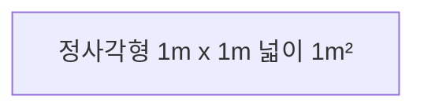

# 4교시: 지수법칙

문자가 여러 번 곱해진 식은 어떻게 간단하게 나타낼까요?
그리고 이 식의 곱셈과 나눗셈은 어떻게 하는 것일까요?
문자가 여러 번 곱해진 식을 간단하게 나타내 봅시다.

## 네 번째 학습 목표

1. 거듭제곱으로 된 수끼리의 곱셈을 해 봅니다.
2. 거듭제곱으로 된 수의 거듭제곱을 간단히 해 봅니다.
3. 거듭제곱으로 된 수끼리의 나눗셈을 해 봅니다.
4. 밑이 곱 또는 분수로 된 수의 거듭제곱을 간단히 해 봅니다.

---

## 미리 알면 좋아요

1. 같은 것끼리 곱하는 것을 제곱이라고 합니다. 넓이를 나타내는 단위 $\text{m}^2$은 $\text{m}$미터가 두 번 곱해진 것입니다.
2. 직사각형 여섯 개로 둘러싸여 있는 도형을 직육면체라고 합니다. 직육면체의 부피를 구하는 방법은  $(\text{가로}) \times (\text{세로}) \times (\text{높이})$입니다.

3. 2, 3, 5, $\cdots$과 같이 1과 자기 자신을 약수로 갖는 수를 소수라고 합니다. 그리고 자연수를 소수의 곱으로 나타내는 것을 소인수분해라고 합니다. 예를 들어 4의 소인수분해는 $2 \times 2 = 2^2$이고 6의 소인수분해는 $2 \times 3$입니다.

# 비에트의 네 번째 수업

지난 시간에는 항의 합으로 이루어진 다항식에서 동류항을 찾으면 다항식을 더 간단하게 나타낼 수 있다고 배웠습니다.

이번 시간에는 문자가 여러 번 곱해진 식을 간단하게 나타내는 방법을 배울 거예요.

비에트가 종이 한 장을 손에 들었습니다.

"이 종이를 이등분하면 몇 조각이 되나요?"

"두 조각이요!"

"이 색종이 두 조각을 모두 이등분하면 몇 장이 되나요?"

"네 조각이요!"

"두 조각을 모두 이등분하니까 네 조각이 되었습니다. 색종이를 이등분하면 나누기 전보다 두 배가 많아집니다."

**$(\text{이등분한 후 조각의 수}) = (\text{이등분하기 전의 조각의 수}) \times 2$**

"네 조각을 모두 이등분하면 몇 장이 되나요?"

"네 조각의 두 배이니까 여덟 조각입니다."

"그렇습니다. $4 \times 2 = 8$입니다. 이렇게 8조각이 됩니다."

이것을 표로 만들어 봅시다.

| 이등분한 횟수 |                                      색종이 조각의 수                                       |
| :-----------: | :-----------------------------------------------------------------------------------------: |
|       1       |                                              2                                              |
|       2       |                                      $2 \times 2 = 4$                                       |
|       3       |                                  $2 \times 2 \times 2 = 8$                                  |
|       4       |                             $2 \times 2 \times 2 \times 2 = 16$                             |
|       5       |                        $2 \times 2 \times 2 \times 2 \times 2 = 32$                         |
|      10       | $2 \times 2 \times 2 \times 2 \times 2 \times 2 \times 2 \times 2 \times 2 \times 2 = 1024$ |

그러면 이등분을 열 번하여 생긴 종이의 수는 $2 \times 2 \times 2 \times 2 \times 2 \times 2 \times 2 \times 2 \times 2 \times 2$이죠? 이렇게 똑같은 2를 열 번 쓰면 시간이 오래 걸립니다. 그리고 이 식을 처음 본 사람은 2가 몇 개 있는지 세어야 하는 불편함이 있어요. 그리고 2를 열 번 곱하는 계산을 하기도 번거로워요. 그래서 지난 시간에 간단하게 나타내는 방법을 배웠습니다. 무엇일까요?

"제곱이요"

기억을 잘 하고 있었네요. 제곱은 같은 것을 곱하는 것이라고 했습니다. 세제곱은 같은 것을 제곱 앞에 써 있는 숫자만큼 '세' 번 곱했다는 뜻입니다.

문자 $x$를 제곱하면 $x \times x = x^2$으로 문자 위에 작게 '두 번 곱했...

...다는 뜻'으로 숫자 '2'를 써 줍니다. 마찬가지로 문자 $x$를 세제곱하면 $x \times x \times x$로 문자 위에 숫자 '3'을 써서 $x^3$이라고 씁니다. 이렇게 같은 것을 여러 번 곱하는 것을 거듭제곱이라고 합니다.

$2^4$라고 쓰인 거듭제곱은 2를 네 번 곱한 것으로 '2의 네제곱'이라고 읽습니다. 똑같이 곱해지는 수 2를 거듭제곱의 밑이라고 하고 곱해지는 횟수인 4를 거듭제곱의 지수라고 합니다.

$$ \Large 2^4 $$
(여기서 2는 밑, 4는 지수를 나타냅니다.)

그러면 색종이를 열 번 이등분하면 몇 조각이 되는지 거듭제곱으로 나타낼 수 있겠죠?

"네, $2^{10}$으로 나타내면 됩니다."

**(만화 대화)**
- 비에트: "이 색종이를 반으로 나누면?"
- 학생1: "2조각이 됩니다."
- 비에트: "2조각을 또 반으로 나누면요?"
- 학생2: "4조각요?"
- 비에트: "또 반으로 나누면?"
- 학생3: "8조각이 됩니다."

**(만화 대화 계속)**
- 마음속 생각: (색종이의 조각의 수가 2배씩 늘어나는군요. 그럼 이등분을 10번하면 $2 \times 2 \times 2 \times 2 \times 2 \times 2 \times 2 \times 2 \times 2 \times 2$조각이 되겠군요.)
- 학생들: "너무 복잡해요.", "선생님 알아보기 힘들어요."
- 비에트: "간단히 나타내는 방법이 있죠. 같은 것을 곱하는 것을 제곱, 같은 것을 세 번 곱하면 세제곱. 그러면 색종이를 10번 이등분 하면?"
- 학생: "$2^{10}$ 이요."
- 비에트: "$2 \times 2 \times 2 \times 2 \times 2 \times 2 \times 2 \times 2 \times 2 \times 2$보다 $2^{10}$이 훨씬 간단합니다."

---

$2^{10}$을 계산하려면 긴 시간동안 계산해야 하고 검산도 해야 해서 번거로워요. 하지만 거듭제곱을 사용하여 나타내면 $2^{10}$으로 간단하게 나타내고 계산을 하지 않아도 됩니다. 거듭제곱을 사용하면 똑같은 것을 여러 번 쓰지 않아도 되고 복잡하게 계산을 하지 않아도 되니까 참 편리하죠?

$2 \times 2 \times 2 \times 3 \times 3$과 같은 값을 가진 숫자 72는 2가 세 번 곱해지고 3이 똑같이 두 번 곱해지고 있으니까 거듭제곱을 이용하여 더 간단하게 나타낼 수 있습니다.

$$ 2 \times 2 \times 2 \times 3 \times 3 = 2^3 \times 3^2 $$

거듭제곱이라는 것을 처음 배운 것 같지만 실은 식의 계산을 배우기 전에도 여러분들은 거듭제곱을 많이 사용하고 있었어요. 여러분은 수학 시간에 $2^3$처럼 위에 작은 글씨로 숫자를 쓴 적이 있어요. 언제였을까요?

"넓이 구할 때요"

"부피 구할 때요"

잘 기억하고 있네요. 넓이를 나타내는 단위 $\text{m}^2$를 '제곱미터'라고 읽죠? $\text{m}^2$에서 작게 쓰인 '2'가 '제곱', $\text{m}$이 '미터(meter)'를 나타냅니다.

비에트가 정사각형을 꺼내 들었습니다.

정사각형의 넓이는 어떻게 구할까요?

"$(\text{정사각형의 넓이}) = (\text{한 변의 길이}) \times (\text{한 변의 길이})$입니다."

맞아요, 이 정사각형 넓이를 구하면 $1\text{m} \times 1\text{m}$입니다. 여기서 길이의 단위 $\text{m}$가 두 번 곱해져 있기 때문에 거듭제곱을 이용하여 $\text{m}^2$이라고 쓴 것입니다.

마찬가지로 부피의 단위도 구할 수 있습니다.

이것은 정육면체, 즉 큐브(cube)입니다. 이 큐브는 헝가리의 건축학 교수인 루빅(Ernő Rubik)이 개발하여 정확한 이름은 '루빅 큐브' 이지만 간단하게 큐브라고 부른답니다.

앞의 큐브에는 한 모서리에 세 개의 다른 색(노랑, 파랑, 빨강)이 모여 있습니다. 그래서 보통 여러 가지 색깔과 모양을 맞추는 게임에 이용됩니다.

부피는 큐브와 같은 입체도형의 내부의 크기를 말하며 부피는 $(\text{가로}) \times (\text{세로}) \times (\text{높이})$를 이용하여 구할 수 있습니다. 큐브는 정육각형이므로 가로, 세로, 높이의 길이가 모두 같습니다. 큐브의 길이를 모르니까 문자를 사용하여 나타내야겠죠? 가로의 길이를 $x\text{m}$라고 합시다.

$$ \text{가로} = \text{세로} = \text{높이} = x\text{m} $$

자, 이제 큐브의 부피를 구해 봅시다.

$$ \text{부피} = \text{가로} \times \text{세로} \times \text{높이} = x\text{m} \times x\text{m} \times x\text{m} $$

부피에 $x$문자가 세 번 똑같이 곱해져 있고 길이의 단위 $\text{m}$가 세 번 곱해져 있으므로 부피는 $x^3\text{m}^3$으로 나타낼 수 있습니다.

즉, 부피의 단위는 $\text{m}$가 세 번 곱해지므로 $\text{m}^3$이고 '세제곱미터'라고 읽습니다.

영어로 세제곱을 큐브(cube)라고 합니다. 신기하게도 정육각형을 나타내는 큐브(cube)라는 뜻과 똑같죠?

**(만화 대화)**
- 비에트 (정사각형 도해): "정사각형의 넓이를 구할 때 거듭제곱을 사용합니다. $1\text{m} \times 1\text{m}$"
- 비에트 (큐브 도해): "정육면체의 부피를 구할 때는 $\text{부피} = \text{가로} \times \text{세로} \times \text{높이} = x\text{m} \times x\text{m} \times x\text{m}$ 이므로 $x^3\text{m}^3$처럼 세제곱을 사용하지요."

---

## 지수 법칙

$a^x$ 라고 쓴 식이 있습니다. $a$라는 문자를 몇 번 곱한 것일까요?

"$x$요"

네, 이렇게 몇 번 곱하는지 알려 주는 $x$를 지수라고 했습니다.

지수에는 여러 가지 법칙이 있어요. 이 법칙에는 어떤 것이 있는지 알아봅시다.

### 첫 번째 지수 법칙

$2^3 \times 2^4$라고 써 있는 식이 있어요. $2^3$과 $2^4$ 모두 거듭제곱으로 된 식입니다. 이렇게 거듭제곱된 수끼리도 곱셈을 할 수 있습니다. 거듭제곱 $2^3$은 2가 세 번 곱해졌다는 것이고 $2^4$는 2가 네 번 곱해졌다는 것입니다.

$$ 2^3 = 2 \times 2 \times 2 $$
$$ 2^4 = 2 \times 2 \times 2 \times 2 $$

그럼 $2^3 \times 2^4$은 2가 몇 번 곱해진 것인가요?

"7번이요"

그렇죠! 2를 세 번 곱하고 또 2를 네 번 곱했으니까 2를 곱한 횟수는 $3 + 4 = 7$, 즉 7번 곱했습니다. 그래서 $2^3 \times 2^4 = 2^7$입니다.

$2^3$과 $2^4$와 같이 밑이 같은 경우에 지수를 더하여 간단하게 나타낼 수 있습니다.

$$ 2^3 \times 2^4 = 2^{3+4} = 2^7 $$

거듭제곱된 식의 곱셈 : 지수의 덧셈으로 구할 수 있습니다.

$$ a^m \times a^n = a^{m+n} $$

---

## 두 번째 지수 법칙

옆의 박테리아는 2005년에 독도에서 처음으로 발견된 것입니다. 어떤 환경이 주어지면 이 박테리아는 분열하여 1시간마다 그 수가 4배로 늘어난다고 합니다. 1마리의 박테리아가 있을 때, 5시간 후에 분열된 박테리아의 수는 얼마일지 구해 봅시다.

한 시간에 1마리가 4마리가 되고, 두 시간이 지나면 4마리가 각각 4배가 되므로 $4 \times 4 = 16$마리가 됩니다. 이것을 시간마다 구해서 표에 적어 봅시다.

| 시간 | 분열된 박테리아의 수                                 |
| ---- | ---------------------------------------------------- |
| 1    | 4                                                    |
| 2    | $4 \times 4 = 4^2 = 16$                              |
| 3    | $4 \times 4 \times 4 = 4^3 = 64$                     |
| 4    | $4 \times 4 \times 4 \times 4 = 4^4 = 256$           |
| 5    | $4 \times 4 \times 4 \times 4 \times 4 = 4^5 = 1024$ |

5시간이 지나면 한 마리의 박테리아가 1024개로 분열됩니다. 색종이를 반으로 나누었을 때 10번 나누면 $2^{10}$, 즉 1024개의 조각이 된다고 했죠? $4^5$와 $2^{10}$을 계산하면 둘 다 1024로 똑같은 값이 나옵니다. 서로 다른 수 2와 4를 각각 10번 5번 곱했는데 똑같은 값이 나오는 이유가 무엇인지 알아봅시다.

$4^5$에서 4는 $2^2$과 같으므로 4를 5번 곱하는 것과 $2^2$을 5번 곱하는 것은 같습니다.

$$ 4^5 = (2^2)^5 $$

$(2^2)^5$이라는 것은 $2^2$을 몇 번 곱하는 거죠?

"다섯 번이요!"

다섯 번 곱하는 것이므로 $(2^2)^5 = 2^2 \times 2^2 \times 2^2 \times 2^2 \times 2^2$입니다. 그리고 $2^2 \times 2^2 \times 2^2 \times 2^2 \times 2^2$에서 $2^2$은 2를 두 번 곱한 것입니다.

$$ \overset{2 \times 2}{\underset{\uparrow}{2^2}} \quad \overset{2 \times 2}{\underset{\uparrow}{\times 2^2}} \quad \overset{2 \times 2}{\underset{\uparrow}{\times 2^2}} \quad \overset{2 \times 2}{\underset{\uparrow}{\times 2^2}} \quad \overset{2 \times 2}{\underset{\uparrow}{\times 2^2}} $$

질문! $2^2 \times 2^2 \times 2^2 \times 2^2 \times 2^2$은 2를 몇 번 곱한 것일까요?

아이들은 자신 있게 "10번이요"라고 소리칩니다.

모두들 거듭제곱을 정말 잘 이해하고 있군요. 대단해요! 그래서 $2^2$을 다섯 번 곱한 $(2^2)^5$과 $2^{10}$은 같습니다.

두 번씩 다섯 번 곱하면 열 번입니다. $2 \times 5 = 10$

괄호 안의 2를 다섯 번 곱하여 열 번이 나옵니다. 이렇게 거듭제곱된 식을 다시 거듭제곱할 때는 지수의 곱으로 구할 수 있습니다.

$$ (2^2)^5 = 2^{2 \times 5} = 2^{10} $$

거듭제곱된 식의 거듭제곱 : 지수의 곱으로 구할 수 있습니다.

$$ (a^m)^n = a^{mn} $$

$(3^5)^2$으로 다시 확인해 봅시다. 거듭제곱된 식 $3^5$을 다시 거듭제곱하면 3을 다섯 번씩 두 번 곱하는 것이므로 $5 \times 2 = 10$, 즉 열 번 곱하는 것입니다.

---

## 세 번째 지수 법칙

문자를 사용하여 식을 나타내면 식을 간단하게 나타내고 풀이 과정을 알 수 있다고 했어요. 문자를 사용하여 나눗셈을 할 때는 나눗셈기호를 생략하고 분수로 나타내면 식을 간단하게 나타낼 수 있었습니다. 거듭제곱으로 나타내어진 식의 나눗셈에서도 식을 간단하게 나타내기 위해서 나눗셈기호를 생략하고 분수로 나타낼 수 있습니다.

밑이 $x$로 같은 거듭제곱의 나눗셈 $x^5 \div x^2$를 간단히 하기 위해 분수로 나타내면 $\frac{x^5}{x^2}$입니다. $x^5$는 $x$를 다섯 번 곱한 것이고 $x^2$은 $x$를 두 번 곱한 것이므로 $\frac{x^5}{x^2} = \frac{x \times x \times x \times x \times x}{x \times x}$로 나타낼 수

있습니다. 똑같은 것을 약분하면 식을 간단하게 할 수 있습니다.

$$ \frac{x^5}{x^2} = \frac{x \times x \times x \times x \times x}{x \times x} = \frac{x \times x \times x \times \cancel{x} \times \cancel{x}}{\cancel{x} \times \cancel{x}} = x^3 $$

분자가 분모보다 $5 - 2$번, 즉 세 번 더 곱해졌죠? 그래서 분자에 $x$가 세 번 곱해진 $x^3$이 됩니다. $x^2 \div x^5$을 간단하게 나타내 봅시다.

$$ \frac{x^2}{x^5} = \frac{\cancel{x} \times \cancel{x}}{\cancel{x} \times \cancel{x} \times x \times x \times x} = \frac{1}{x \times x \times x} = \frac{1}{x^3} $$

이번에는 분모가 분자보다 $5 - 2 = 3$번 더 곱해지므로 분모에 $x$가 세 번 곱해진 $x^3$이 남아 $\frac{1}{x^3}$이 됩니다.

즉, 거듭제곱의 나눗셈을 할 때는 분모와 분자 중 어디가 얼마나 많이 곱해졌는지 살펴본 후 약분하므로 많이 곱해진 쪽의 거듭제곱이 남습니다.

밑이 3으로 같은 거듭제곱의 나눗셈 $3^{10} \div 3^4$을 나눗셈기호를 생략하고 분수로 나타내면 $\frac{3^{10}}{3^4}$입니다. 분자가 분모보다 $10 - 4 = 6$번 더 곱해졌으므로 분자에 여섯 번 곱한 것 $3^6$이 남게 됩니다. 따라서 $\frac{3^{10}}{3^4} = 3^6$입니다.

거듭제곱의 나눗셈 : 분자와 분모가 각각 곱해진 횟수를 비교하여 많이 곱해진 쪽의 지수가 차이만큼 남습니다.

$2 \div 2$는 같은 수로 나누었으므로 $1$입니다. 마찬가지로 거듭제곱으로 된 식의 나눗셈 $a^n \div a^n$은 $a^n$을 같은 수 $a^n$으로 나누므로 1이 됩니다.

---

## 네 번째 지수 법칙

비에트가 트라이앵글과 북을 치며 소리를 냅니다.

트라이앵글과 북의 소리가 들리죠? 우리가 악기의 소리를 듣는다는 것은 악기에서 나는 소리가 공기 속에서 움직여 여러분 귀에 들리는 것입니다. 소리는 3가지 요소 소리의 세기, 소리의 높낮이, 소리의 음색으로 만들어집니다. 트라이앵글 소리보다 북소리가 더 크게 들리죠? 이것을 소리의 세기라고 합니다. 리코더를 부를 때 '도'와 '미'의 소리가 차이가 나는 것은 소리의 높낮이 때문입니다. 그리고 소리의 음색 때문에 우리는 피아노의 '도'와 실로폰의 '도'가 높이가 같은데도 소리를 구분할 수 있습니다. 북에서 난 소리가 공기를 따라 우리의 귀에 들릴 때 소리는 곡선과 같이 왔다갔다 진동을 하며 움직입니다. 그리고 중심에서 최대로 움직이는 거리를 진폭이라고 합니다.

[그림1]은 0.01초 동안 두 번 진동하고 [그림2]는 같은 시간 동안 일곱 번 정도 진동을 합니다. 진동이 많을수록 그리고 진폭이 클수록 소리의 크기는 큽니다.

소리의 세기는 $(\text{진동수} \times \text{진폭})^2$에 비례합니다. 처음 소리의 크기가 1dB(데시벨)일 때, 진동수가 두 배, 진폭이 세 배가 되면 소리의 세기는 $(2 \times 3)^2$배가 되므로 36dB가 됩니다.

$(2 \times 3)^2$을 계산하면 $2 \times 3$의 거듭제곱이므로 $2 \times 3 \times 2 \times 3$를 계산한 것과 같습니다. 똑같은 것을 곱할 때는 거듭제곱을 쓰면 편리하다고 했습니다. 3을 두 번, 2를 두 번 곱한 $2 \times 3 \times 2 \times 3$을 거듭제곱으로 나타내면 $2^2 \times 3^2$이 됩니다. 이렇게 밑이 $2 \times 3$과 같이 곱으로 되어 있을 때의 값을 각각을 지수만큼 곱하는 것과 같습니다.

$$ (2 \times 3)^2 = 2^2 \times 3^2 \quad : \text{2를 두 번, 3을 두 번 곱합니다.} $$

트라이앵글 소리의 세기를 $(2 \times 3)^3$배하면 북의 소리의 세기와 같아집니다. $(2 \times 3)^3$은 2를 세 번, 3을 세 번 곱하는 것과 같으니까 $2^3 \times 3^3$으로 나타내도 됩니다.

곱으로 된 식의 거듭제곱 : 각각을 거듭제곱하여 구할 수 있습니다.

$$ (ab)^n = a^n b^n $$

밑이 곱이 아닌 나눗셈으로 이루어진 식 $\left( \frac{2}{3} \right)^2$도 곱으로 된 식의 거듭제곱처럼 계산할 수 있습니다. 밑 $\frac{2}{3}$이 두 번 곱해졌으므로 거듭제곱하여 분모끼리, 분자끼리 계산하여 거듭제곱으로 나타내면 $\left( \frac{2}{3} \right)^2 = \frac{2}{3} \times \frac{2}{3} = \frac{2 \times 2}{3 \times 3} = \frac{2^2}{3^2}$입니다. 즉, 나눗셈으로 된 식의 거듭제곱에서도 분모와 분자를 각각 거듭제곱하여 구할 수 있습니다.

나눗셈으로 된 식의 거듭제곱 : 각각을 거듭제곱하여 구할 수 있습니다.

$$ \left( \frac{a}{b} \right)^n = \frac{a^n}{b^n} $$

지수의 여러 가지 법칙들을 알면 식을 간단하게 나타낼 수 있습니다. 동류항의 계산과 거듭제곱을 이용하여 식을 간단하게 나타내는 것에 익숙해졌나요?

다음 시간에는 식을 간단하게 나타내는 것을 이용하여 숫자의 연산 '$3+2$', '$3-2$', '$3 \times 2$', '$3 \div 2$'와 같은 다항식의 덧셈, 뺄셈, 곱셈, 나눗셈을 간단하게 나타내도록 해요!

# 네 번째 수업 정리

❶ 같은 문자를 여러 번 곱하는 것을 거듭제곱이라고 합니다.

❷ 거듭제곱에서 여러 번 곱해진 수를 밑, 곱해진 횟수를 지수라고 합니다. 예를 들어 $2^4$이라고 하면 2를 네 번 곱하였으므로 2를 밑, 4를 지수라고 합니다.

❸ 거듭제곱된 식의 곱셈은 지수의 덧셈으로 구할 수 있습니다.

$$ a^m \times a^n = a^{m+n} $$

예를 들어 $2^3 \times 2^4$는 지수 3과 4를 더하여 $2^7$로 간단하게 나타낼 수 있습니다.

❹ 거듭제곱된 식의 거듭제곱은 지수의 곱으로 구할 수 있습니다.

$$ (a^m)^n = a^{mn} $$

예를 들어 $(2^2)^3$은 거듭제곱 $2^2$을 세 번 곱하는 것이므로 지수 2와 3을 곱한 6을 이용하여 $(2^2)^3 = 2^{2 \times 3} = 2^6$으로 간단하게 나타낼 수 있습니다.

❺ 거듭제곱과 거듭제곱의 나눗셈에서 분자와 분모가 곱해진 횟수를 비교하면 많이 곱해진 쪽의 지수가 차이만큼 남습니다. 예를 들어 $5^{10} \div 5^4$을 나눗셈기호를 생략하고 분수로 나타내면 $\frac{5^{10}}{5^4}$입니다. 분자가 분모보다 $10-4=6$번 더 곱해졌으므로 분자에 6번 곱한 것 $5^6$이 남게 됩니다. 그리고 $5^4 \div 5^{10} = \frac{5^4}{5^{10}}$은 분모가 분자보다 여섯 번 더 곱해졌으므로 분모에 여섯 번 곱한 $5^6$이 남아 $\frac{1}{5^6}$이 됩니다.

❻ 똑같은 거듭제곱으로 된 식의 나눗셈 $a^n \div a^n$은 1이 됩니다.

❼ 나눗셈으로 된 식의 거듭제곱은 분모와 분자 각각을 거듭제곱하여 구할 수 있습니다.

$$ \left( \frac{a}{b} \right)^n = \frac{a^n}{b^n} $$