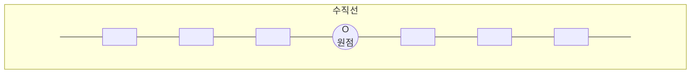
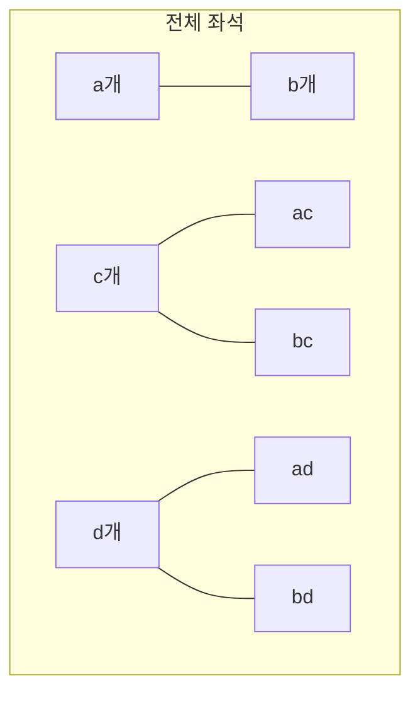

# 6교시 곱셈공식

다항식의 곱셈에는 일정한 공식이 있습니다. 곱셈공식을 알아봅시다.

## 여섯 번째 학습 목표

1. 전개의 뜻을 알아봅니다.
2. 두 다항식의 곱셈을 해 봅니다.

## 미리 알면 좋아요

1. **수직선**: 일정한 간격으로 숫자가 표시되어 있는 직선을 말합니다. 수직선을 나타내는 한자 數直線(수직선)에서 보면 直線(직선), 곧은 선에 數(수), 숫자를 나타냈다는 뜻입니다. 가운데 기준이 되는 것을 원점이라고 하며 $O$로 나타냅니다. 그리고 양쪽의 화살표는 선이 끝없이 이어지는 것을 나타냅니다.

2. **정사각형**: 네 개의 각이 직각이고 네 변의 크기가 같은 사각형을 말합니다. 네 변의 길이가 같으므로 한 변의 길이를 $a$라고 하면 가로와 세로의 길이가 모두 $a$이므로 식으로 표현하면 다음과 같습니다.

$$ (\text{정사각형의 넓이}) = a \times a = a^2 $$

# 비에트의 여섯 번째 수업

지금까지 문자를 사용하여 나타낸 식의 덧셈, 뺄셈, 곱셈, 나눗셈을 간단하게 나타내는 것을 배웠습니다. 오늘은 우리가 건축가라면 지금까지 배운 다항식을 어떻게 사용할 수 있는지 알아봅시다. 우선 이 사진을 보세요.

앞의 사진은 예술의 전당입니다. 이곳은 우리의 문화적 주체성을 확립하고 한국문화예술을 발전시키기 위하여 음악관 $\cdot$ 미술관 $\cdot$ 자료관 $\cdot$ 교육관 등에서 예술문화공연을 볼 수 있고 배울 수 있는 공간입니다. 지금 보고 있는 곳이 예술의 전당 중심인 축제극장으로 한국을 상징하는 선비의 갓 모양으로 만들어졌어요.

이곳에서는 뮤지컬, 독주회 등의 공연이 많이 이루어지기 때문에 오페라 하우스, 음악관, 박물관이 있어요. 그리고 음악관이라도 공연의 크기나 관객의 수를 생각해서 음악당, 콘서트홀, 리사이트홀 등 다양한 크기의 공연장이 있어요. 여러분이 이런 예술문화공연장을 만드는 건축가가 되었다면 지금까지 배운 식의 계산을 이용하여 공연장의 크기와 공연을 볼 사람들을 위한 좌석의 수를 생각해야겠죠? 자, 그럼 장소의 크기도 생각해 보고 필요한 좌석도 몇 개인지 구해 보도록 합시다.

공연장에서 가로의 좌석 수가 10개이고 세로의 좌석 수가 8개라면 전체의 좌석 수는 $10 \times 8 = 80$개입니다.

여러분이 건축가가 되어 공연장에 들어갈 좌석의 수를 가로의

좌석의 수 $=a$, 세로의 좌석의 수 $=c$라고 생각한다면 전체 좌석의 수는 $ac$가 됩니다.

비에트가 포스터를 꺼내 들었습니다.

이것은 뮤지컬 <맘마미아!>의 포스터입니다. 유명한 음악 그룹인 ABBA의 22개의 음악을 하나의 줄거리로 만든 뮤지컬입니다. 엄마와 딸의 가족애를 그리는 줄거리와 서로 다른 22개의 음악이 너무나도 잘 어울려 즐겁게 뮤지컬을 감상할 수 있어요. 영국 극작가상을 수상한 경력이 있는 캐서린 존슨(Catherine Johnson)이 극본을 쓰고 1999년 런던에서 처음 공연하여 박스 오피스 기록을 연일 갱신하며 입석까지 매진되었던 유명한 뮤지컬입니다. <오페라의 유령>, <레 미제라블>의 뒤를 잇는 히트작으로 평가받

고 있으며 뉴욕, 독일, 캐나다, 한국 등 전 세계 극장가에서 인기리에 공연 중입니다.

좌석이 $ac$개인 공연장 보다 더 큰 공연장을 만들기 위해 가로의 좌석수를 $b$개만큼, 세로의 좌석수를 $d$개만큼 늘리려고 해요. 가로, 세로의 좌석의 수를 늘려서 만든 공연장의 전체 좌석 수는 얼마일까요?

“$(a+b)(c+d)$입니다.”

그렇죠, 가로가 $a+b$개이고 세로가 $c+d$개이므로 $(a+b)(c+d)$입니다.

지난 시간에 $3x(x+5)$에서 $3x$를 분배법칙을 사용하여 계산하면 $3x^2$과 $15x$의 합인 $3x^2+15x$가 되었습니다.

$$3x(x+5)=3x^2+15x$$

이렇게 분배법칙을 사용하여 단항식들의 합으로 나타내는 것을 전개한다고 합니다. 우리가 구한 $(a+b)(c+d)$개의 좌석도 분배법칙을 이용하여 전개할 수 있습니다.

가로와 세로가 $b$개, $d$개 늘어나면서 생긴 세 개의 무늬 좌석을 생각하며 다항식 $a+b$와 $c+d$의 곱인 $(a+b)(c+d)$개의 좌석도 분배법칙으로 전개해 봅시다.

<!-- 위 다이어그램은 임시로 작성된 것입니다. 본문 이미지 참고 부탁드립니다. -->

파란색 사각형의 좌석의 수 : 가로가 $a$개, 세로가 $c$개이므로 $ac$개입니다.

곱하기
$$(a+b)(c+d)$$

가로줄 무늬의 좌석의 수 : 가로가 $a$개, 세로가 $d$개이므로 $ad$개입니다.

곱하기
$$(a+b)(c+d)$$

가로줄 무늬의 좌석의 수 : 가로가 $b$개, 세로가 $c$개이므로 $bc$개입니다.

곱하기
$$(a+b)(c+d)$$

빗금 무늬의 좌석의 수 : 가로가 $b$개, 세로가 $d$개이므로 $bd$개입니다.

곱하기
$$(a+b)(c+d)$$

전체 좌석의 수 $= ac+ad+bc+bd$

$$(a+b)(c+d)$$

전체 좌석을 구하는 것을 다시 볼까요?

전체 좌석의 수를 구할 때 가로 좌석의 수가 $a$인 두 무늬의 좌석의 수는 $a$를 전개 $(a+b)(c+d)$하여 구하는 것과 같습니다.

마찬가지로 가로 좌석의 수가 $b$인 두 무늬의 좌석의 수는 $b$를 전개 $(a+b)(c+d)$하여 구하는 것입니다.

즉, 다항식과 다항식의 곱을 전개할 때는 항 $a$를 $c+d$에 전개하고 항 $b$를 $c+d$에 전개하는 것입니다. 네 개의 사각형 무늬가 생긴 것처럼 $(a+b)(c+d)$를 전개하면 ①, ②, ③, ④를 전개해서 네 개의 항이 생깁니다.

$$(a+b)(c+d) = ac+ad+bc+bd$$

## 곱셈공식

이번에 여러분이 지어야 하는 공연장 벽면에 공연 포스터를 걸어 놓을 곳을 지으려고 합니다. 현재 공연 포스터가 걸려 있는 벽면의 크기는 가로와 세로의 크기가 같습니다. 공연 포스터를 직사각형 모양으로 하기 위해 가로와 세로의 크기를 조절한다면 새로 지은 포스터 걸어 놓는 벽면의 크기는 얼마나 될까요?

가로와 세로의 크기를 모르니까 $x$라고 합시다.

현재 공연 포스터 벽면의 크기 : 가로 $\times$ 세로 $= x \times x = x^2$

가로의 길이를 $a$, 세로의 길이를 $b$만큼 조절한 새 공연 포스터 벽면의 크기를 구해 봅시다.

새 공연 포스터 벽면의 넓이

$$(x+a)(x+b) = x^2+bx+ax+ab$$

$(x+a)(x+b)$를 전개하면 네 개의 항이 생겨서 $x^2+bx+ax+ab$가 됩니다. 전개하여 구한 새 공연 포스터의 벽면 크기 $x^2+bx+ax+ab$에서 동류항을 계산하면 식을 더 간단하게 나타낼 수 있습니다. 동류항 $bx$과 $ax$를 계산하면 $(b+a)x$이고 $(b+a)$를 알파벳순으로 써서 나타내면 $(a+b)$이므로 새 공연 포스터의 벽면 크기는 $x^2+(a+b)x+ab$입니다. 다항식의 곱 $(x+a)(x+b)$을 전개하면 $x^2+(a+b)x+ab$가 나오죠? 다항식과 다항식의 곱의 특별한 유형을 곱셈공식이라고 합니다.

**곱셈공식 1**
$$(x+a)(x+b) = x^2+(a+b)x+ab$$

이 공식을 알면 가로, 세로를 얼마나 늘리는지에 따라 변화되는 양을 구하기가 쉬워집니다. 한 변의 크기가 $x$인 정사각형의 가로의 길이를 1, 세로의 길이를 2만큼 늘렸다면 $a=1$, $b=2$를 곱셈공식에 대입하여 $(x+1)(x+2) = x^2+(1+2)x+1 \times 2$이므로 $x^2+3x+2$가 됩니다.

자, 이제 공연자의 벽면을 꾸며 볼까요? 공연장의 소리가 밖에 들리지 않게 하기 위해서 소리를 흡수하는 성질이 있는 방음재를 붙이려고 합니다. 공연장의 벽이 넓이가 $x$인 정사각형이므로 정사각형의 방음재를 붙이는 것이 편리하다고 생각되었습니다. 그래서 크기가 $a$인 정사각형의 방음재를 붙이려고 해요.

(크기가 a인 정사각형 방음재 이미지)

그럼 이 방음재를 벽면에 몇 개 붙여야 하는지 알아야 방음재 회사에 주문을 할 수 있겠죠? 넓이가 36인 벽에 넓이가 4인 타일을 붙이면 $36 \div 4 = 9$개의 타일이 필요하니까 공연장에 필요한 방음재의 개수는 $x \div a^2$, 즉 $\frac{x}{a^2}$개입니다. 그런데 직접 개수를 구하니까 123.5개가 나왔어요. 123개이면 부족하고 124개면 0.5개가 남으니까 개수를 딱 맞게 하려고 방음재의 넓이를 조금 변형해 보려고 합니다.

자, 이것은 한 변의 크기가 $a$인 정사각형의 가로와 세로의 길이를 $b$만큼 크게 해 봅시다.

(가로, 세로의 길이가 $a$인 정사각형을 가로, 세로 $b$만큼 늘린 이미지)

한 변의 크기가 $a+b$인 이 방음재의 넓이는 $(a+b)^2$입니다.

이 방음재의 넓이는 네 개의 사각형 넓이의 합으로 구할 수 있습니다.

큰 사각형의 넓이 = 네 개의 작은 사각형 넓이의 합

| 사각형            | 가로의 길이 | 세로의 길이 | 넓이  |
| ----------------- | ----------- | ----------- | ----- |
| (큰 정사각형)     | $a$         | $a$         | $a^2$ |
| (오른쪽 직사각형) | $b$         | $a$         | $ab$  |
| (아래쪽 직사각형) | $a$         | $b$         | $ab$  |
| (작은 정사각형)   | $b$         | $b$         | $b^2$ |

$$(a+b)^2 = a^2+ab+ab+b^2$$

$ab$ 동류항을 계산하면 $ab+ab=2ab$이므로
$$(a+b)^2 = a^2+2ab+b^2$$입니다.
$a+b$를 제곱하여 전개한 식은 언제나 $a^2+2ab+b^2$가 됩니다.

**곱셈공식 2**
$$(a+b)^2 = a^2+2ab+b^2$$

자, 그럼 한 변의 크기가 $a$인 방음재의 가로와 세로를 3cm씩 늘렸다면 새로운 방음재의 넓이는 $(a+b)^2 = a^2+2ab+b^2$에

$b=3$을 대입하여 구할 수 있겠죠?

$$(a+3)^2 = a^2+2 \times a \times 3+3^2 = a^2+6a+9$$

이번에는 한 변의 크기가 $a$인 방음재의 가로와 세로의 길이를 모두 $b$만큼 줄여볼까요? 그러면 한 변의 길이가 $a-b$인 정사각형 모양의 방음재가 됩니다.

(한 변의 길이가 $a$인 정사각형에서 $b$만큼 줄어든 $(a-b)^2$ 정사각형 그림)

방음재 $(a-b)^2$ 사각형의 넓이는 전체 정사각형에서 나머지 세 사각형의 넓이를 빼서 구할 수 있습니다.

| 사각형               | 가로의 길이 | 세로의 길이 | 넓이            |
| -------------------- | ----------- | ----------- | --------------- |
| (전체)               | $a$         | $a$         | $a^2$           |
| (오른쪽 직사각형)    | $b$         | $a-b$       | $b(a-b)=ab-b^2$ |
| (아래쪽 직사각형)    | $a-b$       | $b$         | $(a-b)b=ab-b^2$ |
| (작은 귀퉁이 사각형) | $b$         | $b$         | $b^2$           |

$(a-b)^2$ 사각형 넓이 = 전체 사각형 넓이 - (오른쪽 직사각형 넓이) - (아래쪽 직사각형 넓이) - (작은 귀퉁이 사각형 넓이)

$$(a-b)^2 = a^2 - (ab-b^2) - (ab-b^2) - b^2$$
$$= a^2 - ab - (-b^2) - ab - (-b^2) - b^2$$

아이들은 $-(ab-b^2)$의 식에서 $-b^2$을 어떻게 빼야 할지 고개를 갸우뚱거렸습니다.

엘리베이터를 보면 1층을 나타내는 1, 2층을 나타내는 2 그리고 지하 1층을 나타내는 $-1$을 본 적이 있죠? 1층, 2층과 같이 우리가 쓰는 1, 2, 3을 양수라고 하고, 지하 1층의 $-1$, 지하 2층의 $-2$와 같은 것을 음수라고 합니다. 양수는 양의 부호인 ‘$+$’를 사용하여 나타내거나 생략해서 나타내고 음수는 음의 부호인 ‘$-$’를 사용하여 나타냅니다. 이것을 수직선에 나타내면 원점 O을 기준으로 오른쪽을 양수, 왼쪽을 음수라고 해요. 즉 음수는 양수의 반대 방향에 있습니다. 숫자 1, 2, 3, $\cdots$은 원점 O에서 떨어진 칸의 수를 말합니다. 즉 $-4$는 원점 O의 왼쪽이므로 음수이고 네 칸 떨어져 있다는 것입니다.

(원점을 기준으로 왼쪽은 음수, 오른쪽은 양수를 나타내는 수직선 이미지)

식 $a^2 - ab - (-b^2) - ab - (-b^2) - b^2$에서 $-(-b^2)$은 $-b^2$ 앞에 1이 생략되어 $(-1) \times (-b^2)$과 같습니다. 양수와 양수의 곱 $2 \times 2 = 4$ 즉 양의 방향입니다. 음수는 양수의 반대 방향이므로 음수를 두 개 곱한 $(-1) \times (-b^2)$는 양수의 반대의 반대 방향이므로 원래 방향이 됩니다. 즉 음수와 음수의 곱은 양수가 됩니다.

$$(-1) \times (-b^2) = +b^2$$

여러분이 가지고 있는 용돈 1000원을 가지고 떡볶이를 사먹으려고 하는데 가격이 올라 1500원이 되었다면 엄마에게 500원을 더 달라고 해야겠죠? 이럴 때 원래 가지고 있던 돈인 1000원이 자산이고 엄마에게 달라고 해야 하는 돈 500원을 부채로 생각합니다. 이때 자산 1000을 양수, 부채 500을 음수라고 할 수 있습니다. 음수의 개념이 처음으로 인도에서 사용되어 유럽 등에도 점점 퍼지게 됩니다.

음수라는 개념과 음수의 곱을 계산하는 것이 어렵죠? 인도에서

처음 사용하긴 했지만 그 개념이 어려워서 많은 사람들이 음수를 사용하는 것을 꺼려했고 위대한 사상가인 파스칼도 이해하지 못했습니다. 그래서 영하 $5^\circ$를 $-5$처럼 나타내는 온도계에서도 음수의 사용을 피하기 위해 노력하였습니다. 실험실에서 얻을 수 있는 기온 중 가장 낮은 온도를 화씨 $0^\circ$가 되게 하여 영하의 기온으로 읽는 경우가 나오지 않게 했지요. 그러나 우리는 오히려 화씨 온도계보다 섭씨 온도계와 친하고 일상생활에서 더 많이 사용하고 있습니다. 이처럼 여러분도 점차 음수와 친해질 수 있을 거예요.

(만화: 떡볶이를 사 먹으려고 돈을 빌리는 상황을 통해 부채와 음수의 개념을 설명하는 만화)
"떡볶이를 사먹자."
"헉~ 갖고 있는 돈은 1000원뿐인데 떡볶이 1인분이 1500원으로 올랐어."
"내가 500원 꿔줄게." 
"고마워."
"나중에 갚으면 돼. 너는 나한테 500원을 빚진 거야."
"영훈이에게 500원을 주어야 하니 -500원을 갖고 있는 셈이네."

(만화: 온도계, 엘리베이터 등 일상생활에서 음수가 사용되는 예시를 보여주는 만화)
강아지: "온도계, 엘리베이터 등에서 쉽게 음수를 발견할 수 있지요."
소년: "어~ 추워!" (온도계가 영하 10도를 가리킴)
청년: "이 건물 지하에 마트가 있어." (엘리베이터의 지하 B1, B2 버튼)

한 변의 길이가 $a-b$인 방음재의 넓이를 다시 구해 볼까요?

$$(a-b)^2 = a^2 - ab - (-b^2) - ab - (-b^2) - b^2$$
$$= a^2 - ab + b^2 - ab + b^2 - b^2$$

동류항 $-ab$와 $-ab$를 계산하면 $-2ab$이고 $b^2$, $b^2$, $-b^2$을 계산하면 $b^2$으로 간단하게 나타낼 수 있습니다.
즉 $(a-b)^2 = a^2 - 2ab + b^2$이 됩니다.
$(a-b)^2 = (a-b)(a-b)$는 전개한 $a^2 - ab - ab + b^2 = a^2 - 2ab + b^2$과 같죠? 다항식 $a-b$와 $a-b$의 곱은 언제나 $a^2 - 2ab + b^2$이 됩니다.

**곱셈공식 3**
$$(a-b)^2 = a^2 - 2ab + b^2$$

공연장 건물과 벽을 꾸몄으니까 이제 무대를 꾸며 봅시다. 직사각형 모양으로 나무 무늬인 바닥재를 이용하여 꾸미려고 해요. 가로의 길이가 $a+b$, 세로의 길이가 $a-b$인 바닥재를 사용하여 바닥을 꾸민다면 얼마나 필요한지 계산을 해야겠죠? 아, 바닥재의 넓이는 $(a+b)(a-b)$이므로 무대 바닥의 크기를 바닥재의 넓이로 나누면 됩니다.

그러면 바닥재의 넓이 $(a+b)(a-b)$는 전개하면 어떻게 될까요?

바닥재에서 사각형 P의 넓이와 사각형 Q의 넓이가 $ab$로 같으니까 다각형의 넓이는 사각형 P를 Q위치에 놓은 사각형의 넓이를 구하는 것과 같습니다.

(도형 이동 이미지: 가로 $a+b$, 세로 $a-b$인 직사각형 면적에서 오른쪽 끝 사각형 P를 잘라내어 왼쪽 아래 빈 공간 Q로 이동시켜 모양을 맞추는 그림)

자~ 퀴즈!! 이 사각형의 넓이는 어떻게 구할까요?
"큰 정사각형에서 작은 정사각형을 빼요~"

네, 정말 도형을 잘 보는군요. 여러분이 말한 것과 같이 이 사각형의 넓이는 한 변의 크기가 $a$인 정사각형에서 한 변의 크기가 $b$인 정사각형의 넓이를 빼서 구할 수 있으니까 바닥재의 넓이 $(a+b)(a-b)$는 $a^2 - b^2$과 같습니다.

직접 전개를 해서 확인할 수도 있어요.

(식 $(a+b)(a-b)$를 분배법칙으로 하나씩 전개하는 과정을 보여주는 식)
$$(a+b)(a-b) = a^2 - ab + ab - b^2$$

전개하면 동류항 $ab$를 계산할 수 있으므로 $a^2 - b^2$이 나온답니다.

**곱셈공식 4**
$$(a+b)(a-b) = a^2 - b^2$$

두 다항식의 곱 $(a+b)(a-b)$에서 두 다항식이 가운데 덧셈, 뺄셈의 기호만 다르죠? 그래서 이 공식을 합·차 공식이라고도 합니다.

자, 그럼 다른 건축물도 지어볼까요? 리모델링이 무엇인지 알고 있나요?

"건물이 다시 짓는 거요!"
"방을 다시 꾸미는 거요!"

네, 맞습니다. 기존의 낡고 불편한 건축물을 크게 늘리거나, 다시 짓거나 수리하여 더 편리하고 실내도 아늑하고 편안하게 꾸미는 것입니다. 그럼 이번에는 영화관 리모델링을 맡은 건축가가 되어 볼까요?

오래된 영화관은 좌석이 좁고 줄과 줄 사이가 좁아서 키가 큰 사람이 앉기에는 불편했습니다. 그래서 새로운 분위기로 바꾸면

서 좌석의 크기를 가로, 세로로 늘려 편안한 감상을 할 수 있는 영화관을 만들기 위해 리모델링을 하려고 합니다. 예전의 한 좌석의 크기입니다.

(도형: 가로 $x$, 세로 $x$인 정사각형 이미지, 넓이는 $x^2$)

리모델링을 하면서 좌석의 크기를 현재 가로의 크기 $x$보다 $a$배로, 세로의 크기 $x$보다 $c$배 만큼 늘리고 영화관 의자의 팔걸이에 음료수를 놓는 부분을 만들기 위해 가로의 길이를 $b$만큼 크게 하려고 합니다. 무릎이 앞에 의자와 닿지 않고 편하게 하기 위해서 세로의 길이도 $d$만큼 크게 하고요. 그러면 좌석 한 개의 크기는 어떻게 될까요?

가로의 크기가 $ax+b$, 세로의 크기가 $cx+d$이므로 좌석 한 개의 크기 $(ax+b)(cx+d)$를 전개하여 구하면 네 개의 항이 생기죠?

(도형 및 식 전개 이미지: 가로 $ax+b$, 세로 $cx+d$인 직사각형을 네 부분으로 나눈 그림과 $(ax+b)(cx+d)$를 분배법칙으로 전개하는 과정을 보여주는 식)
$$(ax+b)(cx+d) = acx^2 + adx + bcx + bd$$

전개하여 구한 $acx^2 + adx + bcx + bd$에서 동류항을 계산하여 식을 더 간단하게 나타낼 수 있죠? 동류항 $adx$와 $bcx$에서 $x$의 계수 $ad$와 $bc$를 계산하면 $(ad+bc)x$입니다. 다항식의 곱 $(ax+b)(cx+d)$를 전개한 것을 특별히 곱셈공식이라고 합니다.

**곱셈공식 5**
$$(ax+b)(cx+d) = acx^2 + (ad+bc)x + bd$$

여러분이 건축가가 되어 공연장의 크기나 벽면, 좌석의 크기, 방음재와 바닥재의 넓이를 구해 보았습니다. 그리고 다항식과 다항식의 곱으로 구한 넓이를 전개하여 나타내 보기도 했어요. 다항식과 다항식의 곱에서 전개를 하여 동류항을 계산하면 간단한 식으로 나타낼 수 있기 때문에 특별히 5가지 경우를 곱셈공식이

라고 해서 많이 사용합니다. 전개를 하여 구할 수도 있지만 많이 사용하기 때문에 구구단처럼 외워두는 것도 편리하답니다. 자, 이제 문자를 사용하여 식을 나타내고 덧셈, 뺄셈, 곱셈, 나눗셈도 간단하게 나타내는 방법을 다 배웠어요. 다음 시간에는 이런 문자들을 누가 만들었는지, 어떻게 만들어졌는지 알아보도록 합시다. 다음 시간에 봐요~.

**여섯 번째 수업 정리**

❶ 원점 O를 기준으로 오른쪽에 있는 수를 양수, 왼쪽에 있는 수를 음수라고 합니다.
(수직선 이미지: 0을 기준으로 오른쪽 화살표 '양수', 왼쪽 화살표 '음수' 표시)

양수와 양수의 곱은 양수이고 음수와 음수의 곱도 양수가 됩니다.

❷ 다항식과 다항식의 곱셈을 분배법칙을 사용하여 단항식들의 합으로 나타내는 것을 전개한다고 합니다. 예를 들어 두 다항식의 곱 $(a+b)(c+d)$를 전개하여 $ac+ad+bc+bd$로 나타내는 것입니다.

❸ 다항식의 곱셈 중 특별한 경우를 곱셈공식이라고 합니다. 다섯 가지 곱셈공식을 외워두면 다항식의 곱셈을 계산할 때 편리합니다.

• $(x+a)(x+b) = x^2 + (a+b)x + ab$
• $(a+b)^2 = a^2 + 2ab + b^2$
• $(a-b)^2 = a^2 - 2ab + b^2$
• $(a+b)(a-b) = a^2 - b^2$
• $(ax+b)(cx+d) = acx^2 + (ad+bc)x + bd$