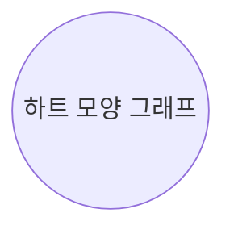



# 7교시 문자 사용의 역사

문자와 기호를 사용하여 식을 나타내는 방법은 어떻게 생겨났을까요?
$=, -, \times, \div$와 같은 기호와 $x, y$등의 문자 사용의 역사를 알아봅시다.

**일곱 번째 학습 목표**

1. 식에 사용하는 문자와 기호의 역사를 알아봅니다.
2. 현재 쓰고 있는 기호를 발견한 수학자를 알아봅니다.

**미리 알면 좋아요**

1. **대수학(代數學, algebra)** 대수학은 영어로 algebra라고 합니다. algebra는 al-jabr라는 아라비아어에서 유래한 것으로 $2 \times \square + 1 = 7$을 나타낸 식 '$2x+1=7$'을 풀기 위한 방법을 말합니다. 우리나라에서는 수 대신에 문자를 써서 문제를 쉽게 풀고 간단하게 나타내는 수학의 한 분야를 말합니다.
2. **기하학(幾何學, geometry)** 도형의 길이, 넓이, 각도 등의 양을 측정하거나 공간에 대한 것을 나타내는 수학입니다. 고대의 각 문명에서 토지의 측량이나 곡물의 부피 등을 계산하면서 발전하였으며 수학의 역사에서 가장 오래된 분야입니다.
3. **좌표** 위치를 나타내는 방법입니다. 수학자 데카르트가 파리가 움직인 것을 보고 원래 있었던 곳과 움직여서 있는 위치를 나타내기 위하여 만든 것입니다.
	예를 들어 원래 있었던 위치를 O, 움직이고 나서 있는 위치 A라고 했을 때 오른쪽으로 1칸, 위쪽으로 2칸 이동하여 있는 파리의 위치를 (한 칸, 두 칸) 즉 $(1, 2)$으로 나타냅니다.

(좌표평면 이미지: $x$축, $y$축이 있고, 원점 O에서 1칸 오른쪽으로, 2칸 위쪽으로 파리가 이동한 모습을 보여주는 그림, $(1, 2)$ 위치 표시)

4. **$\sin, \cos, \tan$** 함수(function)의 종류 중에 하나입니다. 옥수수를 뻥튀기 기계에 넣으면 옥수수 뻥튀기가 나오는 함수가 있듯이 직각삼각형의 각의 크기를 넣으면 $\sin$은 $\frac{\text{높이}}{\text{빗변}}$가 나오고 $\cos$은 $\frac{\text{밑변}}{\text{빗변}}$, $\tan$는 $\frac{\text{높이}}{\text{밑변}}$가 나옵니다.
	예를 들어 삼각형 ABC의 각 $k^\circ$의 아래에 있는 변인 밑변의 길이가 $a \text{cm}$, 높이가 $b \text{cm}$, 빗변이 $c \text{cm}$이므로 함수 $\sin, \cos, \tan$에 $k^\circ$를 넣으면 다음과 같이 나옵니다.

(직각삼각형 ABC 이미지: 빗변 $c \text{cm}$, 밑변 $a \text{cm}$, 높이 $b \text{cm}$, 밑각 $k^\circ$)
$$\sin k^\circ = \frac{b}{c}$$
$$\cos k^\circ = \frac{a}{c}$$
$$\tan k^\circ = \frac{b}{a}$$

(내용 없음 - 배경 이미지만 있는 빈 페이지)

(내용 없음 - 배경 이미지만 있는 빈 페이지)

이제까지 우리는 문자를 사용하여 식을 나타내고 간단하게 하기 위해 문자와 기호를 사용하는 방법을 배웠습니다. 이번 시간에는 이러한 문자와 기호가 어떻게 생겨나게 되었는지를 알아봅시다.

우선 우리가 사용하는 수학이라는 말 'mathematics'는 배우는 모든 것이라는 뜻의 그리스어 mathemata마테마타에서 유래된 것으로 수나 계산만을 의미하는 것이 아니라 일반적인 지식이나 우리가 사고하는 과정을 뜻합니다. 그래서 수학이 발달할수록 지식이 많은 것이기 때문에 수학이 발달한 나라일수록 문명도 더 많이 발달했습니다. 이러한 수학의 발달은 수학 기호의 발달과 함께합니다.

막대기 하나, 두 개, 세 개로 숫자를 나타내던 것을 $1, 2, 3, \cdots$ 이라는 기호를 사용하는 것이나 아무 것도 없다는 것을 빈 자리로 나타내어 '$12 \ 3$' 라고 나타내던 것을 숫자 '$0$' 이라는 기호를 발명하여 '$1203$' 이라고 나타내는 것, 일의 자리 $\cdot$ 십의 자리 $\cdot$ 백의 자리의 개념인 십진법을 사용하면서 숫자를 나타내는 기호가 발달한 인도는 상업과 무역 등이 아주 발달한 나라였습니다. 이렇게 발전된 수학이 유럽에도 전해져서 사용되게 돼요.

(4대 문명 지도 이미지: 황하문명, 메소포타미아문명, 이집트문명, 인더스문명의 위치가 표시된 세계 지도)

그럼 이러한 수학과 상업 등은 어디서부터 생겨난 것일까요?

4대 문명의 발상지는 메소포타미아 문명, 황하 문명, 이집트 문명, 인더스 문명입니다.

문명의 발상지는 기후가 따뜻하고, 큰 강을 끼고 있어 홍수 때면 상류로부터 기름진 흙이 내려오기 때문에 식량이 풍부해서 도

(이집트 나일강 범람 만화 이미지)
- 사람 1: 나일강의 범람으로 큰 홍수가 나서 피해가 막심해.
- 사람 2: 홍수의 피해를 줄이기 위해선 수학이 더욱 필요하다고.
- 사람 3: 파피루스에 수학 공식을 적자.

시가 형성되고 문명이 발생하였습니다. 문명의 발상지에서는 세금을 내고 물건을 사고팔기 위해 숫자를 만들어 사용했습니다. 이집트 문명은 '나일 강'이 규칙적으로 홍수가 일어났어요. 홍수의 피해를 줄이기 위해 홍수가 일어나는 시기를 규칙적으로 예측하기 위한 수학, 태양력, 건축술, 천문학이 발달했습니다.

(린드파피루스 이미지: 오래된 수학책 린드파피루스의 일부분)

자 이것이 무엇일까요?

학생들은 너무나 너무나 긴 종이와 그 위에 적혀 있는 알 수 없는 그림 문자에 무엇인가 궁금한 눈으로 종이를 보고 있습니다.

이것은 이집트 사람들이 계산과정을 적어둔 책으로 길이가 5m, 폭이 30cm 정도 되는 것입니다. 이것은 면적이나 부피, 거듭제곱에 대한 수학문제 85개가 쓰여진 '린드파피루스'라는 이

름의 오래된 수학책입니다. '린드파피루스'에서 파피루스는 이집트 연못에 나는 풀인 파피루스를 잘게 잘라서 만든 종이의 이름이고 '린드'는 헤리린드라는 사람이 이집트의 고대 건물 폐허 속에서 발견해서 지어진 이름입니다. 이 책에는 술의 농도를 구하는 방법이나 가축의 먹이를 어떻게 혼합해야 하는지 등의 문제들이 수학식으로 적혀 있습니다.

여기 써 있는 그림 같은 문자가 상형문자로 이집트에서 사용하던 문자에요. 여러분은 보고 어떤 뜻인지 모르겠죠?

여기 적혀 있는 수학 계산식에는 더하기와 빼기의 기호도 있는데 우리가 현재 쓰는 기호와 달라서 여러분이 알 수 없어요. 이집트에서는 더하기를 왼쪽으로 걸어가는 다리 한 쌍으로 썼고, 빼기는 오른쪽으로 걸어가는 다리 한 쌍으로 썼어요. 그래서 계산식을 쓸 때 상형 문자를 이용하게 식을 나타냈습니다.

그 후 3세기의 수학자 디오판토스가 이런 계산식을 더 간단하게 나타내는 약어를 사용해요. 우리가 선생님의 약어로 '샘'이라는 말을 사용하거나 '열심히 공부하자'는 것의 약어로 '열공'이라고 하듯이 '어떤 수가 있을 때 이 수의 세제곱의 두 배에 제곱의 5배를 뺀다'는 것을 약어로 나타냈어요.

(수학자 디오판토스 초상화)

디오판토스는 책 『산학 Arithmetica』을 13권 지었다고 전해지는데 현재는 6권만 전해지고 이 6권은 1575년에 라틴어로 번역, 출판되었습니다. '대수학의 아버지' 라 불리는 디오판토스는 이집트에서 사용하던 약어의 단계를 지나서 우리가 사용하는 문자의 기본이 되는 식을 사용했어요. 즉 수식, 미지수, 거듭제곱 등을 간단하게 쓰는 기호를 최초로 만들었어요. 또 음수의 법칙을 알고 있었고 1차 방정식뿐만 아니라 2차 이상의 방정식이나 식이 한 개지만 문자가 두 개인 부정방정식의 답을 구할 수 있도록 발전시켰어요.

프랑스의 수학자 비에트(Viete. F. 1540~1603)는 변호사였는데 수학에 취미가 있어서 기호를 만들었어요. 당시 사용하던 대수가 이탈리아식이라 무척 혼란스러웠는데 대수 기호를 체계화하고 미지수, 기지수를 나타내는 기호를 만들어 『해석학 서설』이란 책을 1591년에 발표해요.

비에트는 문자의 사용을 지금과 같이 알파벳을 사용하여 나타냈습니다. 즉 숫자를 대신하는 기호를 만들었지요.

그 후 14세기부터 16세기까지 문화, 예술의 모든 면에서 고대 그리스와 로마의 문화를 발달시키자는 문예부흥인 르네상스Rinascimento 운동이 일어나면서 수학도 많은 발전을 하게 됩니다. 수학이 발달되면서 수학자들은 수학식을 나타내는 편리한 방법을 만들기 위해 각자 편리한 기호를 만들게 됩니다. 이탈리아 수학자 파치올리Pacioli, 1445?~1509?는 '더 많은'을 뜻하는 'piu'

(15세기 수학자 파치올리와 비트만 만화 이미지)
- 15세기 이탈리아 수학자 파치올리: '더 많은'을 뜻하는 'piu'에서 덧셈 p, '더 적은'을 뜻하는 'meno'로부터 뺄셈 m으로 나타내자.
- 15세기 독일 수학자 비트만: 더하기를 'et', 빼기를 '-'로 나타내는 거야. et에서 e는 떼어버리고 t의 모양을 바꿔 덧셈 기호를 $+$로 나타내는 게 더 편리하군.

에서 덧셈을 p, '더 적은'을 뜻하는 'meno'로부터 뺄셈은 m으로 나타내었고 독일의 비트만Widmann, 1460?~은 더하기를 'et', 빼기를 '-'로 나타냈습니다.

영국의 수학자인 오트레드Oughtred, 1574~1660는 수학적 기호가 수학식을 나타내는데 매우 중요하다는 것을 강조하면서 150개가 넘는 수학 기호를 만들었지만 현재까지는 곱셈기호만 사용하고 있습니다.

이 시대에 많은 수학 기호가 만들어졌지만 현재 이 기호를 모두 사용하는 것은 아니에요. 여러분들이 줄넘기를 사기 위해 문구점에 갔을 때 줄넘기의 종류가 많이 있으면 어떤 것을 고를까요?

"색깔이 예쁜 줄넘기요"

"줄넘기하기 편한 손잡이가 있는 거요"

학생들은 제각기 자신이 줄넘기를 고를 기준을 말했습니다.

많은 줄넘기 중에서 본인에게 가장 편리한 것을 사겠죠? 이처

럼 사람들이 쓰기 편한 수학 기호들만이 현재 남아서 우리의 수학책에 쓰이고 있어요.

이러한 기호의 사용 중에서 가장 획기적이고 놀랄만한 발견을 한 사람이 바로 여러분과 수업을 같이 하고 있는 나에요. 내 이름이 뭐지요?

'비에트요'

네, 맞아요. 내가 기호를 발견하기 전까지는 식이라는 것은 '수 계산'이었지만 기호를 발견한 후에는 '기호 계산'이라고 불립니다. 내가 발견한 기호는 어떤 수의 거듭제곱을 나타낼 때 간단하게 한 글자 A로 모두 나타내는 것입니다. 우리가 $x$, $x^2$, $x^3$으로 쓰는 것을 A, A quadratum, A cubum이라고 썼어요. 나중에는 이것도 더 간단하게 A, Aq, Ac와 같이 나타내었어요. 그래서 '어떤 수가 있을 때 이 수의 세제곱의 두 배에 제곱의 다섯 배를 빼고 3을 더한다'를 내가 발견한 방법으로 나타내면 이렇게 쓸 수 있습니다.

$$2 \text{ in A cubum } -5 \text{ in A quardratum } +3$$

내가 쓴 것을 조금씩 변형하여 더 편리하게 쓰려는 수학자들도 나타났습니다. 부등호 '$<, >$'를 발견한 영국의 수학자 해리엇Harriot, 1560~1621은 $2\text{AAA}-5\text{AA}+3$으로 나타내었고 데카르트는 현재와 같이 $2x^3-5x^2+3$으로 나타내었습니다.

- 디오판토스: $K^{\gamma} \beta \Delta \Delta^{\gamma} \epsilon \gamma$
- 비에트: $2 \text{ in A cubum } -5 \text{ in A quardratum } +3$
- 해리엇: $2\text{AAA}-5\text{AA}+3$
- 데카르트: $2x^3-5x^2+3$

내가 A는 문자를 사용하여 나타내는 것을 이용하여 지금 우리가 쓰는 수학식으로 발전한 것이므로 많은 사람들이 나를 '대수학의 아버지'라고 부른답니다.

대수학은 어떤 계산을 위해 문자와 기호를 사용하여 나타내는 학문이고 기하학은 원이나 삼각형, 선과 같은 도형을 다루는 학문입니다. 이런 원이나 삼각형과 같은 기하학과 식을 나타내는

$$ 2 \text{ in A cubum } -5 \text{ in A quardratum } +3 $$

내가 쓴 것을 조금씩 변형하여 더 편리하게 쓰려는 수학자들도 나타났습니다. 부등호 '<, >'를 발견한 영국의 수학자 해리엇 Harriot, 1560~1621은 $2\text{AAA}-5\text{AA}+3$으로 나타내었고 데카르트는 현재와 같이 $2x^3-5x^2+3$으로 나타내었습니다.

- **디오판토스** : $K^\tau \beta \Delta\Delta^\tau \epsilon \gamma$
- **비에트** : $2 \text{ in A cubum } -5 \text{ in A quardratum } +3$
- **해리엇** : $2\text{AAA}-5\text{AA}+3$
- **데카르트** : $2x^3-5x^2+3$

내가 A는 문자를 사용하여 나타내는 것을 이용하여 지금 우리가 쓰는 수학식으로 발전한 것이므로 많은 사람들이 나를 '대수학의 아버지'라고 부른답니다.

대수학은 어떤 계산을 위해 문자와 기호를 사용하여 나타내는 학문이고 기하학은 원이나 삼각형, 선과 같은 도형을 다루는 학문입니다. 이런 원이나 삼각형과 같은 기하학과 식을 나타내는

대수학이 연결되어 원의 모양을 식으로 나타낼 수 있게 된 것은 '나는 생각한다, 고로 나는 존재한다'라는 유명한 말을 남긴 철학자이자 수학자인 데카르트의 업적 덕분입니다. 어려서부터 몸이 허약해서 침대에 누워 명상을 즐기던 데카르트는 천장을 기어 다니는 파리를 보고 위치를 나타내는 방법이 없을까 고민하다가 위도와 경도와 같이 위치를 알려주는 좌표를 만들었습니다.

그래서 하트 모양의 이 도형의 식을 $(x^2+y^2-1)^3-x^2y^3=0$ 라고 나타내는 것이 데카르트에 의해 가능해진 것입니다.

$$\leftarrow (x^2+y^2-1)^3-x^2y^3=0$$

하지만 이런 식을 만들어서 도형을 나타내는 방법을 더 깊이 연구한 사람은 독일의 수학자 라이프니츠Leibniz, 1646~1716입니다. 옥수수를 넣었을 때 옥수수 뻥튀기가 나오는 식 $f(\text{옥수수}) = (\text{옥수수 뻥튀기})$에서 함수 function이라는 용어를 처음 사용한 사람입니다.

function이라는 용어를 기호 $f$로 나타낸 수학자는 스위스의 오일러Euler, 1905~1983입니다. 오일러는 우리가 원기둥의 부피나 원의 둘레를 구할 때 사용하는 원주율 3.14는 원래 3.141592653589793238462643383279…처럼 소수 부분이 무한히 많은 무리수이지만 이 숫자의 소수 부분을 귀찮게 쓰지 않고 원주율이라는 것을 $\pi$ 파이라는 기호로 간단하게 나타낸 수학자에요. 오일러는 수학 공식을 연구하다가 오른쪽 눈을 실명하였지만 연구를 멈추지 않고 함수와 원주율 이외에도 삼각형의 변의 비를 나타내는 함수의 기호 $\sin$ 싸인, $\cos$ 코싸인, $\tan$ 탄젠트와 자연대수의 밑 $e$ 등 많은 수학 기호를 만든 18세기의 가장 뛰어난 수학자입니다.

그 이후에 1부터 100까지의 합을 순식간에 풀어버린 수학 천재 가우스와 코시 등의 수학자들에 의해 수학은 점차 발전하게 됩니다.

그럼 우리나라의 수학은 어땠을까요?

서양의 수학이 전래되기 전 우리의 전통 수학은 산학算學이라는 이름으로 불렸습니다. 우리나라의 수학은 성을 쌓거나 일식과 월식을 예언하는 것과 관련하여 발달하였고 신라 시대 서기 682년

에 산학을 가르쳤다는 기록이 『삼국사기』에 나오기도 합니다.

세종대왕은 수학의 발전을 위해 많은 노력을 하여 집현전 학자들에게 수학을 배우게 하였고 나도 집현전의 학자에게 수학책 『산학계몽』에 대한 강의를 받았습니다.

**(만화) 우리나라의 수학**
- (성을 쌓고 건물을 건축하며) "설계도 대로 되어 가는군." 
- (별과 달, 천문을 관측하며) "내일은 보름달이 뜨겠어."

**(만화) 삼국시대**
- "우리에겐 전통 수학인 산학(算學)이 있지." 
**(만화) 세종대왕**
- (세종대왕) "집현전 학자들도 수학을 공부하시오. 짐도 '산학계몽'을 공부할 것이오."
**(만화) 조선의 계산법**
- "$\frac{1}{10}$은 할, $\frac{1}{100}$은 푼, $\frac{1}{1000}$은 리라고 부르는 우리만의 계산법이 있지."

인도에서 '0'이 발견되고 '십진법'을 사용하며 수학이 발달할 때, 유럽에서는 일차방정식, 이차방정식의 해법을 연구하고 있었고 우리나라 조선은 중국 송나라·원나라의 수학을 흡수하여 독자적으로 수학을 발달시켰어요. $\frac{1}{10}$을 '할', $\frac{1}{100}$을 '푼', $\frac{1}{1000}$을 '리'라고 하는 것과 같이 소수를 나타내는 용어로 분 $\frac{1}{10}$, 리 $\frac{1}{100}$, 호 $\frac{1}{1000}$ 등의 수학 용어들도 생겨나고 우리만의 계산법도 발달하고 있었습니다. 중국에서 받아들인 수학이 조선에서 훨씬 발달했어요.

우리나라의 수학자 홍정하와 중국의 수학자 하국주가 수학 대결을 하고 있었어요. 옥의 부피 구하는 문제를 홍정하가 내었는데 하국주가 풀지 못해서 결국 지고 말았답니다. 홍정하는 조선시대의 대나무로 만든 계산기인 산목셈으로 이 문제를 거뜬히 풀었어요. 즉 구의 부피를 구하는 식이 조선 시대에 있었다는 거죠.

이렇게 수학은 문자와 기호를 사용하면서 점차 발달하게 되었고 수학과 수학의 문자, 기호가 발달할수록 우리의 삶도 편해졌습니다. 슈퍼마켓에서 물건을 살 때 점원이 계산기를 가지고 하

나하나 계산하지 않고 바코드로 상품 번호를 스캔하죠? 바코드라는 것이 수학의 이진법을 이용하여 만들어진 것입니다.

이렇게 수학은 여러 가지 복잡한 계산을 식으로 나타내야 하기 때문에 문자와 기호를 사용하여 간단하게 나타낼 필요가 있었습니다. 이렇게 간단하게 나타낸 식으로 인해 수학이 발달하였고 우리의 삶도 더 편하게 되었습니다. 이 시간을 계기로 수학에서 문자와 기호의 사용이 얼마나 중요한 것인지 생각해 보기를 바랍니다.

학생들은 문자와 기호의 중요성을 생각하며 비에트와 아쉬운 작별의 인사를 나누었습니다.

## 일곱 번째 수업 정리

1. 문명이 발달하면서 수학이 필요하게 되었습니다.
2. 수학은 계산하는 과정과 생각하는 과정을 간단하고 분명하게 나타내기 위하여 문자와 기호를 사용하게 되었습니다.
3. 수학에서 문자와 기호의 사용은 수학의 발전을 가져왔으며 우리의 삶도 편하게 해 주었습니다.
