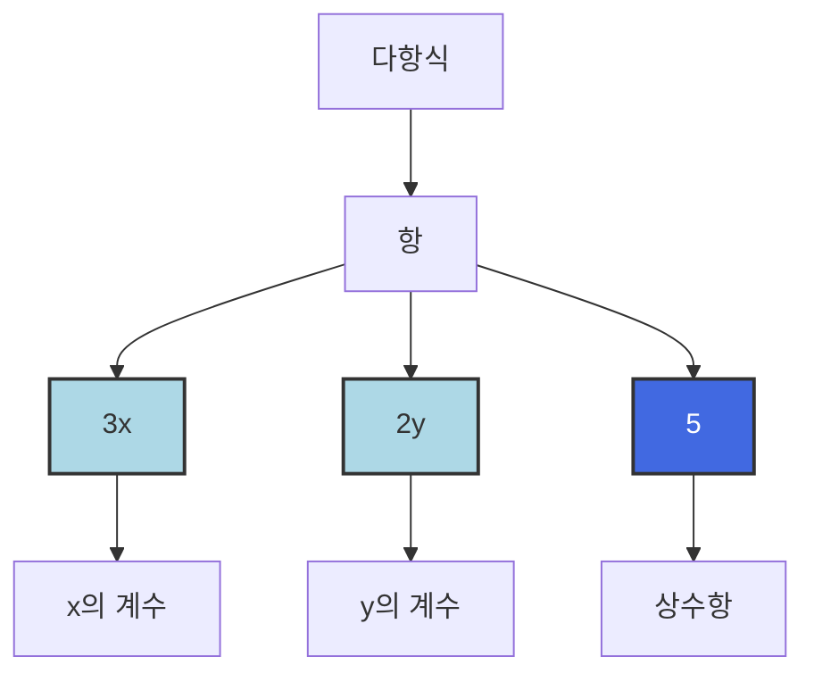

대로 적은 것으로 變(변)은 '변한다' 는 뜻입니다. 즉 문자에 어떤 수를 쓰느냐에 따라 여러 가지 값으로 변할 수 있는 수입니다. 하지만 항 중에서 숫자로만 이루어진 5와 같은 항은 값이 변하지 않습니다. 이렇게 값이 변하지 않는 특별함 때문에 수로 이루어진 항은 상수항이라는 특별한 이름을 줍니다.

비에트가 칠판에 동전을 여러 가지 붙여 놓았습니다.

여기 있는 동전에서 같은 종류끼리 모아서 저금통에 넣을 거예요.

저금통이 몇 개 필요할까요?

"4개요!"
