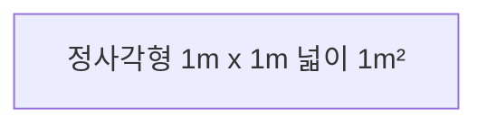

정사각형의 넓이는 어떻게 구할까요?

"$(\text{정사각형의 넓이}) = (\text{한 변의 길이}) \times (\text{한 변의 길이})$입니다."

맞아요, 이 정사각형 넓이를 구하면 $1\text{m} \times 1\text{m}$입니다. 여기서 길이의 단위 $\text{m}$가 두 번 곱해져 있기 때문에 거듭제곱을 이용하여 $\text{m}^2$이라고 쓴 것입니다.

마찬가지로 부피의 단위도 구할 수 있습니다.

이것은 정육면체, 즉 큐브(cube)입니다. 이 큐브는 헝가리의 건축학 교수인 루빅(Ernő Rubik)이 개발하여 정확한 이름은 '루빅 큐브' 이지만 간단하게 큐브라고 부른답니다.
