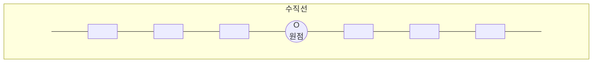

## 여섯 번째 학습 목표

1. 전개의 뜻을 알아봅니다.
2. 두 다항식의 곱셈을 해 봅니다.

## 미리 알면 좋아요

1. **수직선**: 일정한 간격으로 숫자가 표시되어 있는 직선을 말합니다. 수직선을 나타내는 한자 數直線(수직선)에서 보면 直線(직선), 곧은 선에 數(수), 숫자를 나타냈다는 뜻입니다. 가운데 기준이 되는 것을 원점이라고 하며 $O$로 나타냅니다. 그리고 양쪽의 화살표는 선이 끝없이 이어지는 것을 나타냅니다.

2. **정사각형**: 네 개의 각이 직각이고 네 변의 크기가 같은 사각형을 말합니다. 네 변의 길이가 같으므로 한 변의 길이를 $a$라고 하면 가로와 세로의 길이가 모두 $a$이므로 식으로 표현하면 다음과 같습니다.

$$ (\text{정사각형의 넓이}) = a \times a = a^2 $$
