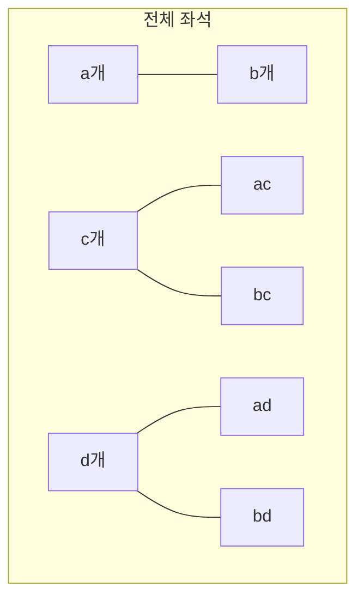

$$3x(x+5)=3x^2+15x$$

이렇게 분배법칙을 사용하여 단항식들의 합으로 나타내는 것을 전개한다고 합니다. 우리가 구한 $(a+b)(c+d)$개의 좌석도 분배법칙을 이용하여 전개할 수 있습니다.

가로와 세로가 $b$개, $d$개 늘어나면서 생긴 세 개의 무늬 좌석을 생각하며 다항식 $a+b$와 $c+d$의 곱인 $(a+b)(c+d)$개의 좌석도 분배법칙으로 전개해 봅시다.

<!-- 위 다이어그램은 임시로 작성된 것입니다. 본문 이미지 참고 부탁드립니다. -->

파란색 사각형의 좌석의 수 : 가로가 $a$개, 세로가 $c$개이므로 $ac$개입니다.

곱하기
$$(a+b)(c+d)$$
