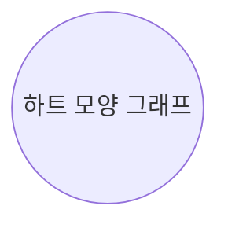

대수학이 연결되어 원의 모양을 식으로 나타낼 수 있게 된 것은 '나는 생각한다, 고로 나는 존재한다'라는 유명한 말을 남긴 철학자이자 수학자인 데카르트의 업적 덕분입니다. 어려서부터 몸이 허약해서 침대에 누워 명상을 즐기던 데카르트는 천장을 기어 다니는 파리를 보고 위치를 나타내는 방법이 없을까 고민하다가 위도와 경도와 같이 위치를 알려주는 좌표를 만들었습니다.

그래서 하트 모양의 이 도형의 식을 $(x^2+y^2-1)^3-x^2y^3=0$ 라고 나타내는 것이 데카르트에 의해 가능해진 것입니다.

$$\leftarrow (x^2+y^2-1)^3-x^2y^3=0$$

하지만 이런 식을 만들어서 도형을 나타내는 방법을 더 깊이 연구한 사람은 독일의 수학자 라이프니츠Leibniz, 1646~1716입니다. 옥수수를 넣었을 때 옥수수 뻥튀기가 나오는 식 $f(\text{옥수수}) = (\text{옥수수 뻥튀기})$에서 함수 function이라는 용어를 처음 사용한 사람입니다.
