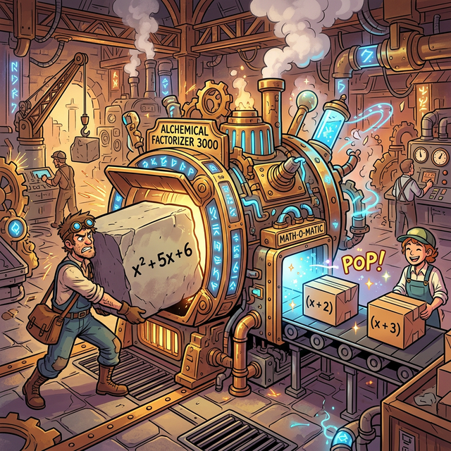



# 00. 인트로: 레고 블록으로 해체하기 (Intro)

스마트폰, 무선 이어폰, 컴퓨터 모니터... 세상의 모든 복잡한 기계 장치들은 수만 개의 부품으로 엉켜 있습니다. 
만약 고장 난 스마트폰 하나를 고쳐야 한다면 어떻게 해야 할까요? 통째로 전자레인지에 돌릴까요? 아닙니다. 드라이버를 가져와서 나사를 풀고, 메인보드, 배터리, 액정 이라는 **가장 기본이 되는 독립적인 부품(블록) 단위로 쪼개고 분해**해야 비로소 어디가 고장 났는지 고칠 수 있습니다.

수학의 다항식 방정식도 똑같습니다.

---

## 1. 덧셈으로 떡진 괴물 슬라임

$x^2 + 5x + 6$ 이라는 시커멓고 복잡한 다항식이 있습니다.
이 수식은 플러스($+$) 기호로 덕지덕지 수식들이 본드처럼 한 덩어리로 무식하게 들러붙은 거대한 슬라임 괴물입니다. 
당신이 이 방정식의 해커가 되어서 속임수를 파악하거나 코딩 물리 엔진에서 가장 계산하기 쉬운 최적화 상태로 만들려면, 이 떡진 덧셈 괴물을 가장 예쁘고 깔끔한 곱하기($\times$) 연결 고리를 가진 장난감 상자 모양으로 분해해야 합니다.

  

## 2. 분해 공장의 이름, "인수분해"

$x^2 + 5x + 6$ 을 마법 도구와 관찰력으로 쪼개보면, 사실 이 괴물의 정체는 **$(x + 2)$ 라는 작고 단단한 블록 상자 하나** 와 **$(x + 3)$ 이라는 단단한 블록 상자 하나** 가 단지 서로 곱하기($\times$) 로 맞붙어 팽창해 있던 빈껍데기 괴물이었음을 알게 됩니다.

> **$x^2 + 5x + 6 \quad \xrightarrow{\text{분해 마법 발동!}} \quad (x + 2) \times (x + 3)$**

이렇게 복잡하게 전개된 다항식을, 더 이상 쪼갤 수 없는 아주 기본적이고 단단한 곱셈 부품(인수, Factor) 들의 결합 스크립트로 분해해 내는 이 모든 과정을 **인수분해(Factorization)** 라고 부릅니다. 
우리는 이 거대한 역방향 분해 공장의 가장 밑바닥 원리인 '공통 묶기' 부터 '합차 데칼코마니' 까지, 천재들의 분해 해킹 기법들을 하나씩 훔칠 준비가 되었습니다. 시작해 볼까요?

