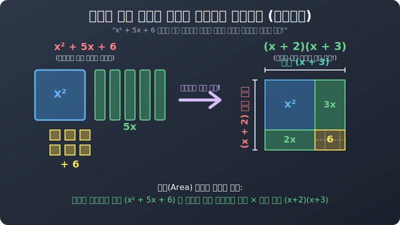

# 01. 첫 번째 수업: 소인수분해와 다항식의 만남 (Prime Factors vs Polynomials)

본격적으로 알파벳 변수가 들어간 흉측한 다항식($ax, y^2$... 등) 을 찢어버리기 전에, 우리는 컴퓨터 공학의 암호학(Cryptography) 스크립트를 지배하고 있는 기초 중의 기초, 초등학교 시절 배웠던 **숫자의 분해 (소인수분해)** 부터 복습해야 합니다. 이 둘의 뼈대 논리가 단 $1\%$ 의 오차도 없이 $100\%$ 완벽히 똑같기 때문입니다.

---

## 1. 숫자 12 의 진짜 뼈를 발라라 (소인수분해)

숫자 $12$ 를 누군가 가져왔습니다. "야, 이 $12$라는 덩어리를 분해해 봐."
하수는 덧셈으로 분해합니다. $\rightarrow$ "$10 + 2$ 요!" 또는 "$7 + 5$ 요!"
이것은 쓸모가 없습니다. 덧셈 분해는 1억 가지 조합이 가능하고 아무런 규칙이나 뼈대를 보여주지 못하는 슬라임 분해입니다.

진짜 수학자와 해커는 **"곱셈($\times$)"** 을 들이댑니다.
숫자 $12$ 가 도대체 어떤 '가장 순수하고 단단한 숫자의 소립자 (더이상 안 쪼개지는 소수 Prime)' 들이 부딪혀서 커진 놈인지 찾아내는 겁니다.

* $12 = 4 \times 3$ (어? 4는 더 쪼개지잖아?)
* $4 = 2 \times 2$ 
* **최종 해킹 완료:** $\mathbf{12 = 2 \times 2 \times 3 \quad (또는 \ 2^2 \times 3)}$

숫자를 이렇게 근본 곱셈 블록으로 분해하는 것을 **소인수분해 (Prime Factorization)** 라고 부릅니다. 여기서 뽑혀 나온 $2$ 와 $3$ 각각을 우린 숫자 12의 가장 깊은 DNA 세포 부품인 **'소인수 (Prime Factor)'** 라고 부릅니다.

## 2. 문자 알파벳 다항식의 뼈를 발라라 (인수분해)

그럼 무대를 숫자에서 '알파벳 덩어리 방정식' 으로 바꿔볼까요?
어떤 자판기나 공장 기계가 $x^2 + 5x + 6$ 이라는 길고 긴 명령어 스크립트 덩어리를 뿜어냈다고 칩시다.
이 명령어 덩어리의 세포 DNA 를 찾기 위해 떡진 덧셈, 뺄셈들을 모조리 걷어내고, 오직 **깔끔하게 "블록 $\times$ 블록" 의 곱셈 껍데기로 압축 분리**해 볼까요?

  

SVG 그림에서 보듯이 면적을 넓게 흩뿌리고 있던 덧셈($+$) 파편 조각들이 사실, 세로 길이 $(x+2)$ 와 가로 길이 $(x+3)$ 을 가진 아주 단정하고 예쁜 하나의 통짜 직사각형 덩어리를 곱하기 면적 계산기로 뽑아낸 껍데기 결과에 불과했던 것입니다!

> **$x^2 + 5x + 6 = \mathbf{(x + 2)(x + 3)}$**

이 과정이 전체 **인수분해(Factorization)** 의 정의입니다. 
숫자에서만 쓰던 방식이 단지 알파벳식 $X$ 나 $Y$ 가 들어간 다항식으로 숙주를 갈아탔을 뿐입니다.

* **인수(Factor):** 분해된 조립 블록 하나하나를 말합니다. 위 식에서는 $(x+2)$ 라는 그룹 묶음 상자 하나, 그리고 $(x+3)$ 라는 묶음 상자 하나가 각각 1인분의 인수(Factor) 입니다!

다음 챕터부터 이 흩뿌려진 조각들을 조립 박스로 되돌리는 가장 원시적이고 강력한 기술, 눈 씻고 찾아보기 스킬인 '공통인수 뽑기' 부터 시작합니다.
