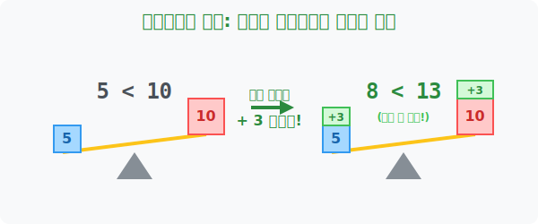

# 2. 요지부동의 저울: 덧셈과 뺄셈에서의 부등호 방향

## [도입부] 학습 목표 (Learning Objectives)
- 기울어진 부등식 저울의 양팔에 똑같은 물건(숫자)을 올려놓거나 똑같이 빼앗아도, 저울의 기울어진 방향 즉 **부등호의 악어 입 방향은 절대로 뒤집히지 않는다**는 철칙을 배웁니다.
- 좌변에 있는 골칫거리 불청객 숫자를 우변으로 휙 던져버리면서 부호만 싹 바꾸는 **'이항(Transposition)'** 스킬이 방정식뿐 아니라 부등식에서도 100% 똑같이 구동됨을 증명합니다.
- 파이썬(Python)의 양변 연산 시뮬레이터를 렌더링 하여, 연산 전후의 `True(참)` 불리언 값이 절대 변질되지 않음을 해킹하듯 구경해 봅니다.

---

## 1. 코끼리와 쥐에게 똑같이 사과를 주면?

이미 기울어진 저울이 하나 있습니다. 
왼쪽 접시엔 5kg짜리 쇳덩이가 있고, 오른쪽 접시엔 10kg짜리 쇳덩이가 있습니다. 
$$5 < 10$$
당연히 10kg 쪽이 묵직하게 아래로 가라앉아 있습니다. 부등호의 악어 입도 10을 향해 쩍 벌려져 있죠.

이제 신이 내려와서 **양쪽 접시에 공평하게 3kg짜리 금괴를 하나씩 올려놓습니다(덧셈).**
왼쪽은 $5 + 3 = 8$kg이 되고, 오른쪽은 $10 + 3 = 13$kg이 됩니다.
$$8 < 13$$
어떻습니까? 여전히 오른쪽 접시가 무겁습니다! 부등호의 방향표는 꿈쩍도 하지 않고 오른쪽(13)을 향해 굳건히 입을 벌리고 있습니다.

마찬가지로 양쪽 접시에서 **똑같이 2kg어치를 마이너스시켜 떼어버려도(뺄셈)**, 원래 무거웠던 놈이 계속 이기는 서바이벌의 법칙은 절대 변하지 않습니다.

<div align="center">
  
</div>

<br>

## 2. 방정식의 영혼, '이항'을 그대로 이식하다

양변에 똑같은 수를 빼도 부등호 방향이 안 바뀐다는 위대한 성질 덕분에, 부등식은 방정식의 궁극기인 **'이항'** 을 그대로 쓸 수 있게 해 주었습니다. 

$$x + 3 > 10$$
이 식에서 미지의 $x$ 정체 범위를 알고 싶어, 양변에 똑같이 $3$을 빼줍니다. 어차피 부등호 방향은 안 바뀔 거니까 안심입니다.
$x + 3 \mathbf{- 3} > 10 \mathbf{- 3}$
$$x > 7$$

이 계산을 빨리하는 단축키가 바로 "왼쪽에 붙어있던 $+3$ 을 통째로 오른쪽으로 휙 넘겨버리면서 기호만 마이너스($-$) 로 싹 바꿔치기하는 것" 입니다. 이항은 부등호 입 방향에 기스 하나 내지 않고 매끄럽게 돌아갑니다!

---

## 3. 💻 파이썬(Python)으로 부등식 저울 양변 스캐닝

파이썬의 비교 연산자는 내부적으로 메모리 칩에 저장된 크기를 저울질합니다. 여기에 똑같은 상수(Constant)값을 양변에 매크로처럼 덧붙여도 결과 논리가 부서지지 않음을 시각적으로 증명해 냅니다.

### 🐍 파이썬 예제: 해킹 없는 저울의 평형 상태 렌더링

```python
print("--- ⚖️ 디지털 저울: 덧셈/뺄셈 연산 시뮬레이터 ---")

# (초기 세팅) 5 < 10 이라는 수학 팩트
left_weight = 5
right_weight = 10

# 처음 저울의 기울기 스캐닝
initial_state = (left_weight < right_weight)
print(f"[초기 상태] {left_weight} < {right_weight} : 이 명제는 {initial_state} 입니다.")

print("\n🚨 이벤트 발생: 양팔 저울에 똑같이 100kg 아이템을 끼얹습니다! (+100)")
magic_item = 100

left_new = left_weight + magic_item
right_new = right_weight + magic_item

# 연산 후 저울의 기울기 재스캐닝
after_add_state = (left_new < right_new)
print(f"[덧셈 후 상태] {left_new} < {right_new} : 이 명제도 여전히 {after_add_state} 입니다!")

# 진단
if initial_state == after_add_state:
    print(" ☞ [파이썬 시스템 통과] 덧셈 연산은 부등호의 방향(논리)을 절대 뒤집지 못합니다!")

# 결과창:
# --- ⚖️ 디지털 저울: 덧셈/뺄셈 연산 시뮬레이터 ---
# [초기 상태] 5 < 10 : 이 명제는 True 입니다.
# 
# 🚨 이벤트 발생: 양팔 저울에 똑같이 100kg 아이템을 끼얹습니다! (+100)
# [덧셈 후 상태] 105 < 110 : 이 명제도 여전히 True 입니다!
#  ☞ [파이썬 시스템 통과] 덧셈 연산은 부등호의 방향(논리)을 절대 뒤집지 못합니다!
```

코더들이 `x > 5` 라는 조건문을 짤 때 버그 방지를 위해 `(x - 2) > 3` 처럼 양변에서 자유자재로 숫자를 가감(+- )하며 코드를 우아하게 리팩토링(Refactoring) 할 수 있는 이유가 바로 이 위대한 부등식의 성질 덕분입니다.

---

## [결론] 학습 정리 (Summary)

1. **무적의 덧셈/뺄셈**: 이미 승패가 결정되어 기울어진 부등식의 양변에 공평하게 같은 숫자를 더하거나 빼는 짓거리를 아무리 많이 하더라도, 그 본래 저울의 무겁고 가벼운 기울기 **방향(입 벌린 쪽)은 절대로 바뀌지 않습니다.**
2. **이항의 합법성**: $(+)$ 방해물을 반대편으로 넘겨 $(-)$ 로 만들어버리는 '이항' 기술은 양변에 같은 수를 빼는 원리에 기초하므로, 부등식 풀이에서도 방정식 때 쓰던 그 손맛 그대로 안전하게 난사할 수 있습니다.
3. **코드 조건문의 무결성**: 파이썬에서 반복 루프(While)의 탈출 조건이 되는 부등식 양 단절에 똑같은 `Counter` 변수를 빼거나 더하며 변형시켜도, 원래 프로그램 설계자가 원했던 `True` 로직은 훼손되지 않습니다.
