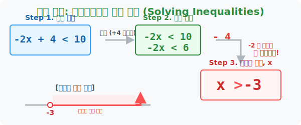

# 4. 왕따 작전: 일차부등식의 풀이 전략 (Solving Inequalities)

## [도입부] 학습 목표 (Learning Objectives)
- "$x$가 들어있는 놈들은 무조건 모두 왼쪽 방(좌변)으로 몰아넣고, 단순 숫자 찌끄러기들은 모조리 오른쪽 방(우변)으로 걷어차라!" 는 부등식 풀이의 근본 **'왕따(격리) 작전 전략'**을 배웁니다.
- 기계를 다루는 것처럼 기계적이고 완벽한 스텝(Step 1~3)으로 어떠한 일차부등식이라도 $\mathbf{x > \text{정답}}$ 의 예쁜 렌더링 결과물로 깎아내는 체계를 훈련합니다.
- 파이썬(Python)의 `SymPy` 대수학 AI 컴퓨터 모듈을 이용해, 인간이 손으로 푸는 이항과 음수 역전 알고리즘을 코드로 단 1줄 만에 자동 공격(풀이) 하는 스킬을 살펴봅니다.

---

## 1. 방정식의 손맛, 부등식에 그대로 적용하다

일차부등식 하나를 푼다는 것은, 온갖 지저분한 잡동사니 문자들이 덕지덕지 붙어있는 조건식 덩어리를 깎고 깎아내서 가장 반짝거리는 **"$\mathbf{x}$ 는 대체 누구보다 큰데(또는 작은데)?"** 라는 깔끔한 수식 한 줄로 탈바꿈시키는 위대한 조각 과정입니다.
놀랍게도 조각하는 도구(스킬)는 우리가 이미 마스터한 '일차방정식'의 이항 돌려차기와 100% 완벽하게 똑같습니다. 단, 앞 장에서 배운 **[음수 나누기 함정]** 만 빼고요!

**[부등식 풀이의 기계적 3단계 왕따 작전]**
$$ -2x + 4 < 10 $$

- **Step 1 (이항의 철퇴):** $x$는 주인공이니 왼쪽(좌변)에 모시고, 방해물 숫자들은 전부 오른쪽(우변)으로 발로 차버려 기호를 반대로 바꿉니다. 
  식: $-2x < 10 \mathbf{- 4}$ ( $+4$ 가 넘어가서 $-4$ 됨, 부등호 방향은 안전함)
  정리: **$-2x < 6$**
- **Step 2 (x 완전 고립):** 최후의 방해물, $x$ 앞에 찰싹 달라붙어 있는 '$-2$' 라는 숫자로 양변을 모조리 나누어 줍니다.
- **Step 3 (비상! 음수의 배신 플립!):** **양변을 하필 '음수($-2$)' 로 나누었으므로**, 부등호 방향 $< ($작다$)$ 를 미친 듯이 $> ($크다$)$ 로 휙 뒤집어 버립니다! 
  최종 정답: **$\mathbf{x > -3}$**

이렇게 깎아낸 정답을 수직선에 올리면, $-3$ 지점에서 구멍 뻥 뚫고(초과 니까) 오른쪽 무한대 방향으로 화살표를 쫙 그려주어 넓은 영토가 정답 영역임을 나타내 줍니다.

<div align="center">
  
</div>

<br>

## 2. 복잡한 놈들도 원리는 하나다

소수($0.1$)나 분수($1/2$)가 등장하거나 괄호가 쳐져 있어도 당황할 필요가 전혀 없습니다.
- **괄호 폭파:** 분배법칙을 쏘아서 괄호를 싹 다 전개하여 박살 내 버립니다.
- **분수/소수 청소:** 양변에 10, 100을 곱하거나 최소공배수를 몽땅 곱해서 식 전체를 깔끔한 '정수(1, 2, 3..)' 로 뻥튀기시킨 뒤 똑같은 왕따 작전을 돌리면 그만입니다.

---

## 3. 💻 파이썬(Python) `SymPy` 부등식 자동 분쇄기

우리가 손으로 땀을 쥐며 [1단계: 이항], [2단계: 부호 역전(Flip)] 을 하는 동안, 수학 전용 인공지능인 파이썬의 `SymPy` 라이브러리는 인간의 언어로 된 수식을 넣기만 하면 밀리초 단위로 이 절차를 모두 통과하여 완벽한 영역 정답을 토해냅니다.

### 🐍 파이썬 예제: $-2x + 4 < 10$ 자동 풀이 인공지능

```python
import sympy as sp

print("--- 🤖 파이썬 로봇의 부등식 깎기 스튜디오 ---")

# 1. 기계에게 'x는 미지의 주인공 문자(Symbol)야' 라고 가르쳐줌 
x = sp.symbols('x')

# 2. 방금 우리가 손으로 풀었던 그 더러운 식을 문자대로 컴퓨터에 삽입 (-2x + 4 < 10)
# (파이썬 내부 명령어: sp.solve / 부등식은 x에 대해 푼다는 의미)
inequality_problem = (-2 * x + 4 < 10)

print(f"▶ 입력된 일차부등식 미션: {inequality_problem}")

# 3. 로봇에게 "풀어!" (solve) 라고 단축 연산 발동
final_answer = sp.solve(inequality_problem)

print(f"▶ 💡 로봇이 1초 만에 깎아낸 최종 x 의 정답 영토: {final_answer}")
print(" ☞ [판독 결과] 로봇 내부에서 음수(-2)로 나눌 때 부등호가 완벽하게 뒤집어져 (x > -3) 이 도출됨!")

# 결과창:
# --- 🤖 파이썬 로봇의 부등식 깎기 스튜디오 ---
# ▶ 입력된 일차부등식 미션: 4 - 2*x < 10
# ▶ 💡 로봇이 1초 만에 깎아낸 최종 x 의 정답 영토: (-3 < x) & (x < oo)
#  ☞ [판독 결과] 로봇 내부에서 음수(-2)로 나눌 때 부등호가 완벽하게 뒤집어져 (x > -3) 이 도출됨!
```

(*해설: 파이썬 로봇의 출력 결과 `-3 < x & x < oo` 는 "x가 -3보다 크고, 우측 무한대(oo)보단 작다", 즉 우리가 도출한 **$x > -3$** 의 완벽한 컴퓨터 언어 번역판입니다!*)

---

## [결론] 학습 정리 (Summary)

1. **x 왕따 전략 (이항)**: 미지의 값 $x$만이 정답을 발설할 수 있게 만들기 위해, 좌변에는 $x$ 패거리만 고립시키고 우변으로는 순수한 상수(숫자) 찌끄러기들을 $+$는 $-$, $-$는 $+$ 로 부호를 매끄럽게 교체하며(이항) 집어던지는 작업입니다.
2. **최후의 검문 (음수 플립)**: 좌변과 우변의 숫자 청소를 다 끝낸 후, $x$ 앞에 붙어있는 찐득이 숫자(계수)로 양변을 나눌 때, **그 놈이 혹시 (마이너스)를 달고 있는 음수 조폭이라면 반드시 부등호 $>$, $<$ 방향을 화들짝 단박에 뒤집어엎어야 합니다.**
3. **무한한 지평선(수직선)**: $x > -3$ 이라는 정답은 단 하나의 값이 떨어지는 방정식과 차원이 다른 넓이(영역)입니다. 이를 모니터링하기 위해 수직선을 가로로 시원하게 긋고 붉은색 지평선 화살표를 우측 무한대로 쏘는 것이 데이터 시각화의 첫걸음입니다.
