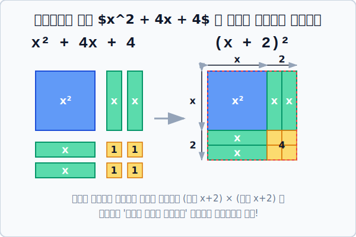



# 02. 안 되면 억지로 맞춘다: 완전제곱식 기하학

## 1. 학습 목표 (Learning Objectives)
* 깔끔한 정수로 인수분해가 되지 않는 최악의 난이도 수식을 풀어내기 위해, 조각난 다항식을 억지로 하나의 **'완전제곱식(Perfect Square)'**으로 조립하는 원리를 배웁니다.
* 알콰리즈미가 했던 방식 그대로, 수학 수식이 어떻게 평면 도형의 면적(기하학) 조각 맞추기와 똑같은 의미를 가지는지 SVG 예술로 시각화합니다.

## 2. 인수분해 거부 사태! 어떡하지?
> **위기 일발:** $x^2 + 4x - 5 = 0$ 은 $(x - 1)(x + 5) = 0$ 으로 아주 예쁘게 쪼개져서 근을 탈탈 털어냈습니다.
> **진짜 위기:** 그런데... **$x^2 + 4x + 2 = 0$** 이 식을 푸시오!

이건 최악입니다. 곱해서 $2$가 되고 더해서 $4$가 되는 예쁜 정수 쌍은 지구상에 존재하지 않습니다!
이렇게 우리의 $X$자 로직이 박살 났을 때, 천재 수학자들은 기발한 아이디어를 냅니다.
어차피 식 전체를 예쁘게 쪼갤 수 없다면, **식을 조금 개조(변형)해서라도 강제로 커다란 괄호 전체의 제곱 덩어리, 즉 완전제곱식 $(x + \square)^2 = \triangle$** 형태로 묶어버리자는 작전입니다! 
이렇게만 만들면 나중에 루트($\sqrt{}$) 모자만 씌워서 폭파시켜 버리면 되니까요.

## 3. 기하학 타일로 맞추는 완전제곱식의 미학
어떻게 $x^2 + 4x$ 라는 지저분한 찌꺼기들을 모아 하나의 거대한 **"정사각형 완전제곱 타일"** 로 합체할 수 있을까요?

$x^2 + 4x + \mathbf{4}$ 라는 식을 예로 들어, 각 요소를 타일 넓이라고 상상해 봅시다.
* $x^2$ : 가로 $x$, 세로 $x$인 커다란 파란색 타일 한 장
* $4x$ : 가로 $1$, 세로 $x$인 얇은 초록색 직사각형 타일 4장
* $4$ : 가로 $1$, 세로 $1$인 앙증맞은 노란색 타일 4장

이들을 바닥에 흩뿌려 놓고 이리저리 테트리스를 하다 보면, 놀랍게도 가로와 세로 길이가 **$(x+2)$**로 완벽하게 핏(fit)되는 찌그러짐 없는 하나의 **거대한 정사각형**이 완성됩니다!

  

## 4. 실전 도구: "반(1/2)의 제곱을 더해주어라!"
수학적으로 어떻게 강제 완전제곱을 만들까요? 무조건 **가운데 $x$ 앞의 숫자(계수)를 절반($\frac{1}{2}$)으로 쪼갠 뒤 제곱한 상수**가 필요합니다!

위에서 풀다 막혔던 **$x^2 + 4x + 2 = 0$** 을 강제 완전제곱식으로 성형 수술해 봅시다.
1. 방해되는 쓸모없는 쓰레기 숫자 $+2$ 를 우변으로 치워버립니다. (이항)
   * $x^2 + 4x = -2$ 
2. 왼쪽 식이 예쁜 정사각형 타일 공장이 되려면 부품이 부족합니다. 가운데 숫자(4)의 절반($2$)을 거듭제곱한 **$+4$** 가 필요합니다! 양쪽 저울(양변)에 똑같이 공평하게 **$+4$**를 밀어 넣습니다.
   * $x^2 + 4x \mathbf{+ 4} = -2 \mathbf{+ 4}$
3. 앗! 드디어 좌변이 그림처럼 예쁜 커다란 정사각형 타일로 응축(합체)되었습니다.
   * $\mathbf{(x + 2)^2 = 2}$
4. 거대한 제곱($^2$) 딱지를 바주카포 루트($\sqrt{}$)로 쏴서 폭파시켜 줍니다.
   * $x + 2 = \pm\sqrt{2}$
5. $x$만 남기고 다 이항시킵니다!
   * 최종 보스 클리어: **$\mathbf{x = -2 \pm \sqrt{2}}$** (무리수 근 2개 발굴 성공!)

## 5. 학습 정리 (Summary)
1. **완전제곱식 만들기**: 정수로 예쁘게 분해되지 않는 이차식은 가운데 계수의 **'반($\frac{1}{2}$)의 제곱'**을 양변에 강제로 더해주어, 억지로 $(A+B)^2 = K$ 형태의 식을 조립해 내는 것이 핵심입니다.
2. 이는 고대 알콰리즈미가 수식이 아닌 실제 정사각형 타일 블록을 쪼개어 면적을 맞추는 **'기하학적 대수학(Geometric Algebra)'** 방식과 완벽하게 일치하는 천재적 발상입니다.

