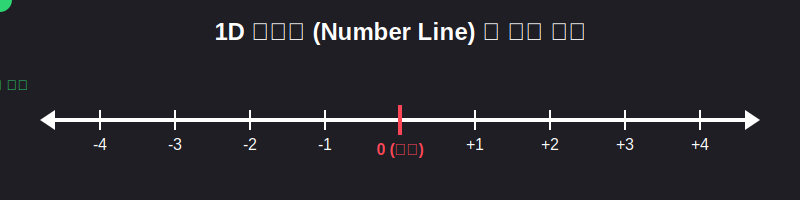

# 01. 첫 번째 수업: 1차원 수직선과 점의 위치 (Number Line)

수학은 우리가 상상하는 모든 세계를 정확한 숫자로 나타내는 신비한 마법입니다. 가장 기초적인 세계, 좌우로만 움직일 수 있는 **1차원 선(Line)** 의 세계로 들어가 봅시다.

---

## 학습 목표
* 점의 위치를 하나의 숙자로 나타내는 법을 배웁니다.
* 수직선에서 기준이 되는 **원점(Origin)** 과 음수/양수의 의미를 이해합니다.
* 파이썬(Python)으로 수직선을 그려보며 컴퓨터가 공간을 인식하는 방법을 맛봅니다.

## 1. 1차원 수직선: 한 줄로 선 세상

1차원의 세상은 무한히 뻗어 있는 하나의 가느다란 선입니다. 이 선 위에서 우리는 앞, 뒤로만 움직일 수 있죠. 수학에서는 이 선 위에 숫자를 일정하게 적어 넣은 것을 **수직선(Number Line)** 이라고 부릅니다.

1. **원점(O, Origin)**: 수직선의 정중앙이자 기준이 되는 점입니다. 좌표는 숫자 **0** 입니다.
2. **오른쪽(+방향, 양수)**: 원점을 기준으로 오른쪽으로 갈수록 숫자가 커집니다. (예: $+1, +2, +3 \dots$)
3. **왼쪽(-방향, 음수)**: 원점을 기준으로 왼쪽으로 갈수록 숫자가 작아집니다. (예: $-1, -2, -3 \dots$)

<div align="center">
  
</div>

> **수직선의 약속**
> *오른쪽으로 가면 내 자산이 늘어나는(+) 것이고, 왼쪽으로 가면 부채가 쌓여서 가난해지는(-) 방향이라고 생각하면 이해하기 쉽습니다.*

### 수직선 위의 보물찾기

여러분이 요원 A(람보)와 요원 B(스파이더맨)에게 지령을 내린다고 가정해 봅시다.
"요원 A는 기준점 0에서 오른쪽으로 3보 이동! 요원 B는 왼쪽으로 2보 이동!"

이러한 지령을 수학적으로 매우 깔끔하게 쓸 수 있습니다.
- 요원 A의 위치 (점 A): $A(3)$
- 요원 B의 위치 (점 B): $B(-2)$

괄호 안의 숫자가 바로 그 사람의 **위치(좌표)** 가 됩니다. 이처럼 수직선에서는 숫자 단 한 개만 알면 세상의 어떤 위치든 정확히 콕 집어낼 수 있습니다.

## 2. 순서쌍? 아직은 아니야!

나중에 2차원 평면으로 넘어가면 엘리베이터(위, 아래)의 개념이 추가되어 숫자가 2개 필요해집니다. 그것을 **순서쌍(Ordered Pair)** 이라고 부릅니다. 
하지만 지금 우리가 있는 1차원 세상은 좌우만 있으므로 숫자 1개로 끝난다는 사실을 꼭 기억하세요!

---

## 3. 파이썬(Python)으로 1차원 세상 그리기

컴퓨터 과학과 프로그래밍에서는 이런 위치 데이터를 다루는 것이 기본 중의 기본입니다. 파이썬의 `matplotlib` 라이브러리를 사용하면 컴퓨터 디스플레이에 멋진 수학적 수직선을 그려낼 수 있습니다.

```python
import matplotlib.pyplot as plt

# 1. 1차원 수직선의 중심을 잡기 위한 데이터 설정
x_values = [-4, -3, -2, -1, 0, 1, 2, 3, 4]
y_values = [0, 0, 0, 0, 0, 0, 0, 0, 0] # 1차원이므로 y는 전부 0 (높이가 없음)

# 2. 수직선과 점 그리기
plt.figure(figsize=(10, 2))
plt.plot(x_values, y_values, 'k-') # 검은색 직선
plt.plot(0, 0, 'go', markersize=15, label="Origin (0)")      # 원점 (초록색)
plt.plot(3, 0, 'yo', markersize=15, label="Agent A (+3)")    # 요원 A 위치 (노란색)
plt.plot(-2, 0, 'co', markersize=15, label="Agent B (-2)")   # 요원 B 위치 (파란색)

# 3. 화면에 꾸미기
plt.title("1D Number Line World")
plt.yticks([]) # y축 눈금 지우기
plt.grid(True)
plt.legend()
plt.show()
```

코드를 실행하면 검은색 하나의 가로축 위에 녹색 원점(0), 노란색 A요원의 점(3), 파란색 B요원의 점(-2)이 반짝이며 찍히는 그래픽을 볼 수 있습니다. 수학의 '좌표' 없이는 오늘날 즐기는 3D 게임 속 캐릭터의 위치조차 계산할 수 없다는 것을 알겠죠?

## 학습 정리
1. **수직선(Number Line)**: 숫자가 일정한 간격으로 나열된 무한한 가로 직선.
2. **원점(0)**: 수직선의 기준점. 오른쪽은 기호 $(+)$ 로 점점 커지고, 왼쪽은 $(-)$ 로 점점 작아진다.
3. **1차원의 좌표**: 직선 위에서 위치를 나타내기 위해서는 오직 한 개의 숫자만 필요하며, 기호로는 $P(a)$ 꼴로 표기한다.

다음 챕터에서는 마침내 1차원의 좁은 선을 벗어나, 광활한 2차원 평면으로 탈출해 보겠습니다!
