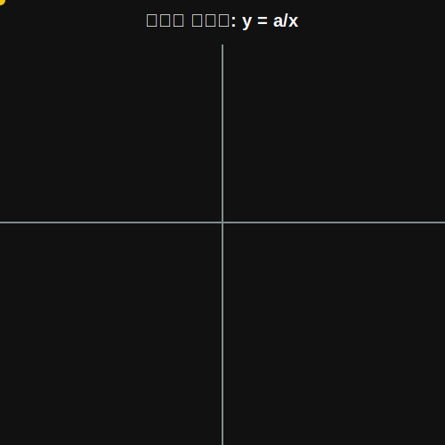

# 04. 네 번째 수업: 정비례와 반비례의 궤적 (Proportions and Inverse)

앞선 수업에서 $y = 3x$ 와 같이 $x$가 2배, 3배 커짐에 따라 $y$도 똑같이 2배, 3배 커지는 관계를 보았습니다. 이를 **정비례(Direct Proportion)** 규칙이라고 합니다.

하지만 세상에는 한 쪽이 커질 때 반대로 줄어드는 기묘한 관계도 존재합니다. 자동차의 속도를 빠르게 올릴수록, 목적지까지 도착하는 데 걸리는 시간은 오히려 짧아지는 시소 같은 관계 말이죠.

---

## 학습 목표
* 정비례($y = ax$)와 반비례($y = a/x$)의 확실한 차이점을 파악합니다.
* 완전히 다르게 생긴 두 비례 관계의 그래프 모양을 머릿속에 시각화합니다.
* 파이썬 코딩으로 반비례 그래프만이 가지는 쌍으로 휜 곡선, 즉 **쌍곡선**을 직접 뽑아봅니다.

## 1. 같이 커지는 정비례 ($y = ax$)

**"1분에 3장씩 문서 복사하기"**
복사기(x)가 1분, 2분, 3분 돌아갈 때 나온 문서 숫자(y)는 3, 6, 9장입니다.

* $x$가 2배, 3배로 증가할 때 $y$도 정직하게 2배, 3배 동일한 비율($a$)로 증가하는 것.
* 관계식: $y = ax \quad (a \neq 0)$
* 그래프 특징: 좌표평면의 중심(원점 $O$)을 시원하게 관통하며 뻗어나가는 완벽한 **직선**입니다.
  * 만약 $a$가 양수면 언덕을 오르듯 우상향 (1, 3사분면 통과)
  * 만약 $a$가 음수면 경사로를 내려가듯 우하향 (2, 4사분면 통과)

## 2. 시소처럼 엇갈리는 반비례 ($y = a/x$)

**"사과 12개를 친구들과 똑같이 나눠 먹기"**
사과 12개가 있습니다.
1. 나 혼자($x=1$) 먹으면, 내가 먹는 사과 개수($y$)는 **12개**.
2. 친구가 1명 와서 둘($x=2$)이 먹으면, 각각 **6개**.
3. 세 명($x=3$)이 오면 각각 **4개**.

친구($x$)가 2배, 3배로 늘어날수록 오히려 내가 먹는 사과 양($y$)은 $\frac{1}{2}$배, $\frac{1}{3}$배로 **반토막, 세토막**이 나버립니다.

* 관계식: $y = \frac{a}{x} \quad (x \neq 0, a \neq 0)$
* 그래프 특징: 숫자를 대입해서 아주 촘촘하게 찍어보면 절대로 $x$축이나 $y$축과 만나진 않으면서, 점차 축에 가까워지기만 하는 미끄러운 **한 쌍의 부드러운 곡선(쌍곡선)**이 됩니다.
  * 만약 $a$가 양수면 1사분면과 3사분면에 그려집니다.

<div align="center">
  
</div>

---

## 3. 파이썬(Python)으로 $y = 12/x$ 쌍곡선 시각화

중학교 시절 손으로 그리기 가장 헷갈리고 짜증 났던 반비례 곡선을, 우리는 단 몇 줄의 파이썬 마법으로 스크린에 단숨에 렌더링하겠습니다!
컴퓨터 그래픽스가 복잡한 데이터 곡선을 그려내는 원리가 정확히 이렇습니다.

```python
import matplotlib.pyplot as plt
import numpy as np

# 1. 반비례 방정식 y = 12 / x 설정
#   x축과 닿지 않아야 하므로 0을 빼고 긍정(1사분면), 부정(3사분면)으로 나눔
x_neg = np.linspace(-12, -0.5, 100) # -12 ~ -0.5 사이의 100개 점
x_pos = np.linspace(0.5, 12, 100)   # 0.5 ~ 12 사이의 100개 점

y_neg = 12 / x_neg
y_pos = 12 / x_pos

# 2. 반비례 쌍곡선 그리기
plt.figure(figsize=(7, 7))

# 제3사분면, 제1사분면에 매끄러운 붉은 곡선 그리기
plt.plot(x_neg, y_neg, 'r-', linewidth=2, label="$y = 12/x$")
plt.plot(x_pos, y_pos, 'r-', linewidth=2) 

# 주요 14분면의 기준 정수 좌표 (나눠 먹은 사과 예시)
# (1,12), (2,6), (3,4), (4,3), (6,2), (12,1)
apple_x = [1, 2, 3, 4, 6, 12]
apple_y = [12, 6, 4, 3, 2, 1]
plt.plot(apple_x, apple_y, 'bo', markersize=6, label="Apple count")

# 3. 2D 좌표축 뼈대 그리기
plt.axhline(0, color='black', linewidth=1)
plt.axvline(0, color='black', linewidth=1)

# 화면 정리
plt.xlim(-13, 13)
plt.ylim(-13, 13)
plt.title("Inverse Proportion: Hyperbola Graph")
plt.grid(True, linestyle=':')
plt.legend()
plt.show()
```

코드를 실행하면, 원점을 절대 지나지 않으며 양쪽 구석에 쌍둥이처럼 마주 보고 그려진 부드러운 붉은 점근선 모양의 곡선을 볼 수 있습니다. 
컴퓨터의 연산 속도를 올려 파일 압축 시간(y)을 줄일 때나 음파의 파장(x)과 주파수(y)를 계산할 때, 이 반비례 $y = \frac{a}{x}$ 곡선은 최첨단 디지털 신호에서 늘 등장합니다!

## 학습 정리
1. **정비례 ($y = ax$)**: $x$값이 커짐에 따라 $y$값도 일정 비율로 커짐. 원점을 지나는 **직선**.
2. **반비례 ($y = a/x$)**: $x$값이 커짐에 따라 $y$값은 반대로 역수 비율로 감소함. 원점 위/아래의 부드러운 **쌍곡선**.
3. **분모의 특징**: 반비례 식의 경우, 분모 $x$에 어떤 수를 넣어도 수학적으로 `0으로 나눌 수 없으므로`, 그래프는 평생 원점이나 축에 영원히 닿지 못하고 한없이 가까워지기만 합니다.
